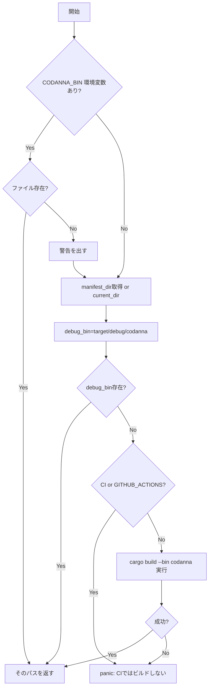

# test_parse_command.rs Review

## TL;DR

- このファイルは外部バイナリ「**codanna**」の「**parse**」コマンドを統合テストで検証し、出力が**JSONL**であること、**位置情報**や**kind_id**が含まれること、**TypeScript/Python**の構文要素が正しく検出されることを確認する。
- 公開APIは存在しないが、テスト支援の**内部ヘルパー**（get_codanna_binary、run_parse_command、parse_jsonl）がコアロジック。
- 重要な分岐は「**codannaバイナリの探索・ビルド**」と「**一時ファイル生成・プロセス実行・後片付け**」。Mermaidフローチャートで整理。
- 重大リスクは**Windowsでのバイナリ拡張子未対応（.exe）**、**CI環境でのビルド不可時のパニック**、**外部プロセス依存**による不安定性。
- 並行実行時の一時ファイル名衝突は、**AtomicUsize + thread_id + timestamp**で回避しているが、**thread_idのDebug表現非安定**が潜在リスク。
- セキュリティ的には**コマンドインジェクションなし**（引数はCommandに安全に渡す）が、**環境変数CODANNA_BINの信頼性**や**ログへの情報漏洩**は配慮が必要。

## Overview & Purpose

- 目的: 外部ツール「codanna」の「parse」コマンドが複数言語のコードを**構文木（AST）**として**JSON Lines（JSONL）**形式でストリーミング出力することを、**位置情報**、**ノードの種類（kind_id）**、**深さ（depth）**などの**データ契約**を伴って検証する。
- 本ファイルの役割:
  - **codannaバイナリの所在決定・必要に応じてビルド**（ローカル環境）
  - **テストコードを一時ファイルに書き出し**、外部プロセスで**parse**を実行し、**標準出力**を取得
  - 出力を**JSONL**として解析し、**言語別の構文要素**や**プロパティ**の存在を**アサート**する
- スコープ: 統合テスト（integration）。内部APIのユニットテストではなく、外部バイナリ連携と出力の整合性を検証。

## Structure & Key Components

| 種別 | 名前 | 公開範囲 | 責務 | 複雑度 |
|------|------|----------|------|--------|
| Function | get_codanna_binary() -> PathBuf | private | codannaバイナリの探索・必要に応じたビルド | Med |
| Function | run_parse_command(code: &str, lang_ext: &str, max_depth: Option<usize>) -> String | private | 一時ファイル生成、parseコマンド実行、出力取得、後片付け | Med |
| Function | parse_jsonl(output: &str) -> Vec<Value> | private | JSONLストリングをVec<serde_json::Value>に変換 | Low |
| Test | test_position_information() | private | AST各ノードにstart/end位置があることを検証 | Low |
| Test | test_kind_id_present() | private | AST各ノードにkind_idがあることを検証 | Low |
| Test | test_typescript_parsing() | private | TSのinterface/function検出＋depth=1を検証 | Low |
| Test | test_python_parsing() | private | Pythonのclassとメソッド検出＋深さ関係を検証 | Low |
| Test | test_output_is_streaming_jsonl() | private | 出力が複数行のJSONLであることを検証 | Low |

### Dependencies & Interactions

- 内部依存
  - test_* 関数 → run_parse_command → get_codanna_binary
  - test_* 関数 → parse_jsonl
- 外部依存（クレート/モジュール）
  | 依存 | 用途 | 備考 |
  |------|------|------|
  | std::env | 環境変数読み取り、作業ディレクトリ取得 | CODANNA_BIN, CARGO_MANIFEST_DIR, CI, GITHUB_ACTIONS |
  | std::path::PathBuf | パス操作 | バイナリ/一時ファイルパス |
  | std::process::Command | 外部プロセス起動 | cargo build, codanna parse |
  | std::fs | ファイル書き込み/削除 | テストコードの一時ファイル化 |
  | serde_json::Value | JSON値表現 | JSONLの各行をValueにデコード |
  | std::sync::atomic::AtomicUsize | 一意ID | 並行テストでの一時ファイル名衝突回避 |
- 被依存推定
  - 本モジュールは統合テスト専用。プロダクションコードから直接利用されない想定。

## API Surface (Public/Exported) and Data Contracts

公開API（pub/external）は「該当なし」。以下はテスト用の内部ヘルパー関数。

| API名 | シグネチャ | 目的 | Time | Space |
|-------|-----------|------|------|-------|
| get_codanna_binary | fn get_codanna_binary() -> PathBuf | codannaバイナリ取得（必要に応じビルド） | O(1)※ | O(1) |
| run_parse_command | fn run_parse_command(code: &str, lang_ext: &str, max_depth: Option<usize>) -> String | 一時ファイル作成・parse実行・stdout取得 | O(|code| + N) | O(|code| + N) |
| parse_jsonl | fn parse_jsonl(output: &str) -> Vec<Value> | JSONLをVec<Value>に変換 | O(L) | O(L) |

※ get_codanna_binaryの時間計算量はデータサイズに依存しないが、「cargo build」を呼ぶ分岐ではビルド時間に依存（非アルゴリズム的要因）。

詳細:

1) get_codanna_binary

- 目的と責務
  - CODANNA_BIN環境変数で指定されたパスが存在すればそれを使用。存在しなければプロジェクトのdebugバイナリ（target/debug/codanna）を使用し、なければローカル環境でcargo buildを実行して生成する。CIでは存在しなければパニック。
- アルゴリズム（主要ステップ）
  - CODANNA_BINを読む→パス存在なら返す→存在しなければ警告
  - CARGO_MANIFEST_DIR→target/debug/codanna を組み立て
  - ファイルがなければ、CIならpanic、ローカルなら「cargo build --bin codanna」を実行→成功ならdebug_bin返す、失敗ならpanic
- 引数
  | 名称 | 型 | 説明 |
  |------|----|------|
  | なし | - | 環境変数を内部で参照 |
- 戻り値
  | 型 | 説明 |
  |----|------|
  | PathBuf | 実行可能なcodannaバイナリのパス |
- 使用例
  ```rust
  let bin = get_codanna_binary();
  assert!(bin.exists());
  ```
- エッジケース
  - CODANNA_BINが設定されているがファイル不存在→警告を出しフォールバック
  - CI環境でdebug_bin不存在→panic
  - Windowsで拡張子.exe問題→現実的に未対応（詳細は「Edge Cases」に記載）

2) run_parse_command

- 目的と責務
  - テスト用コード文字列を安全に一時ファイルへ書き出し、codanna parseを実行し、標準出力（JSONL）を文字列で返す。オプションで最大深度も指定可能。
- アルゴリズム（主要ステップ）
  - AtomicUsize + thread_id + timestamp + pid で一意なファイル名生成
  - 一時ファイルへコードを書き込み
  - get_codanna_binaryでバイナリパス取得
  - Commandで「codanna parse [file] [--max-depth X]」を実行
  - 正常終了ならstdoutをUTF-8として返却、失敗ならstderr・stdoutを含めpanic
  - 一時ファイルは後片付けで削除
- 引数
  | 名称 | 型 | 説明 |
  |------|----|------|
  | code | &str | 解析対象のソースコード |
  | lang_ext | &str | ファイル拡張子（言語判定用）例: "rs", "ts", "py" |
  | max_depth | Option<usize> | AST出力の最大深度指定 |
- 戻り値
  | 型 | 説明 |
  |----|------|
  | String | parseコマンドの標準出力（JSONL） |
- 使用例
  ```rust
  let out = run_parse_command("fn test() {}", "rs", Some(3));
  let nodes = parse_jsonl(&out);
  assert!(!nodes.is_empty());
  ```
- エッジケース
  - 一時ファイル書き込み失敗→panic
  - codanna parse失敗（非ゼロ終了）→stderr/stdout付きでpanic
  - max_depth未指定→引数なしで実行
  - 出力が非UTF-8→lossy変換（未知の文字は置換）

3) parse_jsonl

- 目的と責務
  - 改行区切りのJSON（空行は無視）を1行ずつserde_json::Valueにデコードし、ベクタへ収集
- アルゴリズム（主要ステップ）
  - 出力文字列を行分割→空行を除外→各行をserde_json::from_strでValueへ→Vecにcollect
- 引数
  | 名称 | 型 | 説明 |
  |------|----|------|
  | output | &str | JSONL形式のテキスト |
- 戻り値
  | 型 | 説明 |
  |----|------|
  | Vec<Value> | デコードされたJSON値の配列 |
- 使用例
  ```rust
  let values = parse_jsonl("{\"a\":1}\n{\"b\":2}\n");
  assert_eq!(values.len(), 2);
  ```
- エッジケース
  - 行が不正JSON→expectでpanic
  - 全て空行→空Vec

## Walkthrough & Data Flow

- 全体の流れ
  1. 各テスト関数が解析対象の**コード文字列**を用意
  2. run_parse_commandが**一時ファイル**を作成し、**codanna parse**を実行
  3. 取得した**標準出力**（JSONL）をparse_jsonlで**Vec<Value>**に変換
  4. 一連の**アサーション**で**データ契約**（start/end、kind_id、node種別、depthなど）を検証

- get_codanna_binaryの主要分岐



上記の図は`get_codanna_binary`関数（行番号:不明）の主要分岐を示す。

- run_parse_commandの主要処理

```mermaid
flowchart TD
  A[開始] --> B[AtomicUsize/ThreadId/Timestampで一意名生成]
  B --> C[temp_dirへファイル作成 & code書き込み]
  C --> D[get_codanna_binaryでバイナリ取得]
  D --> E[Commandで parse を構築]
  E --> F{max_depthあり?}
  F -->|Yes| G[--max-depth を追加]
  F -->|No| H[追加なし]
  G --> I[子プロセス実行 output取得]
  H --> I
  I --> J[一時ファイル削除]
  J --> K{ステータス成功?}
  K -->|Yes| L[stdout(UTF-8, lossy)を返却]
  K -->|No| P[panic: stderr/stdout/exit code付き]
```

上記の図は`run_parse_command`関数（行番号:不明）の主要分岐を示す。

## Complexity & Performance

- get_codanna_binary
  - Time: O(1)（存在チェックのみ）。ただし「cargo build」分岐は**ビルド時間**に依存し、場合によっては数十秒〜分オーダー。
  - Space: O(1)
- run_parse_command
  - Time: O(|code|)（書き込み） + O(外部プロセス時間) + O(N)（stdoutの長さ）。NはJSONLの総バイト数。
  - Space: O(|code| + N)（一時ファイルと出力圧の文字列）
- parse_jsonl
  - Time: O(L)（行数。各行をJSONデコード）
  - Space: O(L)（Valueベクタ）
- ボトルネック
  - 外部プロセス実行（codannaの解析処理）とファイルI/Oが支配的
  - CI環境でのビルド禁止→バイナリの事前配置が必須
- スケール限界と運用負荷
  - 巨大コード→stdoutが大きくなり、メモリ消費↑。JSONLを全量文字列として保持する設計のため、非常に大きな出力ではメモリ圧が懸念。

## Edge Cases, Bugs, and Security

- メモリ安全性
  - unsafe未使用。所有権・借用は標準ライブラリの範囲で安全。
  - String::from_utf8_lossyにより非UTF-8も安全に変換、メモリ破壊なし。
- インジェクション
  - std::process::Commandで引数を配列として渡すため**コマンドインジェクションのリスクは低い**。
  - CODANNA_BIN環境変数は信頼境界外だが、Commandに直接パスを渡すのみ（文字列連結によるシェル解釈なし）で安全性は高い。
- 認証・認可
  - 該当なし（ローカルテスト用途）。
- 秘密情報
  - ハードコードされた秘密はなし。
  - eprintln!で環境に関するメッセージ出力あり。パスの漏洩は許容範囲だがCIのログ公開範囲に注意。
- 並行性
  - 一時ファイル名の一意性はAtomicUsize + thread_id + timestamp + pidの複合で高い。ただし**thread_idのDebug表現が非安定**で将来変化の可能性あり。
  - テストは並行実行でもファイル衝突の可能性は極めて低い。
- 既知/推定バグ
  - Windows対応: debug_binが「target/debug/codanna」に固定で、**実際は「codanna.exe」**が一般的。Windowsで失敗する可能性が高い。
  - CI環境でのビルド不可: debugバイナリが存在しない場合、**panic**で即失敗。CIジョブの前提に依存。
- 一時ファイルの削除タイミング
  - 子プロセスの実行後に削除。子プロセスは終了済みのためレースは回避されている。
- エッジケース詳細

| エッジケース | 入力例 | 期待動作 | 実装 | 状態 |
|-------------|--------|----------|------|------|
| CODANNA_BINが存在しないファイル | CODANNA_BIN=/tmp/missing | 警告後にdebug_binフォールバック | get_codanna_binary | Handled |
| CIでdebug_bin不存在 | CI=1 | panic（ビルドしない） | get_codanna_binary | Handled（意図的） |
| Windows拡張子 | Windows環境 | codanna.exeを探す | - | Not handled |
| 非UTF-8出力 | 出力にバイナリ混入 | lossy文字列で返す | run_parse_command | Handled |
| 巨大出力 | 数十MBのJSONL | メモリ圧増加、完了まで待つ | - | Risk |
| 無効JSON行 | 不正フォーマット | panic | parse_jsonl | Handled |
| 一時ファイル名衝突 | 高並行で同時実行 | 一意名で回避 | run_parse_command | Handled（ほぼ） |

根拠（関数名:行番号）: 行番号は本チャンクに記載がないため不明。

## Design & Architecture Suggestions

- Windows対応: debugバイナリの拡張子を**プラットフォームに応じて切り替え**（cfg!(windows)なら"codanna.exe"）。
- バイナリ探索の汎用化: **which/which-rs**に近いロジックでPATH検索を追加し、柔軟性を高める。
- 一意ファイル生成: **tempfile::NamedTempFile**の利用で安全性・後片付けの堅牢性向上（自動削除、レース耐性）。
- バイナリパスのキャッシュ: **OnceCell**等でget_codanna_binaryの結果をキャッシュし、テスト内で何度も探索/存在チェックを避ける。
- エラー表現: panicメッセージに**より構造化情報**（バイナリパス、環境変数値、現在ディレクトリ）を含め、デバッグ容易性を改善。
- 出力処理: 超大規模JSONLに備え、必要に応じて**ストリーム処理**（行ごとに検証）へ拡張可能。

## Testing Strategy (Unit/Integration) with Examples

- 既存テストのカバレッジ
  - 位置情報（start/end）と型（u64）検証
  - kind_idの存在と数値性
  - TypeScriptのinterface/function検出＋depth=1
  - Pythonのclassとfunction_definition検出＋深さ関係
  - 出力が**ストリーミングJSONL**（複数行）であること

- 追加を推奨するテスト
  - max_depthの動作確認（深さ制限が効いているか）
  - エラー系: 無効コードの解析失敗時、stderr出力に有用メッセージが含まれるか（現状panicで打ち切り）
  - Windowsでのバイナリ探索（codanna.exe）テスト（条件付き）
  - 大規模入力でのメモリ使用・時間（統合テストでは軽く）
  - 他言語（例: JavaScript、Go、Rustのより複雑な構文）のノード検出と属性確認

- 例: max_depthテスト
  ```rust
  #[test]
  fn test_max_depth_limits_nodes() {
      let code = "fn a(){ if true { let x=1; } }";
      let out = run_parse_command(code, "rs", Some(1));
      let nodes = parse_jsonl(&out);
      // 期待: depth > 1 のノードが含まれない（仕様次第）
      assert!(nodes.iter().all(|n| n["depth"].as_u64().unwrap_or(0) <= 1));
  }
  ```

## Refactoring Plan & Best Practices

- バイナリ検出
  - get_codanna_binaryを**プラットフォーム対応**・**キャッシュ化**。Windows拡張子、PATH検索を加える。
- 一時ファイル管理
  - **tempfile**に置き換え、**スコープ終端での自動削除**を採用。現状の手動削除は失敗時の残骸リスクあり。
- ログ・エラー
  - eprintln!ではなく、テスト環境で有効化可能な**env_logger**を導入し、必要時のみ詳細ログ。
- テスト再利用性
  - run_parse_commandを**モジュール化**し、他の統合テストからも共有。
- 出力解析
  - parse_jsonlのエラーをpanicではなく**Result<Vec<Value>, Error>**で返し、テスト側で明示的に扱う。

## Observability (Logging, Metrics, Tracing)

- 現状
  - **eprintln!**で警告/ビルド情報を出力。外部プロセス失敗時はpanicメッセージに**stderr/stdout/exit code**を含めている。
- 改善案
  - テストラン時に**RUST_LOG**で詳細ログ制御可能にする。
  - 失敗時に**環境変数**や**参照パス**のダンプをオプション化。
  - codanna側が構造化ログを出すなら、テストでの**stderr解析**も検討。

## Risks & Unknowns

- codannaの出力スキーマ詳細（全ノード型・属性）はこのチャンクに現れないため**不明**。テストが想定するフィールド（start, end, kind_id, depth, node）の存在は仮定。
- Windowsでの動作（バイナリ名など）は**未対応の可能性**が高い。
- CI環境での前提（バイナリの事前ビルド）に依存しており、パイプライン変更で**テストが突然失敗**するリスク。
- thread_idのDebug表現依存は**将来互換性**に不確実性。とはいえ衝突確率は非常に低い。