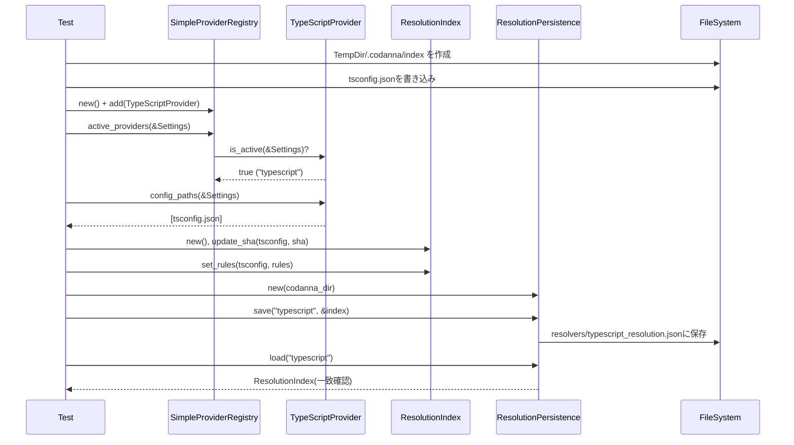

# integration\test_provider_initialization.rs Review

## TL;DR

- 目的: TypeScript向けプロジェクト解決プロバイダの初期化と、設定ファイル(tsconfig.json)に基づく解決キャッシュの永続化ロードを検証する統合テスト。
- 主要公開API: このファイル自体に公開APIはなし。テストから使用する外部APIは Settings, LanguageConfig, SimpleProviderRegistry, TypeScriptProvider, ResolutionIndex/Persistence, compute_file_sha。
- 複雑箇所: Persistence層のSHA・Rules管理と保存/読込の整合性検証、Providerの有効化判定と設定ファイルパス検出。
- 重大リスク: TypeScriptProviderがハードコードされた「.codanna」パスを使用するため、テスト環境隔離やキャッシュ再構築(rebuild_cache)の完全検証が不可能。実運用だと汚染や競合の可能性。
- Rust安全性: テストでは unwrap/expect の多用は妥当だが、ライブラリ側では適切なエラー設計が必要。unsafe は登場せず、所有権/借用は単純。
- セキュリティ: ファイルI/O系でパス検証・競合に注意。機密情報の取り扱いはなし。インジェクションは不該当だがPath traversalに注意。
- パフォーマンス: compute_file_shaやファイル読み書きが O(size) 。Provider判定は O(#providers)、config_pathsは O(#config_files)。

## Overview & Purpose

この統合テストは、codannaプロジェクトの「プロジェクト解決プロバイダ」(TypeScriptProvider)が Settings の言語設定と config_files(tsconfig.json)に応じて正しくアクティブ化され、設定ファイルを検出し、永続化層(ResolutionPersistence)が解決インデックス(ResolutionIndex)を安全に保存・読込できることを検証します。特に以下を確認します。

- Settings に TypeScript の LanguageConfig を挿入すると、SimpleProviderRegistry.active_providers が TypeScriptProvider を有効化する。
- Provider.config_paths が Settings で指定した tsconfig.json を正しく認識する。
- ResolutionIndex の SHA 更新・再構築要否(needs_rebuild)判定、Rules 設定(set_rules)が機能し、ResolutionPersistence.save/load で内容が保持される。
- 欠損設定ファイル、無効JSON、複数設定、言語が disable の場合の挙動。

制約として、TypeScriptProvider がハードコードされた「.codanna」ディレクトリを使用するため、テスト側の IndexPath が完全には反映されず、Provider のキャッシュ再構築(rebuild_cache)の実ファイルI/Oは本テストでは抑制・迂回しています。

## Structure & Key Components

| 種別 | 名前 | 公開範囲 | 責務 | 複雑度 |
|------|------|----------|------|--------|
| Function | create_test_settings | private(test) | TypeScript向けSettingsを生成 | Low |
| Function | test_provider_initialization_with_valid_config | private(test) | 正常なtsconfigでProviderとPersistenceを検証 | Med |
| Function | test_provider_initialization_with_missing_config | private(test) | 不在のtsconfigでProvider有効性のみ検証 | Low |
| Function | test_provider_initialization_with_invalid_json_config | private(test) | 無効JSONでProvider有効性のみ確認 | Low |
| Function | test_provider_initialization_with_multiple_configs | private(test) | 複数tsconfigの検出確認 | Low |
| Function | test_provider_not_active_when_disabled | private(test) | 言語disable時にProvider非活性 | Low |

### Dependencies & Interactions

- 内部依存
  - 全テスト関数が create_test_settings を使用して Settings を構築。
  - test_provider_initialization_with_valid_config が ResolutionIndex/Rules と ResolutionPersistence に直接依存し、SHA計算/保存/読込の正当性を確認。

- 外部依存

| 依存先 | 用途 |
|--------|------|
| codanna::config::{LanguageConfig, Settings} | 言語設定と全体設定の構築 |
| codanna::project_resolver::providers::typescript::TypeScriptProvider | TypeScriptプロバイダの生成と検出 |
| codanna::project_resolver::registry::SimpleProviderRegistry | Provider登録とアクティブ判定 |
| codanna::project_resolver::persist::{ResolutionPersistence, ResolutionIndex, ResolutionRules} | 解決インデックスの永続化/ロード |
| codanna::project_resolver::sha::compute_file_sha | tsconfigのSHA計算 |
| std::fs, std::path::PathBuf, std::collections::HashMap | ファイルI/O、パス、マップ構築 |
| tempfile::TempDir | テスト用の隔離ディレクトリ生成 |

- 被依存推定
  - このモジュールは統合テスト専用であり、プロダクションコードから直接参照されることはない。CIやローカルテストランナーが実行。

## API Surface (Public/Exported) and Data Contracts

このファイルの公開APIはありませんが、定義関数と利用する外部APIの振る舞いを以下に整理します。

| API名 | シグネチャ | 目的 | Time | Space |
|-------|-----------|------|------|-------|
| create_test_settings | fn create_test_settings(config_files: Vec<PathBuf>, index_path: PathBuf) -> Settings | テスト用にTypeScriptが有効なSettingsを作る | O(k) | O(k) |
| test_provider_initialization_with_valid_config | fn test_provider_initialization_with_valid_config() | 正常な構成でProvider/Persistence検証 | O(m + k + S) | O(k + R) |
| test_provider_initialization_with_missing_config | fn test_provider_initialization_with_missing_config() | 欠損tsconfigでProvider活性確認 | O(m + k) | O(1) |
| test_provider_initialization_with_invalid_json_config | fn test_provider_initialization_with_invalid_json_config() | 無効JSONでProvider活性確認 | O(m + k + S_invalid) | O(1) |
| test_provider_initialization_with_multiple_configs | fn test_provider_initialization_with_multiple_configs() | 複数tsconfigの検出確認 | O(m + k) | O(k) |
| test_provider_not_active_when_disabled | fn test_provider_not_active_when_disabled() | 言語無効時はProviderが非活性 | O(m) | O(1) |

注:
- k = config_filesの数
- m = 登録プロバイダ数
- S, S_invalid = 対象ファイルサイズ(正常/無効JSON)
- R = ルール数・SHAエントリ数（ここでは小）

### create_test_settings

1. 目的と責務
   - テスト用に TypeScript 言語設定を有効化し、指定された config_files と index_path を Settings にセットする。

2. アルゴリズム（ステップ分解）
   - Default::default() で Settings を初期化し index_path を上書き。
   - LanguageConfig を enabled=true、config_files=引数、extensions=["ts","tsx"]、parser_options=空で作成。
   - settings.languages に "typescript" キーで挿入。
   - settings を返す。

3. 引数

| 引数 | 型 | 説明 |
|------|----|------|
| config_files | Vec<PathBuf> | 使用する tsconfig.json のパス一覧 |
| index_path | PathBuf | 永続化インデックスのベースパス |

4. 戻り値

| 戻り値 | 型 | 説明 |
|--------|----|------|
| settings | Settings | TypeScript が有効化された設定 |

5. 使用例

```rust
let settings = create_test_settings(vec![PathBuf::from("/tmp/tsconfig.json")],
                                    PathBuf::from("/tmp/.codanna/index"));
```

6. エッジケース
- config_files が空: Providerは有効でも、config_pathsが空になる可能性がある（このチャンクには現れないため不明）。
- index_path が存在しないディレクトリ: Persistence側が作成するかは不明（このチャンクには現れない）。
- 重複パス: Provider側の重複排除有無は不明。

コード引用（行番号不明）:

```rust
fn create_test_settings(config_files: Vec<PathBuf>, index_path: PathBuf) -> Settings {
    let mut settings = Settings {
        index_path,
        ..Default::default()
    };

    let ts_config = LanguageConfig {
        enabled: true,
        config_files,
        extensions: vec!["ts".to_string(), "tsx".to_string()],
        parser_options: HashMap::new(),
    };

    settings
        .languages
        .insert("typescript".to_string(), ts_config);
    settings
}
```

### test_provider_initialization_with_valid_config

1. 目的と責務
   - Providerの初期化と設定ファイル検出、永続化層の保存/読込の整合性を検証。

2. アルゴリズム（ステップ分解）
   - TempDir を生成し、tsconfig.json と .codanna/index ディレクトリを作成。
   - tsconfig.json に baseUrl と paths を書き込む。
   - Settings を作成し、SimpleProviderRegistry に TypeScriptProvider を登録。
   - active_providers で1件の "typescript" が有効であることを確認。
   - config_paths が tsconfig のみを返すことを確認。
   - compute_file_sha で tsconfig の SHA を算出、ResolutionIndex に登録し needs_rebuild=false を確認。
   - ResolutionRules を設定し、ResolutionPersistence.saveで保存、存在確認。
   - loadで読み戻し、rulesの内容一致を確認。

3. 引数
- なし

4. 戻り値

| 戻り値 | 型 | 説明 |
|--------|----|------|
| () | unit | テスト成功時は何も返さない |

5. 使用例
- テスト関数としての直接利用のみ。

6. エッジケース
- tsconfigが巨大: SHA計算・I/O コストが増加。
- ファイルパーミッション不備: fs::write/読み込みが失敗（unwrapによりテスト失敗）。
- Providerが .codanna をハードコード: index_path の注入が効かず、rebuild_cache の完全検証が不能。

重要部分抜粋（行番号不明）:

```rust
let mut registry = SimpleProviderRegistry::new();
registry.add(std::sync::Arc::new(TypeScriptProvider::new()));

let providers = registry.active_providers(&settings);
assert_eq!(providers.len(), 1, "Should have one active provider");
assert_eq!(providers[0].language_id(), "typescript");

let config_paths = providers[0].config_paths(&settings);
assert_eq!(config_paths, vec![tsconfig_path.clone()]);
```

```rust
let mut index = ResolutionIndex::new();
let sha = compute_file_sha(&tsconfig_path).unwrap();
index.update_sha(&tsconfig_path, &sha);
assert!(!index.needs_rebuild(&tsconfig_path, &sha));

let rules = ResolutionRules {
    base_url: Some("./src".to_string()),
    paths: vec![
        ("@/*".to_string(), vec!["*".to_string()]),
        ("@components/*".to_string(), vec!["components/*".to_string()]),
        ("@utils/*".to_string(), vec!["utils/*".to_string()]),
    ].into_iter().collect(),
};
index.set_rules(&tsconfig_path, rules.clone());

let persistence = ResolutionPersistence::new(&codanna_dir);
persistence.save("typescript", &index).unwrap();
let loaded_index = persistence.load("typescript").unwrap();
```

### test_provider_initialization_with_missing_config

1. 目的と責務
   - 存在しない tsconfig を指定しても Provider が「有効化」自体はされることを確認。

2. アルゴリズム
   - TempDir 生成、indexパス作成。
   - non-existent-tsconfig.json を設定に与える。
   - Registry に Provider を登録し active_providers が1件であることを確認。

3. 引数/戻り値
- 引数なし、戻り値は unit。

4. エッジケース
- 実際の rebuild_cache は .codanna ハードコードによりテスト不能。

### test_provider_initialization_with_invalid_json_config

1. 目的と責務
   - 無効JSONの tsconfig を指定しても Provider がアクティブであり、異常時もクラッシュしないことを確認。

2. アルゴリズム
   - TempDir 生成、invalid-tsconfig.json を作成。
   - Settings 構築、Registry 登録、active_providers の数を確認。

3. エッジケース
   - 無効JSONのパース例外は Provider 内部で処理されるべき（このチャンクには現れないため詳細不明）。

### test_provider_initialization_with_multiple_configs

1. 目的と責務
   - 複数 tsconfig を設定した場合に Provider が両方のパスを認識することを確認。

2. アルゴリズム
   - ルートとパッケージの tsconfig を作成（パッケージは extends 指定）。
   - Settings に両パスを与え、Registry 登録、config_paths が2件返ることを確認。

### test_provider_not_active_when_disabled

1. 目的と責務
   - TypeScript 言語設定が enabled=false の場合、Provider が非アクティブであることを確認。

2. アルゴリズム
   - Settings をデフォルトで用意し、enabled=false の LanguageConfig を挿入。
   - Registry 登録、active_providers が0件であることを確認。

## Walkthrough & Data Flow

- 入力データ
  - Settings.index_path と languages["typescript"].config_files。
  - tsconfig.json の内容（baseUrlやpaths）。

- 処理フロー（valid_config テストを例）



上記の図は test_provider_initialization_with_valid_config 関数の主要フローを示す（行番号不明）。

- 出力データ
  - Provider 活性リスト
  - config_paths のリスト
  - resolvers/typescript_resolution.json（保存されたキャッシュ）
  - 読み戻した ResolutionIndex と Rules の一致

## Complexity & Performance

- Provider活性判定: O(m)（登録プロバイダ数）。このテストでは m=1。
- config_paths: O(k)（設定ファイル数）。k=1または2。
- ファイルI/O（作成/書き込み/読み込み）: O(S)（対象ファイルサイズ）。
- compute_file_sha: O(S)。
- Persistence.save/load: O(R + S_out)（シリアライズ/デシリアライズ対象のインデックスサイズ）。

ボトルネック:
- 大きな tsconfig ファイルの SHA 計算とI/O。
- JSONシリアライズ/デシリアライズのコスト（ルール数増加時）。

スケール限界:
- config_files が多い場合の反復処理。
- ルールやインデックスが巨大化した場合の保存/読込時間。

実運用負荷要因:
- ディスクI/Oの待ち時間・パス権限。
- 同時に複数プロセスが .codanna を触る場合の競合（このチャンクには現れないが懸念）。

## Edge Cases, Bugs, and Security

セキュリティチェックリスト:
- メモリ安全性: unsafe不使用。Buffer overflow や use-after-free は発生しない（標準ライブラリと所有権で保護）。
- インジェクション: SQL/Command は不該当。Path traversal は外部入力のパスを信頼する場合に注意（このテストは自己生成パスのみ）。
- 認証・認可: 不該当。
- 秘密情報: ハードコード秘密なし。ログ漏えいは println!のみで低リスク。
- 並行性: 同時書き込みのロック管理はこのチャンクには現れない。ハードコード .codanna の共有利用は競合リスク。

詳細なエッジケース一覧:

| エッジケース | 入力例 | 期待動作 | 実装 | 状態 |
|-------------|--------|----------|------|------|
| 設定ファイル欠損 | "/tmp/non-existent-tsconfig.json" | Providerは有効化可能だが、キャッシュ構築時はエラー処理 | test_provider_initialization_with_missing_config | 検証一部（rebuild_cache不可、.codanna制約） |
| 無効JSON | r#"{"invalid json"# | Providerはアクティブ、エラーを握りつぶさず安全に処理 | test_provider_initialization_with_invalid_json_config | 活性のみ確認 |
| 複数設定ファイル | root + package tsconfig | Provider.config_paths が両方を返す | test_provider_initialization_with_multiple_configs | 確認済み |
| 言語無効 | enabled=false | Providerが非アクティブ | test_provider_not_active_when_disabled | 確認済み |
| インデックス保存/読込整合性 | ResolutionRules + SHA | 保存後に一致する内容をロード | test_provider_initialization_with_valid_config | 確認済み |
| ハードコードパス | ".codanna"固定 | テストの隔離やindex_pathの注入が困難 | コメントで認識 | 改善要 |
| 権限不足 | 書込み不可パス | エラーで失敗（テストではunwrapで即失敗） | このチャンクには現れない | 未検証 |

Rust特有の観点（詳細チェックリスト）:
- 所有権: PathBuf/Settings などは move/clone を適切に使用（例: tsconfig_path.clone()）。関数の返却で moveが発生（create_test_settings:行番号不明）。
- 借用: &settings の不変借用は短期間で安全。可変借用は Registry.add 以外で不要。
- ライフタイム: 明示的ライフタイムは不要。Arc の参照は静的境界不明だがテストでは短命。
- unsafe境界: なし。
- Send/Sync: Arc<TypeScriptProvider> を Registry に渡すため、Provider が Send/Sync である必要がある可能性（詳細不明、このチャンクには現れない）。
- データ競合: 単一スレッドのテストで競合なし。
- await境界/非同期: 非同期処理なし。
- キャンセル: 不該当。
- エラー設計: テストでは unwrap/expect を使用し即失敗。ライブラリ側では Result を返し、エラー型の明確化が望ましい。
- panic箇所: unwrap/expect はテストに適切。プロダクションコードでは避けるべき。
- エラー変換: From/Into 実装の有無は不明。

潜在バグ/リスク:
- .codanna パスのハードコードにより、作業ディレクトリ誤認や他プロセス/テストとの競合、環境汚染の可能性。
- 無効JSON時のエラーレポートの粒度・復旧挙動が不明。
- 複数設定ファイルのマージロジックや extends 解決の深さ・サイクル検知はこのチャンクには現れない。

## Design & Architecture Suggestions

- Providerのパス解決をハードコードから脱却
  - Settings.index_path を尊重し、Provider/Persistenceのベースディレクトリを注入可能にする。
  - DI（依存性注入）または Builder パターンでベースパス・ファイル名を構成可能に。

- Persistenceの抽象化
  - Trait (e.g., ResolutionStore) を導入して、ファイルシステム以外（メモリ/DB）の実装を容易にし、テストではモックに差し替え可能に。

- エラー設計の強化
  - エラー型を細分化（InvalidConfig, MissingFile, IoError, ParseError, ConcurrentWrite）。
  - エラーにコンテキストを付与（ファイルパス、操作種別）。

- 設定ファイルの正規化
  - PathBuf の正規化/相対→絶対変換を行い、重複排除。
  - extends チェーンの解決を安全に（循環検出、最大深さ）。

- 競合対策
  - キャッシュファイルへの同時書き込みを Mutex/ファイルロックで保護。
  - atomic write（tempファイルに書いてからrename）で破損防止。

## Testing Strategy (Unit/Integration) with Examples

- Unitテスト
  - ResolutionIndex.needs_rebuild の詳細ケース（SHA不一致/欠損）の検証。
  - ResolutionPersistence.save/load のエラーケース（書込み不可、破損JSON）。
  - Path正規化・重複除去ロジック（このチャンクには現れない機能なら追加実装後にテスト）。

- Integrationテスト拡張
  - Providerに index_path を注入可能にした後、rebuild_cache の完全フローを検証。
  - 複数設定ファイル・extends の深さ/競合ルールのマージ検証。

- 例（Providerにパス注入できると仮定したテストサンプル。実装はこのチャンクには現れないため概念例。）

```rust
// 仮のAPI: TypeScriptProvider::with_base_dir
let provider = TypeScriptProvider::with_base_dir(codanna_dir.clone());
let mut registry = SimpleProviderRegistry::new();
registry.add(Arc::new(provider));
let providers = registry.active_providers(&settings);
assert_eq!(providers.len(), 1);
providers[0].rebuild_cache(&settings).expect("cache rebuild");
```

- 異常系テスト
  - 無効JSONで rebuild_cache が Err を返しつつプロセス健全性を維持すること。
  - 書込み不可ディレクトリで save が Err を返すこと。

## Refactoring Plan & Best Practices

- ステップ1: Providerのベースパスを設定から注入可能にする（.codanna 固定を削除）。
- ステップ2: Persistence層のインターフェース抽象化（Trait化）とDI。
- ステップ3: エラー型の整備と Result への一貫した移行。unwrap/expect の削減（ライブラリ内）。
- ステップ4: パス正規化と重複排除ユーティリティの導入。
- ステップ5: Atomic write・ロック導入で競合・破損防止。
- ベストプラクティス:
  - 明確なログとトレースID。
  - 入力検証（パス存在確認、JSONバリデーション）。
  - 小さなユニットに分割しテスタブルに。
  - ドキュメント化されたデータ契約（ResolutionRules のスキーマ）。

## Observability (Logging, Metrics, Tracing)

- Logging
  - Provider初期化、config_pathsの検出結果、rebuild_cache 成否、Persistenceのsave/load成功/失敗を INFO/ERROR レベルで記録。
  - 無効JSON時の詳細（ファイル名・オフセット・原因）を WARN/ERROR。

- Metrics
  - 処理した設定ファイル数、保存したルール数、SHA計算時間。
  - キャッシュ再構築の頻度と所要時間。

- Tracing
  - 設定読み取り→解析→キャッシュ保存のスパンをトレース。ファイルパスやプロジェクトIDでタグ付け。

- テストでは println! だが、プロダクションでは tracing/log クレートを推奨。

## Risks & Unknowns

- Unknowns（このチャンクには現れない）
  - TypeScriptProvider の内部実装（.codanna以外の詳細、エラー処理、並行性）。
  - SimpleProviderRegistry.active_providers の具体的アルゴリズムとフィルタ条件。
  - ResolutionPersistence のファイル形式（JSONスキーマ）詳細とバージョニング。
  - compute_file_sha のハッシュアルゴリズムとエラー条件。
  - extends の解決戦略（深さ、循環検出）。

- Risks
  - ハードコードパスによる環境汚染・競合。
  - 大規模設定でのI/O/シリアライズコスト増大。
  - 異常系のハンドリング不足がユーザー体験を損なう可能性（無効JSONや欠損ファイル）。

以上の観点を踏まえ、Providerの構成可能性を高め、Persistenceの堅牢性とエラー設計・観測可能性を強化することで、テスト容易性と実運用の信頼性を向上できます。