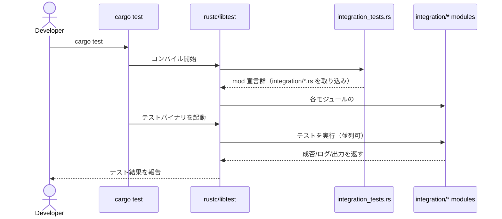

# integration_tests.rs Review

## TL;DR

- 目的: integration/ 配下の複数の統合テストファイルを Rust のテストランナーに認識させるための「集約ゲートウェイ」モジュール
- 公開API: なし（すべてファイル内スコープの mod 宣言）。テスト関数は各サブモジュール内で定義・検出される
- コアロジック: #[path = "..."] 属性で外部パスのテストファイルをモジュールとして取り込むだけ。実行時ロジックは存在しない
- 複雑箇所: なし。保守上の落とし穴は「パスのタイポ」「重複モジュール名」「テストの並列実行時の共有状態」
- 重大リスク: OS/環境差によるパス解決不一致、CI とローカルでの差異、サブモジュール内のグローバル状態衝突（並列テスト）
- Rust安全性/エラー/並行性: 本ファイルは安全・同期なしだが、並列実行時の衝突はサブモジュール側で発生し得るため注意
- 推奨: tests/ 標準構成と cfg(test) の整備、共通フィクスチャの共通化、ログ/トレースの初期化ユーティリティ導入

## Overview & Purpose

本ファイルは integration/ ディレクトリに配置された多数の統合テストファイルを、1つのテストバイナリ（例: cargo test 実行時）としてコンパイル・実行させるための集約ポイントです。Rust の #[path = "..."] 属性で外部ファイルをモジュールとして取り込み、mod test_xxx; の宣言によりサブモジュール内の #[test] 関数をテストランナーに発見させます。

このファイル自体はロジックを持たず、アプリの機能実装には影響しません。テストの発見・編成・依存関係の管理を容易にするのが主目的です。

## Structure & Key Components

| 種別 | 名前 | 公開範囲 | 責務 | 複雑度 |
|------|------|----------|------|--------|
| Module | test_mcp_schema | private | integration/test_mcp_schema.rs を取り込む | Low |
| Module | embedding_model_comparison | private | integration/embedding_model_comparison.rs を取り込む | Low |
| Module | test_resolution_persistence | private | integration/test_resolution_persistence.rs を取り込む | Low |
| Module | test_init_module | private | integration/test_init_module.rs を取り込む | Low |
| Module | test_parse_command | private | integration/test_parse_command.rs を取り込む | Low |
| Module | test_settings_init_integration | private | integration/test_settings_init_integration.rs を取り込む | Low |
| Module | test_project_registry | private | integration/test_project_registry.rs を取り込む | Low |
| Module | test_config_path_resolution | private | integration/test_config_path_resolution.rs を取り込む | Low |
| Module | test_cross_module_resolution | private | integration/test_cross_module_resolution.rs を取り込む | Low |
| Module | test_python_cross_module_resolution | private | integration/test_python_cross_module_resolution.rs を取り込む | Low |
| Module | test_provider_initialization | private | integration/test_provider_initialization.rs を取り込む | Low |
| Module | test_typescript_alias_relationships | private | integration/test_typescript_alias_relationships.rs を取り込む | Low |
| Module | test_typescript_object_property_call | private | integration/test_typescript_object_property_call.rs を取り込む | Low |
| Module | test_external_import_resolution | private | integration/test_external_import_resolution.rs を取り込む | Low |
| Module | test_gdscript_mcp | private | integration/test_gdscript_mcp.rs を取り込む | Low |
| Module | test_kotlin_semantic_search | private | integration/test_kotlin_semantic_search.rs を取り込む | Low |

コード例（代表抜粋）:
```rust
#[path = "integration/test_mcp_schema.rs"]
mod test_mcp_schema;

/* ... 省略 ... */

#[path = "integration/test_kotlin_semantic_search.rs"]
mod test_kotlin_semantic_search;
```

### Dependencies & Interactions

- 内部依存: なし（本ファイル内で関数呼び出しやデータ共有は行っていません）
- 外部依存（ツール/仕組み）:
  | 区分 | 名称 | 用途 |
  |------|------|------|
  | コンパイラ機能 | #[path] 属性 | 外部ファイルをモジュールとして取り込む |
  | テストランナー | libtest（cargo test） | #[test] 関数の検出・実行 |

- 被依存推定:
  - cargo test 実行時にテストバイナリとして本ファイルが参照されます
  - 他のアプリケーションコードからこのモジュールを参照する設計ではありません（テスト専用）

## API Surface (Public/Exported) and Data Contracts

| API名 | シグネチャ | 目的 | Time | Space |
|-------|-----------|------|------|-------|
| 該当なし | 該当なし | 本ファイルは公開APIを提供しない | - | - |

- 目的と責務: テストモジュールの集約のみ。公開関数・型・データ契約は存在しません
- アルゴリズム: なし（コンパイル時のモジュール解決のみ）
- 引数/戻り値/使用例/エッジケース: 該当なし

このチャンクには公開API定義が存在しないため、詳細は不明/該当なしです。

## Walkthrough & Data Flow

- コンパイル時:
  1. 本ファイルの mod 宣言が評価され、#[path] で示した各ファイルがモジュールとして取り込まれる
  2. 各モジュール内の #[test] 関数がテストランナーに登録される
- 実行時:
  1. cargo test により生成されたテストバイナリが起動
  2. 登録済みのテスト関数群が並列/順次で実行される（デフォルトは並列）

シーケンス図（テスト検出と実行の流れ）:

上記の図は integration_tests.rs におけるモジュール取り込みとテスト実行の主要フローを示します（本チャンクの mod 宣言全体に対応）。

## Complexity & Performance

- 本ファイル自身の時間計算量/空間計算量: O(1)
- ビルド（コンパイル）観点:
  - 取り込むモジュール数を M とすると、コンパイル時間/リンキングは概ね O(M) で増加
- 実行（テスト）観点:
  - 実行コストは各サブモジュールのテスト内容に依存（I/O、ネットワーク、DB、外部プロセスなど）
  - cargo test の既定ではテストは並列実行され得るため、グローバル資源に対する競合がボトルネックになる可能性
- スケール限界:
  - テストファイル数の増加に伴うビルド時間の増大
  - 同時実行数に対する外部リソース（ポート、ファイルハンドル、DB接続）枯渇

## Edge Cases, Bugs, and Security

セキュリティチェックリスト
- メモリ安全性: 本ファイルに unsafe は存在せず、バッファオーバーフロー/Use-after-free/整数オーバーフローの懸念なし
- インジェクション: 本ファイルは外部入力を扱わない。SQL/コマンド/パス・トラバーサルの懸念なし
- 認証・認可: 該当なし
- 秘密情報: 本ファイル内にハードコード秘密情報はなし。ログ漏えいはサブモジュール実装に依存
- 並行性: 本ファイルは共有状態を持たない。テストの並列実行に伴う競合はサブモジュール側の設計課題

エッジケース詳細

| エッジケース | 入力例 | 期待動作 | 実装 | 状態 |
|-------------|--------|----------|------|------|
| パスのタイポ | #[path = "integration/typo.rs"] | コンパイルエラーで失敗 | mod 宣言 | コンパイラが検出 |
| モジュール名重複 | 同一ファイルで同名の mod を二重定義 | 再定義エラー | mod 宣言 | コンパイラが検出 |
| OS依存のパス区切り | Windows と POSIX の差 | #[path] は相対パス文字列として処理されるため共通 | #[path] 利用 | 通常問題なし |
| テストの並列実行による衝突 | グローバル一時ディレクトリの共有 | テスト毎に分離/直列化 | 本ファイルでは未制御 | サブモジュールで要対策 |
| 環境依存の設定 | ENV 必須のテスト | ENV が未設定ならスキップ/明示的エラー | 本ファイルでは未制御 | サブモジュールで要対策 |
| ビルド対象の誤配置 | 本ファイルが src/ に置かれている | cfg(test) でのみコンパイル | 本ファイルは設定不明 | 配置に依存（不明） |
| テスト順序依存 | A テストが B に依存 | 順序非依存の設計/fixture 化 | 本ファイルでは未制御 | サブモジュールで要改善 |
| 非ASCIIパス | integration/日本語.rs | コンパイラがパスを解決 | #[path] 依存 | 環境依存で要確認 |

Rust特有の観点（本ファイル）
- 所有権/借用/ライフタイム: 関数やデータを持たないため該当なし
- unsafe 境界: なし
- 並行性・非同期: Send/Sync 境界や await は登場しない
- エラー設計: Result/Option の扱いなし、panic を誘発するコードもなし
- 根拠（関数名:行番号）: このファイルには関数定義が存在しないため、該当箇所の行番号提示は不明

## Design & Architecture Suggestions

- #[path] を使う現構成の維持前提での改善
  - テスト群を論理グルーピングする親モジュールを導入
    ```rust
    // tests/integration_tests.rs
    mod integration {
        #[path = "integration/test_mcp_schema.rs"]
        mod test_mcp_schema;
        /* ... */
    }
    ```
  - 共有フィクスチャ/ユーティリティを tests/common/ に集約し、各モジュールで use common::*; する
  - 遅い/外部依存のテストには #[ignore] や feature/cfg によるゲーティングを付与

- 標準構成への寄せ
  - 可能なら tests/integration/*.rs を各々独立バイナリとして配置し、集約ファイル不要にする（tests ディレクトリ直下の .rs は自動検出対象）
  - サブディレクトリ運用が必要な場合は、現行の集約方式（#[path]）は妥当

- 変更容易性の向上
  - 新規テスト追加の手順を CONTRIBUTING などに明文化（ファイル作成＋mod 追記）
  - mod 宣言のアルファベット順整列と重複防止の pre-commit チェック

- 直列実行が必要なテスト対策
  - serial_test などのクレート導入、またはグローバル資源をテスト毎に分離する仕組みを整備

## Testing Strategy (Unit/Integration) with Examples

- 統合テストファイルの基本例
```rust
// integration/test_example.rs
#[test]
fn it_works_end_to_end() {
    // Arrange
    // ... 初期化やフィクスチャ ...

    // Act
    // ... 外部I/Oや複数モジュールの連携を実行 ...

    // Assert
    assert!(true);
}
```

- 非同期テスト（tokio）の例
```rust
// integration/test_async.rs
#[tokio::test(flavor = "multi_thread", worker_threads = 2)]
async fn async_integration_works() {
    // 非同期の初期化
    // ... await を含む処理 ...
    assert_eq!(2 + 2, 4);
}
```

- ログを有効化して実行（後述の Observability と併用）
  - 実行: RUST_LOG=info cargo test -- --nocapture
  - 長時間/外部依存テストには #[ignore] を付け、手動実行: cargo test -- --ignored

- 部分実行
  - ファイル名/テスト名でフィルタ: cargo test test_mcp_schema

## Refactoring Plan & Best Practices

- Step 1: mod 宣言の整列・重複監視
  - CI で grep/スクリプトにより重複 mod 名や死活ファイルの検出を追加

- Step 2: 共通セットアップの共通化
  - tests/common/mod.rs を作成し、ログ初期化、テンポラリディレクトリ作成、テスト用設定読み込みなどを集約
  - 各テストで use crate::common::*;（tests 直下のバイナリでは crate 参照に注意）

- Step 3: 並列実行安全化
  - グローバル資源（ポート、ファイル、DB）をテストケース毎に分離
  - 必要に応じて直列化（serial_test）を導入

- Step 4: 遅い・不安定なテストの切り分け
  - #[ignore] とラベル運用、feature flag で明確にビルド/実行を切替

- Step 5: ドキュメント整備
  - 新規テスト追加手順、命名規約（test_*.rs）、実行オプションを文書化

## Observability (Logging, Metrics, Tracing)

- ログ初期化の推奨例（共通ユーティリティ）
```rust
// tests/common/mod.rs
use once_cell::sync::Lazy;
use std::sync::Once;

static INIT: Once = Once::new();
pub fn init_logging() {
    INIT.call_once(|| {
        let _ = env_logger::builder().is_test(true).try_init();
    });
}
```

- 各テストでの利用
```rust
// integration/test_example.rs
use crate::common::init_logging;

#[test]
fn it_logs() {
    init_logging();
    log::info!("integration test running");
    assert!(true);
}
```

- tracing を使う場合
```rust
// tests/common/tracing.rs
use once_cell::sync::Lazy;
use tracing_subscriber::{fmt, EnvFilter};

static INIT: Lazy<()> = Lazy::new(|| {
    let _ = tracing_subscriber::fmt()
        .with_env_filter(EnvFilter::from_default_env())
        .with_test_writer()
        .try_init();
});

pub fn init_tracing() { Lazy::force(&INIT); }
```

- メトリクスは統合テストでは過剰なことが多いが、ベンチマークや大規模 E2E では計測（time, histogram）を入れてもよい

## Risks & Unknowns

- サブモジュールの中身はこのチャンクには現れないため、不明
  - 具体的なエラー処理・メモリ安全性・非同期境界・外部I/O 仕様は各ファイル依存で未確認
- 本ファイルの配置（tests/ 直下か src/ 配下か）は不明
  - src/ にある場合は cfg(test) が必須。tests/ にあるなら不要
- CI とローカルでの環境差（パス、権限、ネットワーク可用性）によるテストの不安定化
- 並列実行時のグローバル状態の衝突は本ファイルでは防げないため、各テストの設計ガイドラインが必要

以上より、本ファイル自体は単純・安全ですが、統合テスト全体の健全性は「各サブモジュールの設計・観測性・並列安全性」に大きく依存します。