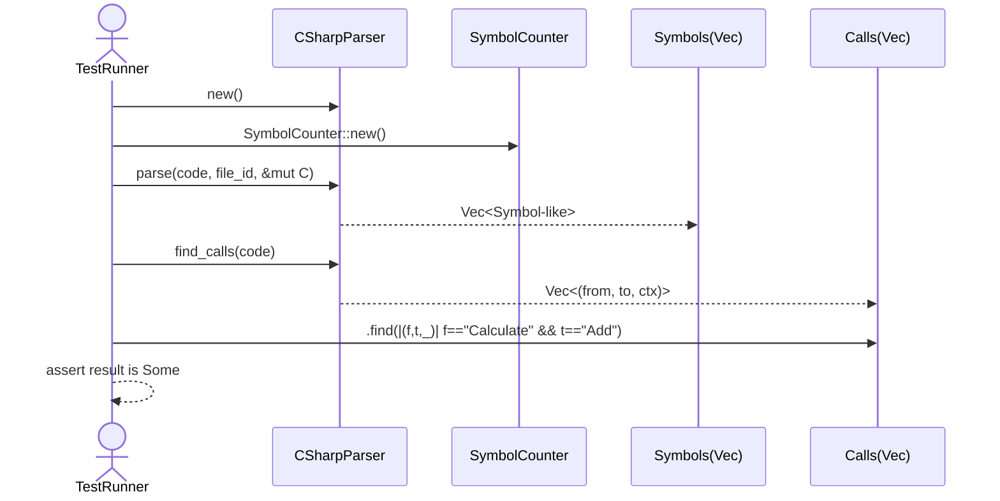

# parsers\csharp\test_parser.rs Review

## TL;DR

- 目的: C#コードからの**シンボル抽出**（クラス/メソッド）と**XMLドキュメントコメント**、**名前空間**、**メソッド呼び出し関係**の検出をCSharpParserで検証するテスト。
- 主要外部API: CSharpParserの**new**, **parse**, **find_calls**。parseはSymbolCounterとFileIdを受け取り、symbolsを返す。find_callsは呼び出しエッジのタプル列を返す。
- 複雑箇所: XMLドキュメントコメントの**複数行**抽出とタグ維持、**名前空間追跡**、**呼び出し元コンテキスト**を含むメソッド呼び出し検出。
- 重大リスク: `assert!`のメッセージで`{doc}`等を使っており、Rustでは文字列補間されないため情報が表示されず**デバッグ困難**。
- Rust安全性: **unsafeなし**、所有権/借用は適正。`unwrap`/`expect`の使用はテストでは妥当だが、失敗時は**panic**。
- 並行性: 本テストは**単一スレッド**。CSharpParserのSend/Syncは不明。
- 不明点: Symbol構造の詳細、find_callsの3番目要素の意味、解析アルゴリズムの内部は**このチャンクには現れない**。

## Overview & Purpose

このファイルは、codannaクレートのC#パーサ（CSharpParser）が以下を正しく行うかを検証する単体テストです。

- クラス・メソッドの**シンボル抽出**と**XMLドキュメントコメント**の取得（summaryタグ含む複数行テキスト）。
- **名前空間**の追跡（module_pathに"MyApp.Services"が設定される）。
- **メソッド呼び出し**関係の検出（Calculate -> Add）。

テストは3つの`#[test]`関数で構成され、外部API `CSharpParser::new`, `LanguageParser::parse`, `CSharpParser::find_calls` を使用します。

## Structure & Key Components

| 種別 | 名前 | 公開範囲 | 責務 | 複雑度 |
|------|------|----------|------|--------|
| Function | test_csharp_parser_basic | private(test) | クラス/メソッドの抽出とXMLドキュメントコメントの検証 | Med |
| Function | test_csharp_namespace_tracking | private(test) | 名前空間(module_path)の追跡とドキュメントの存在検証 | Low |
| Function | test_csharp_method_calls | private(test) | メソッド呼び出し関係の検出（Calculate -> Add）とドキュメント検証 | Med |
| Struct(外部) | CSharpParser | 不明 | C#コードの解析器 | 不明 |
| Trait(外部) | LanguageParser | 不明 | 汎用パーサインターフェース（parseメソッドを提供） | 不明 |
| Struct(外部) | FileId | 不明 | ファイル識別子（`new(1).unwrap()`で作成） | Low |
| Struct(外部) | SymbolCounter | 不明 | シンボルカウンタ（parseへ可変参照で渡す） | Low |

### Dependencies & Interactions

- 内部依存:
  - 各テスト関数は共通して`CSharpParser::new`→`parser.parse(code, file_id, &mut counter)`→結果検証を行います。
  - `test_csharp_method_calls`のみ追加で`parser.find_calls(code)`を利用し、呼び出しエッジを確認します。

- 外部依存（使用クレート・モジュール）:

| クレート/モジュール | 型/関数 | 用途 |
|--------------------|---------|------|
| codanna::parsing::LanguageParser | Trait | `parse`メソッドのスコープに必要（トレイトメソッド呼び出し解決） |
| codanna::parsing::csharp::CSharpParser | Struct | C#解析器の生成・メソッド呼び出し |
| codanna::types::FileId | Struct | ファイル識別子の生成 |
| codanna::types::SymbolCounter | Struct | シンボルのカウント管理、`parse`に渡す |

- 被依存推定:
  - テストランナー（`cargo test`）のみが直接このモジュールを使用。プロダクションコードからの直接利用は**不明**。

## API Surface (Public/Exported) and Data Contracts

このファイル自体に公開APIはありません（テストのみ）。参考として、テストが利用する外部APIを列挙します。

| API名 | シグネチャ | 目的 | Time | Space |
|-------|-----------|------|------|-------|
| CSharpParser::new | 不明 | C#パーサのインスタンス生成 | O(1) 推定 | O(1) 推定 |
| LanguageParser::parse | 使用形: `parse(code, file_id, &mut counter)` | C#コードからシンボル抽出とドキュメントコメント取得 | O(n) 推定 | O(n) 推定 |
| CSharpParser::find_calls | 使用形: `find_calls(code)` | コード中のメソッド呼び出しエッジ検出 | O(n) 推定 | O(k) 推定（検出エッジ数） |

詳細（外部API; このチャンクに定義はないため挙動はテストからの推測）:

1) parse
- 目的と責務: C#ソースからクラス/メソッド等のシンボルを抽出し、各シンボルに対して`name`、`doc_comment`（XMLドキュメントのsummary含む）、`module_path`（名前空間）を設定する。
- アルゴリズム（推測）:
  - 入力`&str`を字句/構文解析。
  - `namespace`宣言を読み取り、現在の名前空間コンテキストを維持。
  - クラス/メソッド宣言の直前にある`///`や`XML`コメントを連結して`doc_comment`に格納。
  - シンボルを収集して返却。
- 引数:

| 引数名 | 型 | 役割 |
|-------|----|------|
| code | &str | 解析対象のC#ソース |
| file_id | FileId | ファイル識別子 |
| counter | &mut SymbolCounter | シンボルIDやカウント管理 |

- 戻り値:

| 型 | 説明 |
|----|------|
| Vec<Symbol類似> | 各要素は少なくとも`name`、`doc_comment: Option<String>`、`module_path: Option<String>`フィールドを持つ（テストからの推測） |

- 使用例（本ファイルより）:
```rust
let mut parser = CSharpParser::new().expect("Failed to create C# parser");
let file_id = FileId::new(1).unwrap();
let mut counter = SymbolCounter::new();
let symbols = parser.parse(code, file_id, &mut counter);
```

- エッジケース:
  - XMLコメントが複数行でもsummaryタグ含めて維持されるべき。
  - 名前空間未指定の場合の`module_path`は`None`になる可能性（このチャンクには現れない）。

2) find_calls
- 目的と責務: コード内のメソッド呼び出し関係（呼び出し元→呼び出し先）を抽出。呼び出し元コンテキストを保持する可能性（第3要素）。
- アルゴリズム（推測）:
  - ソースを走査し、メソッド本体内の呼び出し式を検出。
  - 呼び出し元メソッド名、呼び出し先メソッド名、追加コンテキスト（未判明）をタプルとして収集。
- 引数:

| 引数名 | 型 | 役割 |
|-------|----|------|
| code | &str | 解析対象のC#ソース |

- 戻り値:

| 型 | 説明 |
|----|------|
| Vec<(String類似, String類似, 不明)> | 各タプルは（from, to, context?）。第3要素の意味は不明。 |

- 使用例（本ファイルより）:
```rust
let calls = parser.find_calls(code);
let calculate_to_add = calls
    .iter()
    .find(|(from, to, _)| *from == "Calculate" && *to == "Add");
assert!(calculate_to_add.is_some());
```

- エッジケース:
  - privateメソッドへの呼び出しも検出対象（本テストの`Add`はprivate）。
  - オーバーロードや名前空間/クラス越えの呼び出し分解は不明。

## Walkthrough & Data Flow

- test_csharp_parser_basic
  - 入力コードには`namespace TestNamespace`、`public class TestClass`、`public void TestMethod`が含まれ、各々にXMLドキュメントコメント（summaryタグ）が付与。
  - フロー:
    1. パーサ生成 → FileId生成 → SymbolCounter生成。
    2. `parse`で`symbols`取得。
    3. `symbols`から`name == "TestClass"`のシンボル探索。
    4. `doc_comment`が存在し、`<summary>...A test class... </summary>`を含むことを検証。
    5. `name == "TestMethod"`のシンボル探索。
    6. メソッドの`doc_comment`に「Prints a greeting message...」と`<summary>`が含まれることを検証。
  - 関連コード抜粋:
```rust
let symbols = parser.parse(code, file_id, &mut counter);

assert!(!symbols.is_empty(), "Should extract symbols from C# code");

let class_symbol = symbols.iter().find(|s| &*s.name == "TestClass");
assert!(class_symbol.is_some(), "Should find TestClass");

let class = class_symbol.unwrap();
assert!(class.doc_comment.is_some(), "Should extract XML documentation from TestClass");
let doc = class.doc_comment.as_ref().unwrap();
assert!(doc.contains("<summary>"), "Documentation should contain summary tag, got: {doc}");
/* ... 省略 ... */
```

- test_csharp_namespace_tracking
  - 入力コードには`namespace MyApp.Services`と`public class DataService`。
  - `parse`後、`"DataService"`シンボルの`module_path`が`Some("MyApp.Services")`であることを検証。
  - 関連コード抜粋:
```rust
let symbols = parser.parse(code, file_id, &mut counter);
let class = symbols.iter().find(|s| &*s.name == "DataService").unwrap();
assert_eq!(class.module_path.as_deref(), Some("MyApp.Services"));
```

- test_csharp_method_calls
  - 入力コードには`public class Calculator`、`private int Add(int a, int b)`、`public int Calculate()`があり、Calculate内でAddを呼び出す。
  - `parse`でシンボル抽出後、`find_calls(code)`により呼び出し関係を取得。
  - `("Calculate", "Add", _)`のエッジが含まれることを検証。さらに`Calculate`のドキュメントコメントを検証。
  - Mermaid（フロー図）:

  - 該当コード範囲: 関数`test_csharp_method_calls`（本ファイル内）。

## Complexity & Performance

- parse: 入力長nに対してO(n)時間・O(n)空間（トークン化/AST構築/シンボル蓄積とコメント文字列保持を考慮、推定）。
- find_calls: 入力長nに対してO(n)時間・O(k)空間（検出した呼び出しエッジ数k、推定）。
- テスト自体の負荷は小さく、I/O・ネットワーク・DBは不使用。
- ボトルネック（推定）:
  - 大規模ファイル解析時のコメント連結とシンボル収集。
  - 呼び出し解析のスキャンコスト。
- スケール限界（推定）:
  - 巨大ソースでのメモリアロケーション（コメントテキストやシンボル配列）増加。

## Edge Cases, Bugs, and Security

- エッジケース詳細表:

| エッジケース | 入力例 | 期待動作 | 実装 | 状態 |
|-------------|--------|----------|------|------|
| 空文字列 | "" | `symbols`が空、`calls`が空 | このチャンクには現れない | 不明 |
| 名前空間なし | classのみ | `module_path`がNone | このチャンクには現れない | 不明 |
| 複数行XMLコメント | summaryが複数行 | summary開始/終了タグを保持しつつ全文取得 | テストで検証済（basic） | OK |
| privateメソッド呼び出し | Calculate→Add(private) | 呼び出しエッジを検出 | テストで検証済 | OK |
| 返り値タグ | `<returns>...` | returns情報がdoc_commentに含まれるか | このチャンクには現れない | 不明 |

- 既知/潜在バグ:
  - 重大: `assert!`のエラーメッセージに`"got: {doc}"`や`"got: {method_doc}"`を記述しているが、Rustの文字列リテラルでは**補間されない**。期待通りに内容が表示されず、失敗時の診断が難しくなる。修正例:
    - `assert!(doc.contains("<summary>"), "Documentation should contain summary tag, got: {}", doc);`
    - `assert!(method_doc.contains("<summary>"), "Documentation should at least contain summary tag, got: {}", method_doc);`
  - `LanguageParser`の`use`は、トレイトメソッド呼び出し（`parse`）の解決に必要と思われるため妥当。不要と判断して削除すると**メソッドが見つからない**コンパイルエラーになる可能性がある。

- セキュリティチェックリスト:
  - メモリ安全性: unsafeブロックは**なし**。Buffer overflow / Use-after-free / Integer overflowの懸念は**なし**（Rust安全性と文字列操作のみ）。
  - インジェクション: SQL/Command/Path traversalは**該当なし**（外部I/Oなし、テスト入力のみ）。
  - 認証・認可: **該当なし**。
  - 秘密情報: **該当なし**。ログ漏えいも**該当なし**（ただしassertメッセージの改善推奨）。
  - 並行性: **Race/Deadlockの懸念なし**。同期原語は未使用。

### Rust特有の観点（詳細チェックリスト）

- 所有権:
  - `parser`は`mut`で保持し、`parse`に`&mut self`が渡される（`parser.parse(...)`）。`SymbolCounter`も`&mut`借用。
  - `symbols`は`parse`の戻り値（所有権を取得するコレクション）で、後続の`iter()`で不変借用。
- 値の移動箇所: `FileId::new(1).unwrap()`で生成された`file_id`は`parse`へ移動ではなくコピー/参照渡し（型の詳細は不明だが、借用/コピーが行われる）。
- 借用:
  - `doc_comment.as_ref().unwrap()`でOption内部の`String`を参照借用し、`contains`の間のみ生存。
- ライフタイム: 明示的ライフタイムは**不要**。ローカル変数のスコープに限定。
- unsafe境界:
  - **使用なし**。
- 並行性・非同期:
  - `Send/Sync`境界は**不明**。非同期`await`は**なし**。
- キャンセル: **該当なし**。
- エラー設計:
  - テストでの`unwrap`/`expect`は妥当（失敗時に早期にpanic）。本番コードではエラー型の`Result`を返す設計が望ましい。
  - `assert*`系におけるメッセージ整形の見直し推奨。

## Design & Architecture Suggestions

- テスト共通処理の切り出し:
  - パーサ生成・`FileId`/`SymbolCounter`作成をヘルパー関数へ抽出して重複を削減。
  - 例: `fn setup() -> (CSharpParser, FileId, SymbolCounter) { /*...*/ }`
- 期待値の表現強化:
  - `assert!`メッセージの**文字列補間修正**。失敗時に実際の`doc_comment`内容や`calls`一覧を出力。
- データ契約の明確化（別モジュールで）:
  - Symbolのフィールド仕様（`name`, `doc_comment`, `module_path`, 位置情報など）をドキュメント化。
  - `find_calls`の第3要素の意味を明示（例: 呼び出し位置、クラス名、完全修飾名など）。
- 名前解決/可視性のテスト追加:
  - private/publicのフィルタリング、静的メソッド/拡張メソッド、同名メソッドオーバーロードの扱い。

## Testing Strategy (Unit/Integration) with Examples

- 追加ユニットテスト提案:
  - コメントのバリエーション:
    - `///`連続行、`/** ... */`ブロック、タグの入れ子（remarks/param/returns）。
  - 名前空間なし/入れ子名前空間:
    - `namespace A { namespace B { ... } }`での`module_path`。
  - 構文多様性:
    - レコード、プロパティ、イベント、インターフェイス、構造体。
  - 呼び出し解析拡張:
    - 同クラス外呼び出し、静的メソッド、オーバーロード、名前空間付き呼び出し、ジェネリックメソッド。

- 例: 失敗時の情報を含むアサートの改善
```rust
#[test]
fn test_summary_tag_presence() {
    let code = r#"
public class X {
    /// <summary>
    /// Hello
    /// </summary>
    void M() {}
}
"#;
    let mut parser = CSharpParser::new().expect("Failed to create parser");
    let file_id = FileId::new(1).unwrap();
    let mut counter = SymbolCounter::new();
    let symbols = parser.parse(code, file_id, &mut counter);

    let m = symbols.iter().find(|s| &*s.name == "M").expect("M not found");
    let doc = m.doc_comment.as_deref().expect("Missing doc_comment");
    assert!(doc.contains("<summary>"), "Expected summary tag, got: {}", doc);
}
```

- 例: 呼び出し情報の完全修飾名検証（仮にfind_callsがクラス名を含む場合）
```rust
#[test]
fn test_cross_class_calls() {
    let code = r#"
namespace N {
  public class A { public void M() { new B().N(); } }
  public class B { public void N() {} }
}
"#;
    let mut parser = CSharpParser::new().expect("Failed to create parser");
    let calls = parser.find_calls(code);
    assert!(calls.iter().any(|(f, t, _)| *f == "M" && *t == "N"),
        "Calls: {:?}", calls.iter().map(|(f,t,_)| format!("{f}->{t}")).collect::<Vec<_>>());
}
```

## Refactoring Plan & Best Practices

- 重複除去:
  - パーサ・カウンタ・FileId生成のヘルパー化。
- 可読性:
  - `as_deref()`の活用（既存も使用中）。`let doc = symbol.doc_comment.as_deref().unwrap();`
- エラーメッセージ補間:
  - `assert!(cond, "..., got: {}", value)`へ統一。
- 安全性:
  - `unwrap()`はテストでは許容だが、`expect("...")`に統一すると意図が明確。
- コレクション探索:
  - 頻出パターン（名前検索）をヘルパーに抽出。`fn find_symbol<'a>(symbols: &'a [S], name: &str) -> Option<&'a S>`

## Observability (Logging, Metrics, Tracing)

- 現状: 本ファイル内に**ログ/メトリクス/トレースなし**。
- 提案:
  - 解析時間メトリクス（コードサイズ対時間）をテストで収集し、退行検知。
  - パーサ内部に`debug`ログ（トークン数、検出シンボル数、ドキュメント抽出件数、呼び出しエッジ数）。
  - `tracing`（もし採用している場合）で関数境界・重大分岐のスパンを追加。

## Risks & Unknowns

- 不明:
  - Symbolの完全なデータ構造（位置情報、アクセス修飾子、型情報など）。
  - `find_calls`の第3要素の意味。
  - CSharpParserの内部アルゴリズム（字句解析器/パーサの種類、コメント処理詳細）。
  - `LanguageParser`トレイトの仕様（ジェネリック境界、エラー型）。
- リスク:
  - 文字列補間の誤用により、失敗時の**診断可能性が低下**。
  - 解析の精度に関する仕様不確定（オーバーロード、拡張メソッド、LINQクエリなどの扱いは未テスト）。
  - 大規模コードの性能退行の検出が困難（計測なし）。