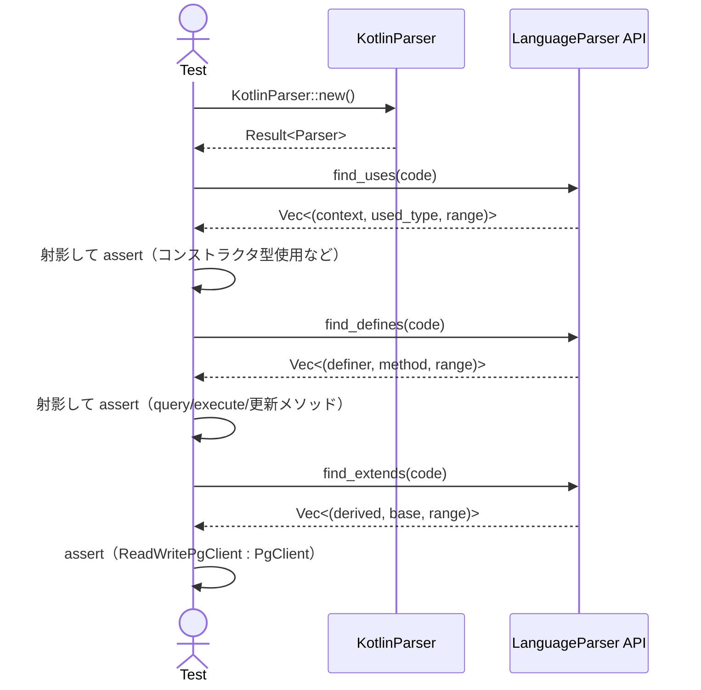

# parsers\kotlin\test_integration.rs Review

## TL;DR

- 本ファイルは、KotlinParser の統合レベルの振る舞いを検証するテストで、特に「コンストラクタ引数」と「data class の引数」の型使用検出、メソッド定義抽出、継承関係抽出の回帰をカバーする。
- 公開APIは本ファイルには存在しないが、外部APIとして KotlinParser::new、LanguageParser トレイトの find_uses/find_defines/find_extends を使用している。
- 重要な仕様（検出対象）:
  - 型使用: クラス/データクラスのコンストラクタ引数に現れる型（例: PgClient, ReadWritePgClient, User, UserSettings, PermissionSet）
  - メソッド定義: クラス内メソッド（query, execute, updateCurrencyCollections）
  - 継承: class ReadWritePgClient : PgClient
- 重大リスク: テスト内のKotlin断片は静的型検証的には不完全な箇所があるが、構文トークン抽出ベースのパーサなら実害は少ない。実際の構文解析器実装の仕様に依存し、将来バージョンで壊れやすい可能性がある。
- Rust安全性: unsafeなし、同期処理のみ、所有権/借用の問題はなし。エラーは expect で即時失敗（テストとしては妥当）。
- カバレッジの不足: ジェネリクス、ネスト型、拡張関数、プロパティ/アクセサ、sealed/enum、型エイリアス、import/パッケージ等は未検証。

## Overview & Purpose

このファイルは、codanna の Kotlin パーサ（KotlinParser）が現実的なKotlinコード断片に対し、以下の3機能を正しく提供できるかを検証する統合テストである。

- 型使用の検出（find_uses）
- メソッド定義の検出（find_defines）
- 継承関係の検出（find_extends）

特に「クラスのコンストラクタ引数」と「data class の引数」における型使用を検出する回帰が主目的であり、コメントにも「THIS WAS THE BUG!」と明記されている通り、過去に検出漏れがあった箇所の再発防止が狙いである。

## Structure & Key Components

| 種別 | 名前 | 公開範囲 | 責務 | 複雑度 |
|------|------|----------|------|--------|
| Function | test_kotlin_readwritepgclient_example | private (#[test]) | 実運用に近いKotlin断片での型使用・メソッド定義・継承の検出を検証 | Med |
| Function | test_kotlin_data_class_with_types | private (#[test]) | data class のコンストラクタ引数の型使用検出を検証 | Low |

- 主要概念
  - KotlinParser: Kotlin ソースコードを解析する実装。new() でインスタンス化。
  - LanguageParser トレイト: find_uses, find_defines, find_extends を提供。
  - uses/defines/extends の戻り値はタプルのベクタで、第三要素 range は start_line フィールドを持つ構造（型名はこのチャンクには現れない）。

### Dependencies & Interactions

- 内部依存
  - 2つのテスト関数はいずれも KotlinParser を生成し、LanguageParser トレイトのメソッド find_uses/find_defines/find_extends を呼び出して結果を検証する。
  - テスト内で共通する補助ロジック（Vec<(String, String)> 作成）が重複している。

- 外部依存（推定）

| 依存 | 用途 | 備考 |
|------|------|------|
| codanna::parsing::kotlin::KotlinParser | 解析器本体の生成とメソッド呼び出し | new() は Result を返すため expect で強制成功 |
| codanna::parsing::LanguageParser | パーサ共通API（find_uses, find_defines, find_extends） | 実体は KotlinParser 実装 |

- 被依存推定
  - このテストファイルを参照するのはRustのテストランナーのみ。他のモジュールからの利用はない。

## API Surface (Public/Exported) and Data Contracts

このファイル自体の公開API: 該当なし（#[test]関数のみ）

このファイルが利用する外部API（推定）

| API名 | シグネチャ | 目的 | Time | Space |
|-------|-----------|------|------|-------|
| KotlinParser::new | fn new() -> Result<KotlinParser, E> | Kotlin パーサのインスタンス化 | 不明 | 不明 |
| LanguageParser::find_uses | fn find_uses(&self or &mut self, code: &str) -> Vec<(String, String, RangeLike)> | 型使用（context, used_type, range）を列挙 | 不明 | 不明 |
| LanguageParser::find_defines | fn find_defines(&self or &mut self, code: &str) -> Vec<(String, String, RangeLike)> | メソッド定義（definer, method, range）を列挙 | 不明 | 不明 |
| LanguageParser::find_extends | fn find_extends(&self or &mut self, code: &str) -> Vec<(String, String, RangeLike)> | 継承関係（derived, base, range）を列挙 | 不明 | 不明 |

詳細（各APIの期待契約を、テストから読み取れる範囲で記述）

1) KotlinParser::new
- 目的と責務
  - Kotlin ソースを解析するためのパーサインスタンスを生成する。
- アルゴリズム
  - 生成処理（不明）。Result を返却。
- 引数
  - なし
- 戻り値
  - Ok(KotlinParser) または Err(E)（E の型はこのチャンクには現れない）
- 使用例
  ```rust
  let mut parser = KotlinParser::new().expect("Failed to create parser");
  ```
- エッジケース
  - 不正な初期化条件（辞書やルールの読み込み失敗など）で Err。テストでは expect により即時失敗。

2) LanguageParser::find_uses
- 目的と責務
  - Kotlin コードにおける「どのコンテキスト（クラスなど）がどの型を使用しているか」を列挙する。
- アルゴリズム（推定）
  - 構文/字句解析によりクラス宣言・data class・コンストラクタ引数などを走査し、使用型を抽出。
- 引数

| 名称 | 型 | 役割 |
|------|----|------|
| code | &str | Kotlin ソース文字列 |

- 戻り値

| 要素 | 型 | 意味 |
|------|----|------|
| context | String | 使用コンテキスト名（例: "AuroraCurrencyRepository", "UserProfile"） |
| used_type | String | 使用された型名（例: "PgClient", "User"） |
| range | RangeLike | 出現位置。start_line フィールドが利用可能（型名は不明） |

- 使用例
  ```rust
  let uses = parser.find_uses(code);
  let use_pairs: Vec<(String, String)> = uses
      .iter()
      .map(|(context, used_type, _)| (context.to_string(), used_type.to_string()))
      .collect();
  assert!(use_pairs.contains(&("AuroraCurrencyRepository".into(), "PgClient".into())));
  ```
- エッジケース
  - 空入力: 戻り値は空配列が望ましい。
  - 構文エラーを含む入力: ベストエフォートで抽出するか、エラーにするかは実装依存（このチャンクには現れない）。
  - data class / コンストラクタ引数の型: 今回の回帰対象として必須検出。

3) LanguageParser::find_defines
- 目的と責務
  - 「どのクラスがどのメソッドを定義したか」を列挙する。
- アルゴリズム（推定）
  - クラス本体のメソッドシグネチャを抽出。
- 引数
  - code: &str
- 戻り値

| 要素 | 型 | 意味 |
|------|----|------|
| definer | String | 定義者（クラス名） |
| method | String | メソッド名 |
| range | RangeLike | 定義位置（start_line が利用可） |

- 使用例
  ```rust
  let defines = parser.find_defines(code);
  let define_pairs: Vec<(String, String)> = defines
      .iter()
      .map(|(definer, method, _)| (definer.to_string(), method.to_string()))
      .collect();
  assert!(define_pairs.contains(&("ReadWritePgClient".into(), "execute".into())));
  ```
- エッジケース
  - オーバーロードや拡張関数、アクセサ（get/set）などの扱いは不明。

4) LanguageParser::find_extends
- 目的と責務
  - クラスの継承/実装関係を抽出する。
- アルゴリズム（推定）
  - class A : B, C などの継承/実装リストを解析。
- 引数
  - code: &str
- 戻り値

| 要素 | 型 | 意味 |
|------|----|------|
| derived | String | 派生型（サブタイプ） |
| base | String | 基底型（スーパタイプ/インターフェース） |
| range | RangeLike | 関係が宣言された位置 |

- 使用例
  ```rust
  let extends = parser.find_extends(code);
  let extend_pairs: Vec<(String, String)> = extends
      .iter()
      .map(|(derived, base, _)| (derived.to_string(), base.to_string()))
      .collect();
  assert!(extend_pairs.contains(&("ReadWritePgClient".into(), "PgClient".into())));
  ```
- エッジケース
  - 複数インターフェース実装、ジェネリクス境界などの扱いは不明。

注: self 受け取りが &self か &mut self かはこのチャンクには現れない（mut 変数化はされているが、&self でも呼べる実装かは不明）。

## Walkthrough & Data Flow

- test_kotlin_readwritepgclient_example の流れ
  1. Kotlin の実例コード断片を文字列で定義（PgClient、ReadWritePgClient、AuroraCurrencyRepository など）。
  2. KotlinParser::new().expect(...) でパーサ生成。
  3. find_uses を呼んで型使用を収集し、(context, used_type) の組に射影して以下を検証:
     - ("AuroraCurrencyRepository", "PgClient")
     - ("AuroraCurrencyRepository", "ReadWritePgClient")
     → コンストラクタ引数に現れる型使用の検出の回帰。
  4. find_defines を呼び、(definer, method) に射影して以下を検証:
     - ("ReadWritePgClient", "query")
     - ("ReadWritePgClient", "execute")
     - ("AuroraCurrencyRepository", "updateCurrencyCollections")
  5. find_extends を呼び、(derived, base) に射影して以下を検証:
     - ("ReadWritePgClient", "PgClient")
- test_kotlin_data_class_with_types の流れ
  1. data class UserProfile(...) と補助クラス定義の文字列を用意。
  2. find_uses を実行し、(context, used_type) に射影して以下を検証:
     - ("UserProfile", "User")
     - ("UserProfile", "UserSettings")
     - ("UserProfile", "PermissionSet")

Mermaid（シーケンス図）



上記の図は test_kotlin_readwritepgclient_example 関数および test_kotlin_data_class_with_types 関数の主要な呼び出しと検証の流れ（該当コード範囲: 各関数全体）を示す。

## Complexity & Performance

- 本ファイル（テストコード）の計算量
  - find_uses/find_defines/find_extends の戻り値に対して Vec を射影・contains 検索（線形）：O(n)
  - 入力コードは短く、テストとしては十分軽量。
- パーサ自体の計算量・空間量
  - 実装詳細は不明。このチャンクには現れないため不明。
- ボトルネック
  - 現状なし（小規模入力）。
- 実運用負荷要因（推測）
  - 大規模ファイルやプロジェクト内多数ファイル解析時に I/O とパースの時間が支配的（本テストは対象外）。

## Edge Cases, Bugs, and Security

セキュリティ/堅牢性チェックリスト（このファイルの範囲）

- メモリ安全性: Rust 安全域のみ。unsafe 使用なし。Buffer overflow / UAF / 整数オーバーフローの懸念なし。
- インジェクション: 外部I/Oなし。SQL/Command/Path traversal の懸念なし。
- 認証・認可: 該当なし。
- 秘密情報: ハードコードされた秘密情報やログ漏えいなし。println でデバッグ情報を出力するが機密ではない。
- 並行性: 非同期・並列処理なし。レース/デッドロック懸念なし。

想定エッジケース（テスト観点）

| エッジケース | 入力例 | 期待動作 | 実装 | 状態 |
|-------------|--------|----------|------|------|
| 空文字列 | "" | すべての検出結果が空 | このチャンクには現れない | 未テスト |
| 構文エラーを含む | "class A(:){}" | ベストエフォート抽出 or 明確なエラー | このチャンクには現れない | 未テスト |
| ジェネリクス型使用 | "class R<T>(t:T)" | Tや具体型の検出 | このチャンクには現れない | 未テスト |
| ネストクラス | "class A{ class B(val u:U) }" | B の context で U を検出 | このチャンクには現れない | 未テスト |
| 複数インターフェース実装 | "class C: I1, I2" | (C,I1),(C,I2) の両方検出 | このチャンクには現れない | 未テスト |
| 拡張関数 | "fun X.foo(){}" | definer/context の扱い定義 | このチャンクには現れない | 未テスト |
| データクラスでデフォルト引数 | "data class D(val u:U=U())" | U の使用検出 | このチャンクには現れない | 未テスト |

既知の/回帰バグの文脈
- コメント「THIS WAS THE BUG!」より、以前はコンストラクタ引数の型使用検出が漏れていた。現テストはこれを回帰カバー。

Kotlin断片の妥当性に関する注意
- execute のシグネチャと呼び出し引数数が一致していないが、構文レベルの解析（型使用/定義/継承の抽出）には影響が小さい可能性が高い。構文厳格性が高いパーサ実装であれば誤解析リスクになり得る。

Rust特有の観点

- 所有権/借用
  - parser 変数は let mut で束縛。find_* 呼び出しで &self か &mut self かは不明だが、少なくとも可変借用の競合はない。
- ライフタイム
  - 文字列リテラルを &str で渡すのみ。明示的ライフタイムは不要。
- unsafe 境界
  - なし。
- 並行性/非同期
  - 同期テストのみ。Send/Sync の境界は不明（このチャンクには現れない）。共有状態の保護は不要。
- エラー設計
  - new() の失敗は expect で即時 panic。テストとして適切。その他の find_* は Result を返さず、失敗時の扱いは不明。

## Design & Architecture Suggestions

- テストの共通化
  - uses/defines/extends の結果を (A,B) の Set に射影するヘルパを共通関数化し、重複コード削減。
  - 例: make_pairs_uses, make_pairs_defines, make_pairs_extends のユーティリティ関数。
- ログ出力の制御
  - println をテスト中に常時出さず、RUST_LOG や feature flag で制御。あるいは tracing を用いて必要時のみ出力。
- 入力バリエーションの拡張
  - 実例＋合成ケース（ジェネリクス、ネスト、複数実装、拡張関数、プロパティ、アクセサ）を体系的に追加し、回帰検出力を高める。
- スナップショット/ゴールデンテスト
  - 解析結果（Vec の内容）を insta 等でスナップショット化し、差分で回帰検知。
- フェイルファストと診断性
  - 失敗時にどの要素が検出されなかったかを明確化（現在も assert メッセージは良い）。さらに missing set を出力すると解析の改善に有効。

## Testing Strategy (Unit/Integration) with Examples

- 追加したい統合テスト例（ジェネリクス）
  ```rust
  #[test]
  fn test_kotlin_generics_usage() {
      let code = r#"
      interface Repo<T> { fun save(t: T) }
      class UserRepo: Repo<User> {
          override fun save(t: User) {}
      }
      data class Box<T>(val value: T)
      class User
      "#;
      let parser = KotlinParser::new().expect("parser");
      let uses = parser.find_uses(code);
      let pairs: Vec<(String, String)> = uses.iter()
          .map(|(c, u, _)| (c.to_string(), u.to_string()))
          .collect();
      assert!(pairs.contains(&("UserRepo".into(), "User".into())));
      assert!(pairs.contains(&("Box".into(), "T".into()))); // 型パラメータの扱いが仕様次第なら、ここは変更可
      let extends = parser.find_extends(code);
      let epairs: Vec<(String, String)> = extends.iter()
          .map(|(d,b,_)| (d.to_string(), b.to_string()))
          .collect();
      assert!(epairs.contains(&("UserRepo".into(), "Repo".into())));
  }
  ```

- 複数インターフェース実装
  ```rust
  #[test]
  fn test_kotlin_multiple_interfaces() {
      let code = r#"
      interface A
      interface B
      class C: A, B
      "#;
      let parser = KotlinParser::new().expect("parser");
      let ex = parser.find_extends(code);
      let ep: Vec<(String, String)> = ex.iter().map(|(d,b,_)|(d.to_string(),b.to_string())).collect();
      assert!(ep.contains(&("C".into(), "A".into())));
      assert!(ep.contains(&("C".into(), "B".into())));
  }
  ```

- ネストクラスと data class
  ```rust
  #[test]
  fn test_kotlin_nested_and_data_class() {
      let code = r#"
      class Outer {
          data class Inner(val u: User)
      }
      class User
      "#;
      let parser = KotlinParser::new().expect("parser");
      let uses = parser.find_uses(code);
      let pairs: Vec<(String, String)> = uses.iter().map(|(c,u,_)|(c.to_string(),u.to_string())).collect();
      assert!(pairs.contains(&("Inner".into(), "User".into())));
  }
  ```

- デフォルト引数と可空型
  ```rust
  #[test]
  fn test_kotlin_default_and_nullable() {
      let code = r#"
      data class Profile(val name: String = "anon", val email: String?)
      "#;
      let parser = KotlinParser::new().expect("parser");
      let uses = parser.find_uses(code);
      let pairs: Vec<(String, String)> = uses.iter().map(|(c,u,_)|(c.to_string(),u.to_string())).collect();
      assert!(pairs.contains(&("Profile".into(), "String".into())));
  }
  ```

- 拡張関数やトップレベル関数の定義検出（仕様要確認）
  ```rust
  #[test]
  fn test_kotlin_extension_function_define() {
      let code = r#"
      class User
      fun User.greet() {}
      "#;
      let parser = KotlinParser::new().expect("parser");
      let defines = parser.find_defines(code);
      // definer の扱いが "User" か "<top-level>" かは実装仕様。期待を決め、テスト化。
      for (d, m, _) in defines { println!("{} defines {}", d, m); }
  }
  ```

## Refactoring Plan & Best Practices

- ヘルパー抽出
  - Vec<(String, String, RangeLike)> → Vec<(String, String)> へ射影する関数を util にまとめる（DRY）。
- アサーションの強化
  - contains だけでなく、期待集合との等価比較（余分や不足を検出）を行う。
- ログ/出力の整備
  - println を削減し、失敗時のみ詳細を出すか、tracing + test_subscriber でキャプチャ。
- テストデータ構造化
  - 複数ケースのパラメタライズ（rstest や macro）で可読性・拡張性向上。
- スナップショット導入
  - insta による結果スナップショットで差分追跡。
- 命名の一貫性
  - use_pairs, define_pairs, extend_pairs の命名や生成ロジックを統一。

## Observability (Logging, Metrics, Tracing)

- テストからの観測
  - 解析結果のカウントや中間生成物を debug ログとして出力し、RUST_LOG=debug で有効化。
  - 失敗時に不足/過剰エントリを整形して表示（pretty_assertions の導入も有効）。
- パーサ側（参考）
  - トークナイズ・ノード生成・抽出段階ごとに trace を挿入すれば障害解析が容易（このチャンクには現れないが、将来の保守性に寄与）。

## Risks & Unknowns

- Range の正確な型やフィールドは不明（start_line の存在のみ確認できる）。
- find_* の self 受け取り（&self / &mut self）は不明。mut 変数束縛はあるが不要な可能性がある。
- パーサの厳密さ（厳格構文 vs ベストエフォート）やエラーハンドリングポリシーはこのチャンクには現れない。
- Kotlin の広範な言語機能（ジェネリクス、拡張関数、sealed、companion object、型エイリアス、import 解決など）への対応範囲は未確認。
- 実例コードの型適合性は二次的だが、実装変更で解析結果に影響するリスクがある。