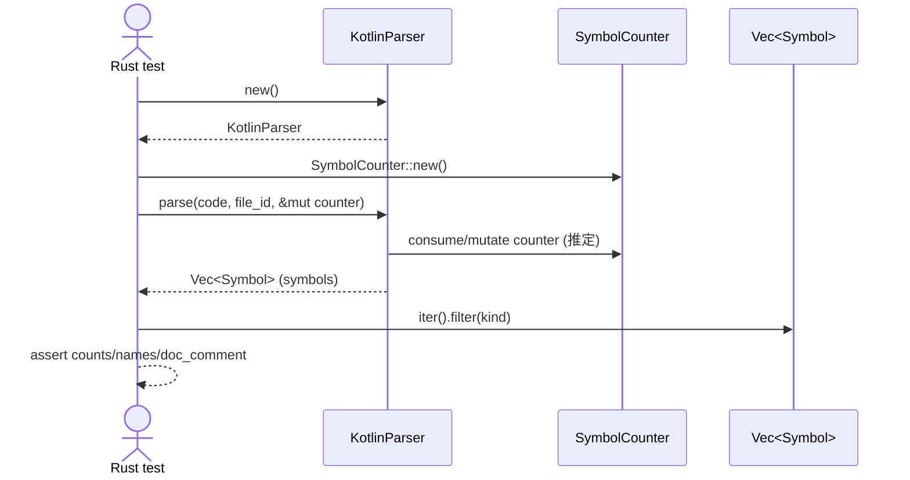

# parsers\kotlin\test_interfaces_and_enums.rs Review

## TL;DR

- このファイルは、Kotlin構文（interface/enum/実装/companion object）のシンボル抽出を検証するためのRustのユニットテスト集（5本）🧪
- 公開APIは無し（テスト専用）。外部APIとしてKotlinParser::newとLanguageParser::parseを利用（詳細は本チャンク外で不明）
- コア検証は、SymbolKind（Interface/Enum/Class/Method/Constant）別にフィルタして名前と個数、doc_commentの有無を確認
- 複雑な部分は少ないが、enum定数を「>=8」で緩く検証するなど、将来の仕様変動に耐える工夫あり
- 重大リスクは、不明な外部API契約への依存と、unwrap/expectの多用によるパニック（テストでは妥当だが失敗時の情報は乏しい）
- プロパティ（val name: String）やcompanion object内メソッドの検出は十分に検証されておらず、網羅性に課題
- スレッド・unsafe・メモリ安全性の懸念は無し（同期/非同期なし、所有権/借用は単純）

## Overview & Purpose

このファイルは、codannaクレートのKotlinパーサ（KotlinParser）が、Kotlinコード断片からシンボル（インターフェース、列挙、クラス、メソッド、定数、docコメント）を正しく抽出できるかを検証するためのユニットテストです。各テストはコード断片をパースし、返却されたシンボル一覧をSymbolKindでフィルタして期待する個数・名前・doc_commentの有無を検証します。

目的:
- Interfaceの宣言とメソッド抽出
- Enum classの宣言、定数（列挙子）抽出、docコメント抽出、メソッド抽出
- Interfaceの実装（class : Interface）の検出
- 複数インターフェースの実装
- Enumのcompanion objectと定数の最小検出（companion内メソッドは未検証）

## Structure & Key Components

| 種別 | 名前 | 公開範囲 | 責務 | 複雑度 |
|------|------|----------|------|--------|
| Function (test) | test_interface_declaration | private (#[test]) | Interface宣言・メソッド・docコメントの抽出検証 | Low |
| Function (test) | test_enum_class_declaration | private (#[test]) | Enum宣言・定数・docコメント・メソッド抽出の検証 | Low |
| Function (test) | test_interface_implementation | private (#[test]) | クラスのインターフェース実装検出 | Low |
| Function (test) | test_multiple_interfaces | private (#[test]) | 複数インターフェースの実装検出 | Low |
| Function (test) | test_enum_with_companion_object | private (#[test]) | Enumと定数抽出、companion object併存時の最低限の検証 | Low |

コード要点（抜粋）:

```rust
#[test]
fn test_interface_declaration() {
    let code = r#"... Kotlin ..."#;
    let mut parser = KotlinParser::new().expect("Failed to create parser");
    let mut counter = SymbolCounter::new();
    let file_id = FileId::new(1).unwrap();

    let symbols = parser.parse(code, file_id, &mut counter);

    let interfaces: Vec<_> = symbols.iter().filter(|s| s.kind == SymbolKind::Interface).collect();
    assert_eq!(interfaces.len(), 2, "Should find 2 interfaces, found {}", interfaces.len());

    // doc_comment, メソッド抽出などを検証
}
```

### Dependencies & Interactions

- 内部依存
  - 各テスト関数 → KotlinParser::new → parser.parse(...) → Vec<Symbol> を受け取り、filter/mapで検証
  - Symbolのフィールド利用: s.kind（SymbolKind列挙）、s.name.as_ref()、s.doc_comment（Option型）
- 外部依存（本チャンクに型定義は無く、使用のみ）
  - 下表は「使用からの推定」。正確な定義はこのチャンクには現れない。

| 依存 | 由来 | 用途 | 備考 |
|------|------|------|------|
| KotlinParser | codanna::parsing::kotlin::parser | パーサ生成・解析 | new(), parse()を使用 |
| LanguageParser | codanna::parsing::parser | トレイト境界 | parseの提供元（推定） |
| FileId | codanna::types | ファイルID付与 | new(1).unwrap() |
| SymbolCounter | codanna::types | 記号IDカウンタ等 | new() → &mut 渡し |
| SymbolKind | codanna::types | 種別判定 | Interface/Enum/Class/Method/Constant を使用 |

- 被依存推定
  - このテストモジュールに依存するのはRustのテストランナーのみ。プロダクションコードからの被依存は「該当なし」。

## API Surface (Public/Exported) and Data Contracts

このファイル自体の公開API: 該当なし（すべて#[test]関数、exports=0）。

外部API利用（使用から推定・本チャンク外）:

| API名 | シグネチャ | 目的 | Time | Space |
|-------|-----------|------|------|-------|
| KotlinParser::new | fn new() -> Result<KotlinParser, E> | パーサの生成 | O(1) | O(1) |
| LanguageParser::parse（推定） | fn parse(&mut self, code: &str, file_id: FileId, counter: &mut SymbolCounter) -> Vec<Symbol> | Kotlinコードをシンボル列に変換 | 不明（推定: O(N)） | 不明 |
| FileId::new | fn new(u32) -> Result<FileId, E> もしくは Option<FileId> | FileIdの生成 | O(1) | O(1) |
| SymbolCounter::new | fn new() -> SymbolCounter | カウンタ生成 | O(1) | O(1) |

データ契約（このチャンクの使用から読み取れる前提。詳細実装は不明）:

- parseの戻り値Vec<Symbol>の各要素は少なくとも以下を持つ
  - kind: SymbolKind（Interface/Enum/Class/Method/Constant を確認）
  - name: AsRef<str>を満たす名前フィールド（s.name.as_ref()で比較）
  - doc_comment: Option<...>（インターフェースやenumに対してSomeであることを検証）
- 列挙の各エントリはSymbolKind::Constantとして返る
- インターフェース/enum内の関数はSymbolKind::Methodとして返る（companion object内はこのファイルでは未検証）

API詳細（parseのみ、使用に基づく推定）:

1) 目的と責務
- 文字列のKotlinコードから、抽象的なシンボル一覧（型・メソッド・定数など）を抽出し、ドキュメントコメントなどのメタ情報も付与する

2) アルゴリズム（推定のため概略）
- トークナイズ → 構文解析 → シンボル抽出（kind判定・名前・doc_comment）→ Vecに蓄積

3) 引数（推定）

| 引数 | 型 | 役割 |
|------|----|------|
| code | &str | Kotlinソースコード |
| file_id | FileId | ファイル識別子 |
| counter | &mut SymbolCounter | シンボルID発行などの補助 |

4) 戻り値（推定）

| 型 | 意味 |
|----|------|
| Vec<Symbol> | 見つかったシンボル列 |

5) 使用例

```rust
let code = r#"interface I { fun f(): Int }"#;
let mut parser = KotlinParser::new().expect("create");
let mut counter = SymbolCounter::new();
let file_id = FileId::new(1).unwrap();
let symbols = parser.parse(code, file_id, &mut counter);
// symbols.iter().filter(|s| s.kind == SymbolKind::Interface) ...
```

6) エッジケース（このチャンクでは未検証）
- 空コード、コメントのみ、ネストした宣言、アノテーション付き、ジェネリクス境界、companion object内の静的関数扱い、enumエントリ固有ボディ など

## Walkthrough & Data Flow

一般的なテストのデータフロー:
- Kotlinコード断片（文字列）を準備
- KotlinParserのインスタンス化と補助構造（FileId, SymbolCounter）を準備
- parseでVec<Symbol>を取得
- kindでフィルタし、名前やdoc_commentの存在を検証

例: test_enum_class_declaration の主要フロー

```rust
#[test]
fn test_enum_class_declaration() {
    let code = r#"... enum Status ... enum Priority ..."#;

    let mut parser = KotlinParser::new().expect("Failed to create parser");
    let mut counter = SymbolCounter::new();
    let file_id = FileId::new(1).unwrap();

    let symbols = parser.parse(code, file_id, &mut counter);

    let enums: Vec<_> = symbols.iter().filter(|s| s.kind == SymbolKind::Enum).collect();
    assert_eq!(enums.len(), 2);

    let constants: Vec<_> = symbols.iter().filter(|s| s.kind == SymbolKind::Constant).collect();
    assert!(constants.len() >= 8);

    let methods: Vec<_> = symbols.iter().filter(|s| s.kind == SymbolKind::Method).collect();
    assert!(!methods.is_empty());
}
```

シーケンス図（代表パターン。上記のtest_enum_class_declarationのフローに対応）:


上記の図はtest_enum_class_declaration関数の主要フローを示す（行番号はこのチャンクでは不明）。

## Complexity & Performance

- テスト側の処理
  - フィルタリング: symbolsに対する反復フィルタを複数回実施
    - 各フィルタはO(N)、合計でO(kN)（kはフィルタ回数、実際は小定数）
    - 追加メモリはフィルタ結果Vecの分（O(M)）
- パーサ（parse）の計算量は本チャンクでは不明（一般にソース長Nに対してO(N)〜O(N log N)相当と推定）
- 実運用負荷要因（テスト観点）
  - I/O・ネットワーク・DBは関与なし
  - 複数回parseを呼ぶが、ソースは小さいためボトルネックになりづらい
- 改善余地
  - 1回のループで種別ごとに分類（HashMap<SymbolKind, Vec<&Symbol>>）するとフィルタ回数を削減できる

## Edge Cases, Bugs, and Security

セキュリティ/健全性チェックリスト観点
- メモリ安全性
  - unsafe未使用、外部FFIなし → バッファオーバーフロー/Use-after-freeの懸念は本テストでは無し
  - 整数オーバーフロー: FileId::new(1)のみで問題なし
- インジェクション
  - SQL/Command/Path traversal対象なし（埋め込み文字列はKotlinコードのみ）
- 認証・認可
  - 該当なし
- 秘密情報
  - ハードコーディング秘密/ログ漏えいなし
- 並行性
  - 非同期/並行処理なし、レース/デッドロック懸念なし

エッジケース詳細（このチャンクでの実装有無・状態は不明が多い）

| エッジケース | 入力例 | 期待動作 | 実装 | 状態 |
|-------------|--------|----------|------|------|
| 空文字列 | "" | シンボル0件 | このチャンクには現れない | 不明 |
| コメントのみ | "/** a */ //x" | シンボル0件・doc_commentなし | このチャンクには現れない | 不明 |
| ジェネリクス境界付interface | "interface R<T: Any>" | Interface検出・型パラメータは無視でも可 | このチャンクには現れない | 不明 |
| interfaceプロパティ | "val name: String" | Propertyシンボル検出 | 本テストでは未検証 | 不明 |
| enumエントリにボディ | "A{ fun x(){} }" | Constant/Methodの両方適切に検出 | このチャンクには現れない | 不明 |
| companion内メソッド | "companion object { fun f() }" | Static/Methodとしての扱いを定義どおり | 未検証 | 不明 |
| 複数ファイルID | FileId異なる2回のparse | シンボルのfile_idが正しく反映 | このチャンクには現れない | 不明 |
| ドキュメントコメントの結合 | /** ... */直前 | doc_commentが対応宣言にだけ付与 | 一部検証（Interface/Enum） | 部分確認済 |

潜在的不具合・懸念
- unwrap/expectの多用により、前提が崩れるとパニック。テストでは許容だが、失敗情報の粒度が低い
- enum定数の件数を「>=」で検証しており、仕様差/将来的変更を許容する一方で、過剰検出の取りこぼしを見逃す可能性
- companion object内メソッドやプロパティ抽出の仕様が未検証で、回 regressions を検出できない

Rust特有の観点
- 所有権/借用
  - codeは &'static str、parseに&strで借用渡し
  - counterを&mutで一時借用、関数呼び出し期間のみ
  - symbolsはVec<Symbol>として所有、iter()で不変借用してフィルタ
  - ライフタイム明示の必要なし（コンパイラ推論で十分）
- unsafe
  - unsafeブロック無し
- 並行性/非同期
  - Send/Sync要件なし、await境界なし、キャンセル処理なし
- エラー設計
  - KotlinParser::new().expect(...), FileId::new(...).unwrap() を使用
  - テストとしては妥当だが、失敗時の追加情報は短いメッセージのみ

## Design & Architecture Suggestions

- テストヘルパの導入で重複排除と可読性向上
  - 例: parse_symbols(code) -> Vec<Symbol>
  - 例: index_by_kind(&[Symbol]) -> HashMap<SymbolKind, Vec<&Symbol>>
  - 例: assert_has_symbol(kind, name)
- 検証粒度を高める
  - interfaceのプロパティ（val/var）のシンボル化
  - companion object内メソッドの扱い（Method/Function/Staticの区別）を明示検証
  - enumエントリのdoc_commentや、エントリ固有ボディ内シンボルの検証
  - overrideメソッド（classでのoverride fun）のシンボル化
- 期待件数の確定化
  - 必要に応じて「>=」から「==」に変更して過検出を検知
- シンボルにスコープ/親子関係があるなら、その関連（親=クラス/enum、子=メソッド/定数）の整合性検証を追加
- 名前比較のためのユーティリティ導入（name_eq(&Symbol, &str)）

## Testing Strategy (Unit/Integration) with Examples

追加ユニットテスト案（Kotlin断片はRust文字列で記述）

1) interfaceのプロパティ検出
```rust
#[test]
fn test_interface_property() {
    let code = r#"
interface Named { val name: String }
"#;
    let mut parser = KotlinParser::new().unwrap();
    let mut counter = SymbolCounter::new();
    let symbols = parser.parse(code, FileId::new(1).unwrap(), &mut counter);

    // PropertyのSymbolKindがあるなら検証（仮: SymbolKind::Property）
    // このチャンクではKind不明のため、存在を前提にしない検証は保留
}
```

2) companion object内メソッド
```rust
#[test]
fn test_enum_companion_method_detection() {
    let code = r#"
enum class E { A;
  companion object { fun from(s: String): E? = null }
}"#;
    let mut parser = KotlinParser::new().unwrap();
    let mut counter = SymbolCounter::new();
    let symbols = parser.parse(code, FileId::new(1).unwrap(), &mut counter);

    // SymbolKind::Method あるいは Static的分類を期待するなら検証
}
```

3) enumエントリ固有ボディ
```rust
#[test]
fn test_enum_entry_with_body() {
    let code = r#"
enum class S {
  A { fun x() = 1 },
  B
}"#;
    let mut parser = KotlinParser::new().unwrap();
    let mut counter = SymbolCounter::new();
    let symbols = parser.parse(code, FileId::new(1).unwrap(), &mut counter);

    // Aの子としてメソッドxが抽出されるか（親子関係の表現があるなら検証）
}
```

4) ジェネリクス境界とnullable
```rust
#[test]
fn test_interface_generics_and_nullable() {
    let code = r#"
interface Repo<T: Any> {
  fun find(id: Long?): T?
}"#;
    let mut parser = KotlinParser::new().unwrap();
    let mut counter = SymbolCounter::new();
    let symbols = parser.parse(code, FileId::new(1).unwrap(), &mut counter);

    // インターフェースとメソッドの抽出のみ厳密に検証
}
```

5) アノテーションとdocコメントの結合確認
```rust
#[test]
fn test_doc_comment_with_annotation() {
    let code = r#"
/** doc */
@Deprecated("x")
interface I { }
"#;
    let mut parser = KotlinParser::new().unwrap();
    let mut counter = SymbolCounter::new();
    let symbols = parser.parse(code, FileId::new(1).unwrap(), &mut counter);

    // Iのdoc_commentがSomeであることを確認
}
```

## Refactoring Plan & Best Practices

- ヘルパ関数の抽出
```rust
fn parse_symbols(code: &str) -> Vec<Symbol> {
    let mut parser = KotlinParser::new().expect("parser");
    let mut counter = SymbolCounter::new();
    let file_id = FileId::new(1).unwrap();
    parser.parse(code, file_id, &mut counter)
}

fn names_of<'a>(syms: impl IntoIterator<Item=&'a Symbol>, kind: SymbolKind) -> Vec<&'a str> {
    syms.into_iter().filter(|s| s.kind == kind).map(|s| s.name.as_ref()).collect()
}
```
- アサート補助
```rust
fn assert_contains(haystack: &[&str], needle: &str) {
    assert!(haystack.iter().any(|&n| n == needle), "missing: {needle}, got: {:?}", haystack);
}
```
- 一度の走査で分類
```rust
use std::collections::HashMap;
fn index_by_kind<'a>(symbols: &'a [Symbol]) -> HashMap<SymbolKind, Vec<&'a Symbol>> {
    let mut m = HashMap::new();
    for s in symbols {
        m.entry(s.kind).or_insert_with(Vec::new).push(s);
    }
    m
}
```
- pretty_assertions や insta を併用して失敗時の差分やスナップショットを明確化

## Observability (Logging, Metrics, Tracing)

- テスト失敗時の可観測性向上
  - 失敗メッセージに、検出されたシンボル一覧（kind/名前/親子関係/位置）が表示されるようデバッグ出力を追加
  - 例: println!("{:?}", symbols)（Debug実装がある場合）
- メトリクス
  - kindごとの件数を集計し、期待と差分を出力
- トレーシング（本テストでは過剰だが、パーサ側にtracingを仕込むと解析工程のボトルネックや失敗箇所が特定しやすい）

## Risks & Unknowns

- KotlinParser/LanguageParser/Symbolの詳細仕様が本チャンクには現れないため、テストの妥当性が内部契約に依存
- companion object内の関数やプロパティなど、曖昧な分類の仕様が不明で、回帰検出が不足
- enum定数の件数検証が緩いため、過剰検出（誤検出）を見逃すリスク
- 位置情報（行/列）や親子関係（例: メソッドの所属クラス/enum）が存在するか不明で、それらの妥当性検証が未実施

以上の点を踏まえ、プロパティやcompanion objectの取り扱い、シンボル親子関係、doc_commentの結合規則などを追加テストで明確化することを推奨します。