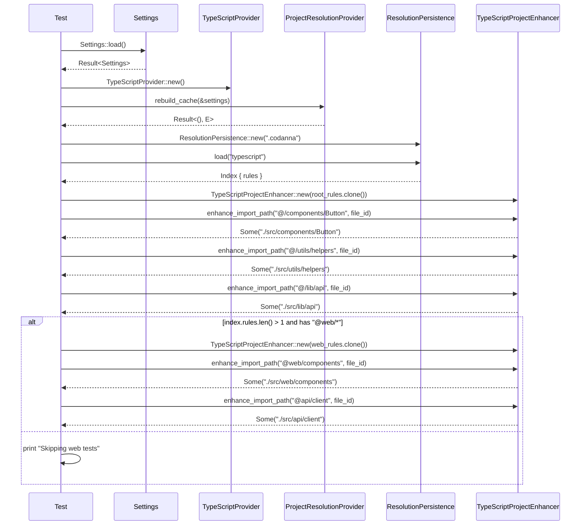

# parsers\typescript\test_resolution_pipeline.rs Review

## TL;DR

- 目的: TypeScriptのtsconfig由来のエイリアス解決ルールをプロジェクトに適用し、インポートパスを補強するパイプラインの挙動をテストする（インデクシングなし）。
- 主な外部API: Settings::load, TypeScriptProvider::new/rebuild_cache, ResolutionPersistence::new/load, TypeScriptProjectEnhancer::new/enhance_import_path, FileId::new。
- 複雑箇所: tsconfigのextendsチェーンの継承（親からのpaths継承と子のbaseUrl優先）、複数tsconfigルール間の選択。
- 重大リスク: ローカル環境依存（.codanna/settings.toml と examples/typescript/ 必須）、ファイルシステムへの永続化の副作用、unwrap/expectによるテスト時パニック、パスのUTF-8前提。
- Rust安全性: unsafeなし、所有権/借用問題なし。エラー処理はexpect/unwrap中心で失敗時にpanic。並行性は扱わない。
- パフォーマンス: enhance_import_pathはルール数に線形、rebuild_cache/loadはI/Oボトルネック。テスト自体は軽量だが環境次第で遅延。

## Overview & Purpose

このファイルは、TypeScriptのエイリアス解決ルール（tsconfig.jsonのbaseUrlおよびpaths）を「codanna」プロジェクトの解決パイプラインへ組み込み、インポートパスを強化（enhance）する挙動を検証する統合テスト群です。

- test_typescript_resolution_pipeline: 設定を読み込み、プロバイダでルールを構築・永続化し、読み込んだルールでエイリアス解決を検証します。複数のtsconfigが存在する場合、特定のパッケージ用エイリアス（@web/*など）も検証します。
- test_typescript_extends_chain: tsconfigのextendsチェーンが正しく解決され、子が親のpathsを継承しつつbaseUrlは子設定が優先されることを検証します。
- test_resolution_without_config: ルールなし（空）でのenhance挙動（常にNone）を確認するユニットテストです。

テストのうち前二つはローカルの設定・例示ディレクトリに依存するため#[ignore]でマークされ、明示的に実行しない限りスキップされます。

## Structure & Key Components

| 種別 | 名前 | 公開範囲 | 責務 | 複雑度 |
|------|------|----------|------|--------|
| Function | test_typescript_resolution_pipeline | private(test) | 設定→プロバイダ→永続化→ロード→エンハンサー→検証のE2Eパイプラインテスト | Med |
| Function | test_typescript_extends_chain | private(test) | tsconfigのextends継承（paths継承、baseUrl優先）を検証 | Med |
| Function | test_resolution_without_config | private(test) | ルールなし時のenhance_import_pathの基本挙動確認 | Low |
| External Struct | Settings | 外部（codanna） | 設定ファイル読み込み（TypeScriptのconfig_filesを含む） | Low |
| External Struct | TypeScriptProvider | 外部（codanna） | tsconfigを解析しプロジェクト解決ルールのキャッシュを再構築 | Med |
| External Trait | ProjectResolutionProvider | 外部（codanna） | rebuild_cacheインターフェース | Med |
| External Struct | ResolutionPersistence | 外部（codanna） | 解決ルールの永続化・ロード | Med |
| External Struct | ResolutionRules | 外部（codanna） | baseUrlとpathsのデータ契約 | Low |
| External Struct | TypeScriptProjectEnhancer | 外部（codanna） | ResolutionRulesに基づきimportパスを補強 | Med |
| External Struct | FileId | 外部（codanna） | ファイル識別子（enhance時の文脈に利用） | Low |

### Dependencies & Interactions

- 内部依存
  - 全テスト関数で共通して「Settings → TypeScriptProvider.rebuild_cache → ResolutionPersistence.load → TypeScriptProjectEnhancer.new → enhance_import_path」というフローを辿ります（関数名:行番号=不明）。
  - test_typescript_resolution_pipelineでは、index.rulesからルール選択を行い、ルートとweb用に別エンハンサーを作成します。

- 外部依存（主要）
  | クレート/モジュール | 用途 |
  |--------------------|------|
  | codanna::config::Settings | 設定読み込み（TypeScript tsconfigファイル群） |
  | codanna::project_resolver::providers::typescript::TypeScriptProvider | tsconfig解析と解決ルール生成 |
  | codanna::project_resolver::provider::ProjectResolutionProvider | rebuild_cacheの呼び出し |
  | codanna::project_resolver::persist::{ResolutionPersistence, ResolutionRules} | ルールの永続化・ロード |
  | codanna::parsing::typescript::resolution::TypeScriptProjectEnhancer | インポートパスの補強（エイリアス解決） |
  | codanna::FileId | ファイルID生成 |
  | std::path::Path | 永続化ディレクトリ指定 |

- 被依存推定
  - テストモジュールのため、他モジュールからの利用は「該当なし」。

## API Surface (Public/Exported) and Data Contracts

このファイル自体の公開API: 該当なし（すべて#[test]関数で非公開）。

参考として、ファイル内で使用する外部APIを整理します。

| API名 | シグネチャ | 目的 | Time | Space |
|-------|-----------|------|------|-------|
| Settings::load | fn load() -> Result<Settings, E> | 設定ファイルの読み込み | O(size of config) + I/O | O(size of config) |
| TypeScriptProvider::new | fn new() -> TypeScriptProvider | プロバイダの生成 | O(1) | O(1) |
| ProjectResolutionProvider::rebuild_cache | fn rebuild_cache(&self, settings: &Settings) -> Result<(), E> | tsconfig群を解析してルールをキャッシュ/永続化 | O(#configs + total tsconfig size) + I/O | O(size of rules) |
| ResolutionPersistence::new | fn new(root: &Path) -> ResolutionPersistence | 永続化管理の初期化 | O(1) | O(1) |
| ResolutionPersistence::load | fn load(lang: &str) -> Result<Index, E> | 言語別ルールインデックスのロード | O(size of index) + I/O | O(size of index) |
| TypeScriptProjectEnhancer::new | fn new(rules: ResolutionRules) -> Self | ルールからエンハンサー作成 | O(size of paths) | O(size of paths) |
| TypeScriptProjectEnhancer::enhance_import_path | fn enhance_import_path(&self, import: &str, file_id: FileId) -> Option<String> | インポートパスの補強（エイリアス→具体パス） | O(P * L) | O(L) |
| FileId::new | fn new(u32) -> Option<FileId>/Result<FileId, E>（不明） | ファイルIDを生成 | O(1) | O(1) |

注: Index型やEの具体型はこのチャンクでは不明。

### TypeScriptProjectEnhancer::enhance_import_path の詳細

1) 目的と責務
- 文字列のインポート式（例: "@/components/Button"）を、ResolutionRulesに基づいて具体的なファイルパス（例: "./src/components/Button"）へ解決・補強します。baseUrlが設定されている場合は先頭に付与します。

2) アルゴリズム（推定・テストからの根拠）
- 入力importが相対パス（"./", "../"）なら補強不要でNoneを返す（test_resolution_without_configの期待から推定）。
- importがpathsで定義されたエイリアスパターンにマッチするか検査（例: "@/components/*"）。
- マッチした場合、"*"部分を入力から抽出してターゲットパターンへ埋め込み（例: "components/*"→"components/Button"）。
- baseUrlがSomeなら先頭に付与（例: "./src" + "/components/Button"）。
- 該当なしならNone。

3) 引数
| 名前 | 型 | 必須 | 意味 |
|------|----|------|------|
| import | &str | 必須 | インポート元文字列 |
| file_id | FileId | 必須 | ファイルコンテキスト（ルール選択や相対計算に利用の可能性あり、詳細不明） |

4) 戻り値
| 型 | 意味 |
|----|------|
| Option<String> | Some(補強後パス)またはNone（補強不要/ルール不一致） |

5) 使用例
```rust
let rules = ResolutionRules {
    base_url: Some("./src".to_string()),
    paths: std::array::IntoIter::new([("@/*".to_string(), vec!["/*".to_string()])])
        .collect(), /* 例示目的 */
};
let enhancer = TypeScriptProjectEnhancer::new(rules);
let file_id = FileId::new(1).unwrap();
assert_eq!(
    enhancer.enhance_import_path("@/components/Button", file_id),
    Some("./src/components/Button".to_string())
);
```

6) エッジケース
- importが相対パス（"./local", "../up"）→ None。
- ルールが空（baseUrlなし、paths空）→ 常にNone。
- importがエイリアスだがpathsに該当キーパターンがない→ None。
- "*"ワイルドカードが空/終端→ パターンと入力の一致判定が曖昧になる可能性（このチャンクでは実装不明）。

### ProjectResolutionProvider::rebuild_cache の詳細（推定）

1) 目的と責務
- Settingsのlanguages.typescript.config_filesを読み取り、各tsconfigを解析してResolutionRulesを生成・永続化します。

2) アルゴリズム（推定）
- 設定からtsconfigパス列挙。
- 各tsconfigのbaseUrl, paths, extendsを解析。
- extendsチェーンを解決し、親→子の順でpaths統合、baseUrlは子が優先。
- ルールを永続化領域（.codanna）へ書き出し。

3) 引数/戻り値
- 引数: &Settings（TypeScript設定必須）
- 戻り値: Result<(), E>

4) 使用例（本ファイルより）
```rust
let settings = Settings::load().expect("Failed to load settings");
let provider = TypeScriptProvider::new();
use codanna::project_resolver::provider::ProjectResolutionProvider;
provider.rebuild_cache(&settings).expect("Failed to process TypeScript configs");
```

5) エッジケース
- tsconfigが存在しない/読み取り不可→ Err。
- extendsループ/循環参照→ Err（想定、詳細不明）。
- paths重複→ マージ戦略（子優先？）は不明。

### ResolutionPersistence::load の詳細（推定）

1) 目的と責務
- 永続化されたルールインデックスから言語別（"typescript"）のルール群を読み込みます。

2) 引数/戻り値
- 引数: &str（言語キー）
- 戻り値: Result<Index, E>（Indexにはrules: HashMap<..., ResolutionRules>などが含まれる想定）

3) 使用例（本ファイルより）
```rust
let persistence = ResolutionPersistence::new(Path::new(".codanna"));
let index = persistence.load("typescript").expect("Resolution index should be persisted");
assert!(!index.rules.is_empty(), "Should have resolution rules");
```

4) エッジケース
- 永続化ファイル欠如/破損→ Err。
- バージョン不一致→ Err（不明）。

## Walkthrough & Data Flow

以下は test_typescript_resolution_pipeline のメインフローです。



上記の図は`test_typescript_resolution_pipeline`関数の主要フローを示す（行番号:不明）。

test_typescript_extends_chainのデータフロー（簡略）:
- Settings::load → TypeScriptProvider::new → rebuild_cache → ResolutionPersistence::load → web_rules選択 → pathsに親・子のキーが共存することをassert（@web/*, @api/*, @components/*, @utils/*）→ baseUrlは子（./src）が優先されることをassert。

test_resolution_without_configのデータフロー:
- ResolutionRules { base_url: None, paths: {} } → TypeScriptProjectEnhancer::new → enhance_import_path("@anything/file", file_id)がNone → enhance_import_path("./local", file_id)がNone。

## Complexity & Performance

- enhance_import_path: 入力文字列長L、パターン数Pに対してパターン照合が線形であると仮定すると、時間計算量O(P * L)、空間O(L)（結果文字列生成）。
- rebuild_cache: tsconfigファイル数C、各ファイルサイズ・パースコストに依存し、I/Oが支配的。時間O(sum(parse(tsconfig_i))) + I/O、空間O(size of rules)。
- load: 永続化ファイルのサイズに依存。I/O + デシリアライズコスト。時間O(size of index)、空間O(size of index)。
- ボトルネック:
  - I/O（設定読み込み、ルール永続化/ロード）
  - extendsチェーン解決のパース（詳細不明）
- スケール限界:
  - pathsパターンが非常に多い場合、enhance_import_pathの線形走査が遅延要因。
  - 大規模モノレポの多数tsconfig解析時のrebuild_cacheが重くなる可能性。

## Edge Cases, Bugs, and Security

セキュリティチェックリスト評価:

- メモリ安全性
  - Buffer overflow / Use-after-free / Integer overflow: Rust安全な抽象のみ使用、unsafeなし。該当なし。
  - unwrap/expectによるpanic: 多数あり。Settings::load().expect(...), FileId::new(1).unwrap(), to_str().unwrap()（UTF-8前提）。テストとしては許容だが不安定要因。
- インジェクション
  - SQL/Command: 該当なし。
  - Path traversal: エイリアス展開結果に".."/絶対パスが混入する入力が与えられた場合の扱いは不明（このチャンクには現れない）。enhance_import_pathでの正規化・検証の有無は不明。
- 認証・認可
  - 該当なし。
- 秘密情報
  - ハードコードされた秘密情報: なし。
  - ログ漏えい: 設定・パスをprintlnで出力。機密ではないが、過度なログはCI環境では冗長。
- 並行性
  - Race condition / Deadlock: テストは同期的。ResolutionPersistenceの永続化/ロードが他プロセスと競合する可能性はあるが、このチャンクからは不明。

詳細エッジケース表:

| エッジケース | 入力例 | 期待動作 | 実装 | 状態 |
|-------------|--------|----------|------|------|
| 空ルール | import="@anything/file" | None（補強なし） | test_resolution_without_configで検証 | OK |
| 相対インポート | import="./local" | None（補強不要） | test_resolution_without_configで検証 | OK |
| UTF-8でないパス文字列 | ts_config.config_files[0].to_str()がNone | panicしない/安全にErrにするのが望ましい | 現状unwrapでpanic | NG（テスト時） |
| 設定ファイル欠如 | Settings::load()がErr | テストをskipまたは失敗理由を表示 | expectでpanic | NG（意図的だが環境依存） |
| ルール未永続化/破損 | persistence.load("typescript")がErr | テストをskip/明示的失敗 | expectでpanic | NG（環境依存） |
| 複数tsconfigのwebルール欠如 | "@web/*"が存在しない | web用テストをskip | 実装あり（index.rules.len()を検査） | OK |
| 異常なエイリアス | "@/../secret" | Noneまたは拒否 | このチャンクでは不明 | 不明 |

Rust特有の観点:

- 所有権/移動
  - root_rules.clone()により、ルールの所有データ（String/HashMap）が複製され、エンハンサーに移動（test_typescript_resolution_pipeline:行番号不明）。問題なし。
- 借用
  - settings, indexなどは不変借用のみで短期間利用。可変借用なし。
- ライフタイム
  - 明示的なライフタイムパラメータ不要。String/HashMap所有で安定。
- unsafe境界
  - unsafeブロックなし。
- 並行性・非同期
  - Send/Sync要件はこのテストでは関与せず。共有状態保護（Mutex/RwLock）も不要。
- エラー設計
  - Result vs Option: enhance_import_pathはOptionで返し、存在しない補強はNone。ロード・キャッシュ再構築はResultで失敗を扱う。
  - panic箇所: unwrap/expect多用。テストでは許容されるが、CI安定性には懸念。
  - エラー変換: From/Intoの利用は不明。

## Design & Architecture Suggestions

- テスト環境の安定化
  - ローカルの.settingsやexamplesディレクトリへの依存を避け、テスト用フィクスチャをターゲットディレクトリ（tempdir）に動的生成する。
  - ResolutionPersistenceのルートを一時ディレクトリに切り替え、副作用を隔離。
- unwrap/expectの削減
  - to_str().ok_or(...)で明示的エラーにし、#[ignore]テストでも診断を改善。
  - FileId::newは失敗可能性に応じてmatchで安全に取り扱う。
- エイリアス展開の安全性強化
  - "../"のようなパストラバーサルを結果に含めないための正規化・検証。
  - Windows/Unixのパス区切りの差異（'\\' vs '/'）へ配慮。
- extendsチェーンの検証強化
  - 親→子のpathsマージ戦略（重複キーの優先順位）の明文化とテストケースの追加。
- テストの再利用性
  - provider, persistence, enhancerの生成を共通ヘルパー関数へ抽出し、DRY化。

## Testing Strategy (Unit/Integration) with Examples

- ユニットテスト（ルール展開の純粋関数的検証）
  - ResolutionRulesを直接構築し、enhance_import_pathのマッチングと置換ロジックを多角的に検証。
```rust
#[test]
fn alias_resolution_basic() {
    use codanna::parsing::typescript::resolution::TypeScriptProjectEnhancer;
    use codanna::project_resolver::persist::ResolutionRules;
    use codanna::FileId;

    let mut paths = std::collections::HashMap::new();
    paths.insert("@/components/*".to_string(), vec!["components/*".to_string()]);
    let rules = ResolutionRules { base_url: Some("./src".into()), paths };
    let enhancer = TypeScriptProjectEnhancer::new(rules);
    let file_id = FileId::new(1).unwrap();

    assert_eq!(
        enhancer.enhance_import_path("@/components/Button", file_id),
        Some("./src/components/Button".to_string())
    );
    assert_eq!(
        enhancer.enhance_import_path("./local", file_id),
        None
    );
}
```

- プロパティベーステスト
  - エイリアスの"*"部分が任意文字列でも正しく置換されることをquickcheck等で検証（ツール導入は別途）。
- インテグレーションテスト（extendsチェーン）
  - 一時ディレクトリに最小限のtsconfig親子を生成し、extendsの継承とbaseUrl優先を検証。
```rust
#[test]
fn extends_chain_in_tempdir() {
    // 1) tempdir作成、2) parent/child tsconfigを書き出し、3) Settingsをそのdirを指すように構築、
    // 4) provider.rebuild_cache → persistence.load → web_rules検証
    // 実装詳細はプロジェクトのSettings/ProviderのAPIに依存（このチャンクでは不明）
}
```

## Refactoring Plan & Best Practices

- ステップ1: テストヘルパー導入
  - make_enhancer_with_rules(rules: ResolutionRules) -> TypeScriptProjectEnhancer
  - build_index_from_temp_configs(configs: &[&str]) -> Index
- ステップ2: unwrap/expectの削減
  - to_str()はmatchで安全に扱い、エラーメッセージを改善。
- ステップ3: 環境非依存化
  - #[ignore]を外すためにtempdirフィクスチャとモック（可能ならProvider/Persistence）を利用。
- ベストプラクティス
  - テストは副作用を隔離（tempdir）。
  - ログはトレースレベルで抑制可能に。
  - パス操作はstd::path::Path/PathBufで行い、文字列連結を避ける。

## Observability (Logging, Metrics, Tracing)

- ログ
  - printlnではなくtracing::info!/debug!へ移行し、テスト時のみ出力制御。
```rust
#[test]
fn setup_tracing_for_tests() {
    // テスト内で一度だけ呼ぶ（複数回初期化を避ける工夫が必要）
    let _ = tracing_subscriber::fmt()
        .with_env_filter("info")
        .with_test_writer()
        .try_init();
}
```
- メトリクス/トレース
  - rebuild_cacheの処理時間、解析したtsconfig数をメトリクス化。
  - enhance_import_pathのヒット率（エイリアスが解決できた割合）をテストログに出力。

## Risks & Unknowns

- ローカル依存: .codanna/settings.toml と examples/typescript/が必要なため、CI/他環境での再現性が低い。
- 永続化の副作用: .codannaディレクトリに書き込みが発生、他テスト/プロセスと競合の可能性。
- パス表現の差異: OS依存（Windowsの'\\'）とUTF-8前提のto_str().unwrap()による潜在的パニック。
- ルール選択戦略: 複数tsconfigがある場合にどのルールを適用するかの基準（FileIdとtsconfigの関連付け）がこのチャンクでは不明。
- extendsの詳細挙動: 循環参照や深い継承時のマージ戦略・衝突解決は不明。

以上により、テストの安定性と安全性を高めるには、環境非依存のフィクスチャ、panicの削減、エイリアス展開の正規化・検証の追加が有効です。