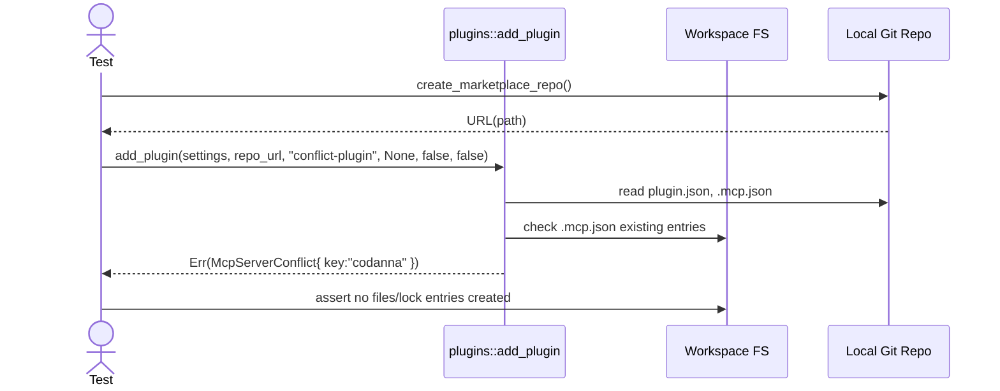

# plugins\test_install_flow.rs Review

## TL;DR

- このファイルは、外部公開APIである**plugins::add_plugin / remove_plugin / verify_plugin / update_plugin / list_plugins**の統合的な振る舞いを検証するテスト群と、そのための最小ヘルパー関数群を提供する。
- 主な公開APIの契約（推測）は「インストール」「更新」「検証」「一覧」「削除」で、エラー型は**PluginError**（InvalidPluginManifest / McpServerConflict / IntegrityCheckFailed / NotInstalled など）を返す。
- 重要なシナリオは**dry-runの不変性**、**MCP競合の検出**、**改ざん検出と更新による整合性回復**、**未インストール更新のエラー**を網羅している。
- 複雑箇所は**ローカルGitリポジトリの動的生成（create_marketplace_repo）**と**外部GitHubリポジトリへ依存するテスト**で、ネットワーク起因のフレーク（不安定）リスクがある。
- セキュリティ面では**改ざん検出**と**MCP競合ブロック**をテストで担保。テストコード自体はunsafeなし・ローカルファイルI/O中心でメモリ安全。
- パフォーマンスはI/Oや（推測）ハッシュ計算中心で**O(F)**（ファイル数）程度。ネットワークを使うケースは外部環境に左右される。
- 推奨事項は「ネットワーク依存の除去」「テストヘルパーの型安全化」「重複ロジックの共通化」「ログのキャプチャ強化」。

## Overview & Purpose

このファイルは、codannaのプラグイン管理機能（pluginsモジュール）の**インストール→検証→一覧→更新→削除**までの一連のフローを、実際のファイル配置・設定マージ・ロックファイルの更新といった副作用を含めて検証するための統合テストを提供する。

- プロダクト設定（Settings）を**一時ワークスペース上**に用意し、**外部リポジトリからのプラグイン取得**と**ローカル仮想マーケットプレイス（create_marketplace_repo）**の両パスを使って、正常系と異常系を実行。
- 成功時には**.claude配下のコマンド/スクリプト設置**、**.mcp.jsonのマージ**、**.codanna/plugins/lockfile.jsonの更新**を検証し、失敗/ドライラン時には**ワークスペースの不変性**を確認。
- 改ざん検出（verify_plugin）と更新（update_plugin）により、**インテグリティ（整合性）の維持**を確認する。

主なユースケースは以下をカバーする。
- add_plugin: 正常インストール、dry-run不変、無効なマニフェスト、MCP競合
- remove_plugin: ファイル削除とロックファイル整合性
- verify_plugin: 改ざん前後の整合性チェック
- update_plugin: 改ざん復元、dry-run不変、未インストールエラー
- list_plugins: 空/インストール後のレポート

行番号はこのチャンクに含まれないため、根拠は「関数名:行番号不明」として併記する。

## Structure & Key Components

| 種別 | 名前 | 公開範囲 | 責務 | 複雑度 |
|------|------|----------|------|--------|
| Function | with_temp_workspace | private (test) | 一時ディレクトリを生成し、ワークスペースPathを渡してテストを実行 | Low |
| Function | assert_file_exists | private (test) | ワークスペース相対パスのファイル存在をアサート | Low |
| Function | read_json | private (test) | JSONファイルを読み取り、serde_json::Valueにパース（失敗時panic） | Low |
| Function | load_workspace_settings | private (test) | .codanna/settings.tomlを生成/読み込み、Settingsを初期化（workspace_root, debug設定） | Med |
| Function | create_marketplace_repo | private (test) | ローカルにGitリポジトリを初期化し、marketplace.json / plugin.json / 追加ファイルをコミット | Med |
| Test | add_plugin_installs_codanna_cc_plugin | private (test) | リモートプラグインのインストール成功とファイル設置/ロック/MCPマージを検証 | Med |
| Test | dry_run_does_not_modify_workspace | private (test) | dry-runインストールがワークスペースを変更しないことを検証 | Low |
| Test | remove_plugin_cleans_files_and_lockfile | private (test) | 削除でファイル消去とロックファイル整合性を検証 | Low |
| Test | verify_plugin_detects_tampering | private (test) | 改ざん検出（IntegrityCheckFailed）を検証 | Low |
| Test | list_plugins_reports_state | private (test) | インストール前後での一覧レポートの成功を検証 | Low |
| Test | update_plugin_restores_integrity | private (test) | 改ざん後に更新で内容が元に戻ることと検証成功を確認 | Med |
| Test | update_plugin_dry_run_does_not_modify_workspace | private (test) | 更新のdry-runでロックファイルが変化しないことを検証 | Low |
| Test | update_plugin_requires_installation | private (test) | 未インストールの更新でNotInstalledエラーを検証 | Low |
| Test | install_fails_on_invalid_manifest | private (test) | 無効なマニフェストでインストールがInvalidPluginManifestエラーになることを検証 | Low |
| Test | install_fails_on_mcp_conflict | private (test) | MCP競合（同一キー）でインストールが拒否されることを検証 | Med |

### Dependencies & Interactions

- 内部依存（呼び出し関係）
  - 各テスト → with_temp_workspace → load_workspace_settings
  - テスト内アサーション → assert_file_exists / read_json
  - 異常系/競合テストのためのローカルGit → create_marketplace_repo
  - すべての主要操作は**codanna::plugins**の公開API呼び出しに依存（add/remove/verify/update/list）

- 外部依存（クレート・モジュール）
  | 依存 | 用途 |
  |------|------|
  | std::fs / std::path::Path | ファイル操作・パス結合 |
  | serde_json::Value | JSONの動的パース |
  | tempfile::TempDir | 一時ディレクトリ生成 |
  | git2::{Repository, IndexAddOption, Signature} | ローカルGitリポジトリ初期化とコミット |
  | codanna::{Settings, plugins} | プロダクト設定とプラグイン管理API |
  | codanna::plugins::error::PluginError | プラグイン関連エラーの型 |

- 被依存推定
  - 本モジュールはテスト専用であり、他モジュールから直接使用されない。
  - テストで行うファイル配置、ロック、MCPマージの検証は、**pluginsモジュールの公開APIの契約**に対する回帰防止に寄与。

## API Surface (Public/Exported) and Data Contracts

このファイル自体には公開APIはないが、テスト対象の外部公開APIが明確に使用されているため、そのインターフェイスを「テストからの推測」に基づき記載する（正確な定義はこのチャンクには現れない）。

| API名 | シグネチャ | 目的 | Time | Space |
|-------|-----------|------|------|-------|
| plugins::add_plugin | fn add_plugin(settings: &Settings, source: &str, plugin_name: &str, commit: Option<&str>, force: bool, dry_run: bool) -> Result<(), PluginError> | プラグインのインストール（ファイル設置、MCPマージ、ロック更新）。dry-run対応 | 推測: O(F+M) | 推測: O(F) |
| plugins::remove_plugin | fn remove_plugin(settings: &Settings, plugin_name: &str, purge: bool, dry_run: bool) -> Result<(), PluginError> | プラグイン削除（ロックに基づくファイル消去、MCPのクリーンアップ） | 推測: O(F) | 推測: O(1) |
| plugins::verify_plugin | fn verify_plugin(settings: &Settings, plugin_name: &str, quiet: bool) -> Result<(), PluginError> | ロックと現状ファイルの整合性検証（改ざん検出） | 推測: O(F·H) | 推測: O(1) |
| plugins::list_plugins | fn list_plugins(settings: &Settings, verbose: bool, quiet: bool) -> Result<(), PluginError> | インストール済みプラグイン一覧のレポート出力 | 推測: O(P) | 推測: O(1) |
| plugins::update_plugin | fn update_plugin(settings: &Settings, plugin_name: &str, commit: Option<&str>, restore: bool, dry_run: bool) -> Result<(), PluginError> | プラグイン更新（変更差分の適用、整合性回復）。dry-run対応 | 推測: O(F+N) | 推測: O(F) |

補助関数（このファイルに定義）:

| API名 | シグネチャ | 目的 | Time | Space |
|-------|-----------|------|------|-------|
| with_temp_workspace | fn with_temp_workspace<F: FnOnce(&Path)>(test: F) | 一時WS作成とスコープ内テスト実行 | O(1) | O(1) |
| assert_file_exists | fn assert_file_exists(workspace: &Path, relative: &str) | ファイル存在アサート | O(1) | O(1) |
| read_json | fn read_json(workspace: &Path, relative: &str) -> serde_json::Value | JSON読み取り・パース（失敗panic） | O(S) | O(S) |
| load_workspace_settings | fn load_workspace_settings(workspace: &Path) -> Settings | Settings初期化（.codanna生成、debug有効化） | O(1) | O(1) |
| create_marketplace_repo | fn create_marketplace_repo(workspace: &Path, repo_name: &str, plugin_name: &str, plugin_manifest: &str, extra_files: &[(&str, &str)]) -> String | ローカルGitリポジトリを生成しmarketplace/pluginマニフェストと追加ファイルをコミット | O(Fg) | O(Fg) |

各APIの詳細（外部公開API、推測ベース）

1) plugins::add_plugin
- 目的と責務
  - 指定ソース（URL/パス）から**プラグインを取得**し、ワークスペースへ**コマンド/スクリプト配置**、**MCP設定マージ**、**ロックファイル更新**を行う。dry-run時は副作用なし。
- アルゴリズム（推測）
  1. ソースからplugin manifestを読み込む（例: .claude-plugin/plugin.json）。
  2. マニフェスト検証（commandsなどの必須項目の妥当性）。
  3. MCP設定が含まれていれば既存.mcp.jsonへマージ（キー競合検出）。
  4. .claude/commandsや.scriptsへのファイルコピー。
  5. .codanna/plugins/lockfile.jsonへコミットIDとファイルリストを記録。
  6. dry_run=trueなら上記の副作用をスキップ。
- 引数（推測）
  | 引数 | 型 | 説明 |
  |------|----|------|
  | settings | &Settings | ワークスペースルート等の設定 |
  | source | &str | リポジトリURLまたはローカルパス |
  | plugin_name | &str | プラグイン識別名 |
  | commit | Option<&str> | 固定コミット参照（省略可） |
  | force | bool | 強制上書き等の振る舞い（このチャンクではfalseのみ使用） |
  | dry_run | bool | 副作用なしでの検証モード |
- 戻り値
  | 型 | 内容 |
  |----|------|
  | Result<(), PluginError> | 成功時Ok、失敗時InvalidPluginManifest/McpServerConflict等 |
- 使用例
  ```rust
  #[test]
  fn add_plugin_installs_codanna_cc_plugin() {
      with_temp_workspace(|workspace| {
          let settings = load_workspace_settings(workspace);
          let marketplace = "https://github.com/bartolli/codanna-cc-plugin.git";
          plugins::add_plugin(&settings, marketplace, "codanna-cc-plugin", None, false, false)
              .expect("plugin installation should succeed");
          // ... ファイル存在やMCPの検証 ...
      });
  }
  ```
- エッジケース
  - 無効マニフェスト → PluginError::InvalidPluginManifest
  - MCP競合（同一キー） → PluginError::McpServerConflict
  - dry-run → ワークスペース不変（.claude/.mcp.json/lockfile未生成）

2) plugins::remove_plugin
- 目的と責務
  - ロックファイルに基づいた**インストール済みファイルの削除**と、MCP設定から該当サーバーの**除去**（推測）。
- アルゴリズム（推測）
  1. lockfileから対象プラグインの追跡ファイル一覧を取得。
  2. 対象ファイルを削除、空ディレクトリも整理。
  3. MCP設定から関連エントリを削除。
  4. lockfileからプラグイン項目を削除。
- 引数/戻り値は上記表参照。
- 使用例
  ```rust
  #[test]
  fn remove_plugin_cleans_files_and_lockfile() {
      with_temp_workspace(|workspace| {
          let settings = load_workspace_settings(workspace);
          // 事前インストール
          plugins::add_plugin(&settings, "https://github.com/bartolli/codanna-cc-plugin.git",
              "codanna-cc-plugin", None, false, false).expect("install succeeds");

          plugins::remove_plugin(&settings, "codanna-cc-plugin", false, false)
              .expect("remove succeeds");
          // ... ファイルとlockfileのアサーション ...
      });
  }
  ```
- エッジケース
  - 未インストール削除（推測） → 適切なエラーまたはno-op（このチャンクには現れない）

3) plugins::verify_plugin
- 目的と責務
  - ロックファイルに記録された**期待ハッシュ/内容**とワークスペースの**実ファイル**を比較し、改ざん/破損を検出。
- アルゴリズム（推測）
  1. lockfileから対象プラグインの追跡ファイル集合を取得。
  2. 各ファイルのハッシュ/サイズ等を比較。
  3. 不一致があればIntegrityCheckFailed。
- 使用例
  ```rust
  #[test]
  fn verify_plugin_detects_tampering() {
      with_temp_workspace(|workspace| {
          let settings = load_workspace_settings(workspace);
          let marketplace = "https://github.com/bartolli/codanna-cc-plugin.git";

          plugins::add_plugin(&settings, marketplace, "codanna-cc-plugin", None, false, false)
              .expect("install succeeds");
          plugins::verify_plugin(&settings, "codanna-cc-plugin", false)
              .expect("verification succeeds before tampering");

          // 改ざん
          let target_file = workspace.join(".claude/commands/codanna-cc-plugin/ask.md");
          fs::write(&target_file, "tampered content").expect("tamper file");

          let err = plugins::verify_plugin(&settings, "codanna-cc-plugin", false)
              .expect_err("verification should fail after tampering");
          assert!(matches!(err, PluginError::IntegrityCheckFailed { .. }));
      });
  }
  ```
- エッジケース
  - 改ざん → IntegrityCheckFailed
  - 不在ファイル（推測） → エラー

4) plugins::list_plugins
- 目的と責務
  - 現在インストール済みのプラグイン状態を列挙/レポート（推測）。引数で詳細/静粛など出力モードが切替（推測）。
- 使用例
  ```rust
  #[test]
  fn list_plugins_reports_state() {
      with_temp_workspace(|workspace| {
          let settings = load_workspace_settings(workspace);
          // 空状態
          plugins::list_plugins(&settings, false, true).expect("list succeeds when empty");
          // インストール後
          plugins::add_plugin(&settings, "https://github.com/bartolli/codanna-cc-plugin.git",
              "codanna-cc-plugin", None, false, false).expect("install succeeds");
          plugins::list_plugins(&settings, true, false).expect("list succeeds after install");
      });
  }
  ```
- エッジケース
  - 空状態でも成功（出力は静粛モードで抑制、推測）

5) plugins::update_plugin
- 目的と責務
  - 指定コミットや最新状態への**更新**を行い、改ざん/差分を**整合性回復**。dry-runは副作用なし。
- アルゴリズム（推測）
  1. インストール済みか検証（未インストールならNotInstalled）。
  2. ソースから最新/指定コミットを取得し差分計算。
  3. 必要ファイルの再配置・上書き。
  4. lockfileのcommitやファイルハッシュ更新。
- 使用例
  ```rust
  #[test]
  fn update_plugin_restores_integrity() {
      with_temp_workspace(|workspace| {
          let settings = load_workspace_settings(workspace);
          let marketplace = "https://github.com/bartolli/codanna-cc-plugin.git";
          plugins::add_plugin(&settings, marketplace, "codanna-cc-plugin", None, false, false)
              .expect("install succeeds");

          // 改ざん
          let target_file = workspace.join(".claude/commands/codanna-cc-plugin/ask.md");
          let original = fs::read_to_string(&target_file).expect("read original command");
          fs::write(&target_file, "tampered content").expect("tamper file");

          // 更新で復元
          plugins::update_plugin(&settings, "codanna-cc-plugin", None, true, false)
              .expect("update succeeds");
          let restored = fs::read_to_string(&target_file).expect("read restored command");
          assert_eq!(restored, original);

          plugins::verify_plugin(&settings, "codanna-cc-plugin", false)
              .expect("verification passes after update");
      });
  }
  ```
- エッジケース
  - 未インストール更新 → PluginError::NotInstalled
  - dry-run更新 → lockfileのcommit不変

データ契約（推測）
- .mcp.json: キー**"mcpServers"**を持ち、サーバー名→設定（command/args等）マップ。
- lockfile.json: キー**"plugins"**下にプラグイン名キーがあり、**"name"**, **"files"**, **"commit"**などを記録。

## Walkthrough & Data Flow

主要シナリオのデータフロー（ファイル設置・設定マージ・ロック更新）を、テストコードに沿って追跡する。

- インストール（add_plugin_installs_codanna_cc_plugin）
  - 入力: Settings（workspace_root=.codanna）、source=GitHub URL、plugin_name="codanna-cc-plugin"
  - 副作用:
    - .claude/commands/codanna-cc-plugin/ask.md, find.md の生成
    - .claude/scripts/codanna-cc-plugin/... の生成
    - .mcp.jsonへ"codanna"/"codanna-sse"のマージ
    - .codanna/plugins/lockfile.jsonへ追跡ファイルとcommit記録
    - indexディレクトリは不生成（sanityチェック）
  - 出力: Result<(), Ok>

- 削除（remove_plugin_cleans_files_and_lockfile）
  - 入力: Settings, plugin_name
  - 副作用:
    - 追跡ファイルの削除（ask.mdなどが消える）
    - lockfileから該当プラグイン項目が消える
    - .mcp.jsonから"codanna"関連が消える（存在時）
  - 出力: Result<(), Ok>

- 改ざん検出（verify_plugin_detects_tampering）
  - 入力: Settings, plugin_name
  - 変更: ask.mdの内容をtampered contentに書き換え
  - 出力: PluginError::IntegrityCheckFailed

- 更新で整合性回復（update_plugin_restores_integrity）
  - 入力: Settings, plugin_name, restore=true
  - 動作: 改ざんされたファイルが元の内容に戻る
  - 後続: verify_pluginが成功

- MCP競合（install_fails_on_mcp_conflict）
  - ローカルmarketplace_repoを生成し、mcpServersに"codanna"を含むプラグインを用意
  - add_pluginがPluginError::McpServerConflictで失敗
  - 副作用は残らない（コマンド未設置、lockfile未記録）

Mermaid（状態遷移）: update_plugin_restores_integrity（行番号不明）に対応

```mermaid
stateDiagram-v2
    [*] --> NotInstalled
    NotInstalled --> Installed: add_plugin
    Installed --> Tampered: external write (fs::write)
    Tampered --> Updated: update_plugin (restore=true)
    Updated --> Verified: verify_plugin (ok)
```

上記の図は`update_plugin_restores_integrity`テストの主要状態遷移を示す（行番号不明）。

Mermaid（シーケンス）: install_fails_on_mcp_conflict（行番号不明）に対応



上記の図は`install_fails_on_mcp_conflict`テストの主要インタラクションを示す（行番号不明）。

## Complexity & Performance

- 時間計算量（推測）
  - add_plugin: O(F + M)（コピーするファイル数FとMCPエントリ数Mに比例）
  - remove_plugin: O(F)
  - verify_plugin: O(F·H)（ファイルハッシュ計算Hを含む）
  - update_plugin: O(F + N)（差分適用、必要に応じてネットワークN）
  - list_plugins: O(P)（プラグイン数P）
- 空間計算量（推測）
  - add_plugin / update_plugin: O(F)（ファイル設置）
  - remove_plugin / list_plugins / verify_plugin: O(1)〜O(F)
- 実運用負荷要因
  - I/O: .claude配下のファイル配置/削除/読み取り
  - ネットワーク: リモートリポジトリからの取得（テストではGitHub URL使用）
  - Git操作: ローカルリポジトリ生成/コミット（create_marketplace_repo）
- ボトルネック/スケール限界
  - 多数ファイルのハッシュ検証時（verify）と更新差分（update）が重い可能性
  - ネットワーク依存テストはCIで不安定化要因（タイムアウト/レート制限）

## Edge Cases, Bugs, and Security

エッジケース一覧（テストで扱う主なもの）

| エッジケース | 入力例 | 期待動作 | 実装 | 状態 |
|-------------|--------|----------|------|------|
| dry-runインストール | add_plugin(..., dry_run=true) | ワークスペース不変（.claude/.mcp.json/lockfile未生成） | dry_run_does_not_modify_workspace | Covered |
| 削除後の整合性 | remove_plugin("codanna-cc-plugin") | 追跡ファイル削除、lockfileから項目削除、MCPから該当キー削除 | remove_plugin_cleans_files_and_lockfile | Covered |
| 改ざん検出 | ask.mdを書き換え | verify_pluginがIntegrityCheckFailed | verify_plugin_detects_tampering | Covered |
| 更新による復元 | tamper→update_plugin(..., restore=true) | ファイル内容が元に戻りverify成功 | update_plugin_restores_integrity | Covered |
| 更新dry-run不変 | update_plugin(..., dry_run=true) | lockfileのcommit不変 | update_plugin_dry_run_does_not_modify_workspace | Covered |
| 未インストール更新 | update_plugin("未インストール") | PluginError::NotInstalled | update_plugin_requires_installation | Covered |
| 無効マニフェスト | commandsが不正 | PluginError::InvalidPluginManifest | install_fails_on_invalid_manifest | Covered |
| MCP競合 | mcpServersに既存キー（"codanna"） | PluginError::McpServerConflict | install_fails_on_mcp_conflict | Covered |
| インデックス非生成 | add_plugin後 | workspace/indexが存在しない | add_plugin_installs_codanna_cc_plugin | Covered |

セキュリティチェックリスト

- メモリ安全性
  - Buffer overflow / Use-after-free / Integer overflow: 該当なし（Rust安全。unsafeブロックはこのチャンクには現れない）
  - 所有権/借用: &Path参照、serde_json::Valueの所有、fs読み書きの戻り値はスコープ内で完結（関数:行番号不明）。TempDirでライフタイム管理。
- インジェクション
  - SQL/Command: 該当なし（テスト側ではコマンド実行しない）
  - Path traversal: create_marketplace_repoのextra_filesに相対パスを許可するため、"../"等の悪意入力は潜在リスク。ただしテストデータは安全。プロダクション側でサニタイズ推奨。
- 認証・認可
  - 該当なし（ローカルI/Oのみ）
- 秘密情報
  - Hard-coded secrets: なし。署名メールはダミー（"test@example.com"）。
  - Log leakage: このテストは出力ログを直接扱わない。settings.debug=trueだがログ収集は未実装。
- 並行性
  - Race condition / Deadlock: 該当なし（同期I/Oのみ）。TempDirによりWSはテスト毎に分離。

Rust特有の観点（詳細）
- 所有権
  - with_temp_workspaceはTempDirの所有を関数内に保持し、FnOnceクロージャに&Pathを貸与。TempDirはスコープ終了で安全にクリーンアップ（関数:行番号不明）。
- 借用
  - fs関数へ&Path/&strの不変借用のみ。可変借用の長期保持なし。
- ライフタイム
  - 明示的ライフタイムは不要。Settingsにworkspace_root = Some(PathBuf)で所有を移動。
- unsafe境界
  - 使用なし。
- 並行性/非同期
  - Send/Syncの議論は不要。全処理同期的でawaitなし。
- エラー設計
  - テスト内ヘルパーはpanic駆動（unwrap_or_else/expect）で簡潔性重視。公開APIはResult<_, PluginError>でエラーを表現。unwrap/expectはテスト文脈では許容。

潜在的なバグ/改善点
- ネットワーク依存: "https://github.com/bartolli/codanna-cc-plugin.git"への依存はCI不安定化要因。ローカルミラー/固定fixtureへ置換推奨。
- read_jsonがpanic: 型安全性が低い（serde_json::Value）。lockfileやmcpの型を定義した構造体にパースすると表現力と検証力が向上。
- Path traversal: create_marketplace_repoのextra_filesは任意相対パスを受け取り、悪用で上位ディレクトリを書き得る。テストでは安全だが保護を提案。

## Design & Architecture Suggestions

- テストのネットワーク依存を除去
  - codanna-cc-pluginの必要ファイルをローカルrepoに固定したfixtureで再現（create_marketplace_repoを拡張）。これにより安定性と速度向上。
- ヘルパーの型安全化
  - read_json用にLockfile/McpConfig構造体を定義しserdeでデシリアライズ。Valueからの型取り扱いを削減し、失敗時にも明確なメッセージ。
- 共通アサーションの抽出
  - "lockfileにプラグインが存在しないか"、"MCPにキーがないか"などのチェックをヘルパー関数化し重複削減。
- テストデータの定数化
  - プラグイン名やファイルパスを定数にまとめ、メンテ容易性向上。
- ログ検証の追加
  - settings.debug=trueを活用し、トレーシング出力の検証を追加。ユーザ向け出力契約の一貫性確認に有用。

## Testing Strategy (Unit/Integration) with Examples

追加/改善すべきテスト戦略
- オフライン固定テスト
  - 外部GitHubを使わず、create_marketplace_repoで完全再現。ネットワークに依存しないCI。
- プロパティベース
  - commandsファイル集合の順不同性、空集合などに対するverifyの健全性。
- Path traversal防止
  - extra_filesに"../"が含まれる場合に拒否することの検証（プロダクション側に対するテスト）。
- 並行更新/検証
  - 2つの操作が同時に走った場合（将来的な並行実装を想定）にレースしないことのテスト（このチャンクには現れない機能だが設計上考慮）。
- dry-run全系
  - remove_pluginのdry-run、verify/listの出力モードの詳細（このチャンクには現れない仕様は不明）。

例: ローカルのみでのインストール・更新テスト（固定repo）

```rust
#[test]
fn local_repo_install_and_update_without_network() {
    with_temp_workspace(|workspace| {
        let settings = load_workspace_settings(workspace);
        // 固定化されたローカルrepo生成
        let repo_url = create_marketplace_repo(
            workspace,
            "fixed_repo",
            "fixed-plugin",
            r#"{
                "name": "fixed-plugin",
                "version": "0.1.0",
                "description": "Local fixed plugin",
                "author": { "name": "Test" },
                "commands": "./commands/cmd.md"
            }"#,
            &[("commands/cmd.md", "# Command\n\nBody")]
        );

        plugins::add_plugin(&settings, &repo_url, "fixed-plugin", None, false, false)
            .expect("install succeeds without network");

        // 改ざん→更新（ローカル差分で復元）
        let target = workspace.join(".claude/commands/fixed-plugin/cmd.md");
        fs::write(&target, "tampered").expect("tamper");

        plugins::update_plugin(&settings, "fixed-plugin", None, true, false)
            .expect("update restores");
        assert_eq!(fs::read_to_string(&target).unwrap(), "# Command\n\nBody");
    });
}
```

## Refactoring Plan & Best Practices

- 重複したパス文字列を定数へ
  - 例: ".claude/commands/{plugin}"、".codanna/plugins/lockfile.json"、".mcp.json" をconstに。
- ヘルパーの戻り型をResultへ
  - read_jsonのpanicをResultにし、テストで?を使って早期終了。失敗時の文脈を付与しやすい。
- create_marketplace_repoの安全強化
  - extra_filesのパス検証を追加（親ディレクトリ外への書き込み禁止）。
- アサートのメッセージ強化
  - 期待と実際の差分（特にlockfileのfiles配列やmcpServers）のdiff出力を追加。
- テストケースのモジュール化
  - 正常系/異常系のテーブルドリブンテスト化で追加ケースの拡張容易性。

## Observability (Logging, Metrics, Tracing)

- ログ
  - plugins側の**インストール/削除/検証/更新**の各ステップで**info/debug**を出す設計（このチャンクには現れない）。テスト側で`tracing_subscriber`を初期化し、期待ログをキャプチャ・検証。
- メトリクス
  - ファイル数、更新差分数、ハッシュ検証時間などをカウント（将来の性能ボトルネック可視化）。
- トレーシング
  - ソース→ファイル配置→ロック更新→MCPマージまでのスパンをtraceで関連付ける。

テストでのキャプチャ例（概略）
```rust
#[test]
fn logs_are_emitted_on_install() {
    // テスト用サブスクライバ初期化（詳細はプロダクションのtracing設定に依存）
    // tracing_subscriber::fmt().with_test_writer().init();

    with_temp_workspace(|workspace| {
        let settings = load_workspace_settings(workspace);
        let repo_url = create_marketplace_repo(
            workspace, "repo", "p", r#"{"name":"p","version":"0.1.0","commands":"./c.md"}"#,
            &[("c.md", "body")]
        );
        plugins::add_plugin(&settings, &repo_url, "p", None, false, false)
            .expect("install succeeds");

        // ここでログ内容を検証（このチャンクには現れない具体APIは不明）
    });
}
```

## Risks & Unknowns

- 不明点
  - plugin.jsonの正確なスキーマ、MCPマージの詳細ポリシー、lockfileの完全構造はこのチャンクには現れない。
  - plugins::update_pluginの引数（第4引数）の正確な意味は不明（restoreフラグと推測）。
  - list_pluginsの出力仕様（標準出力か、返り値か）は不明。
- リスク
  - ネットワーク依存（GitHub）によりテストがフレークし得る。
  - Path traversalの潜在リスク（create_marketplace_repoのextra_files）。
  - OS差異（パス区切りやファイル権限）による挙動差。
  - 大規模プラグイン（ファイル数が多い）でverify/updateが遅くなる可能性。

以上の通り、本ファイルは公開APIの振る舞い契約を実際の副作用に基づいて広範に検証しており、セキュリティ（改ざん/MCP競合）とdry-run不変性を適切にカバーしている。一方で、ネットワーク依存の除去、型安全性の強化、テストの共通化と観測可能性の向上が、保守性と信頼性の観点で効果的である。