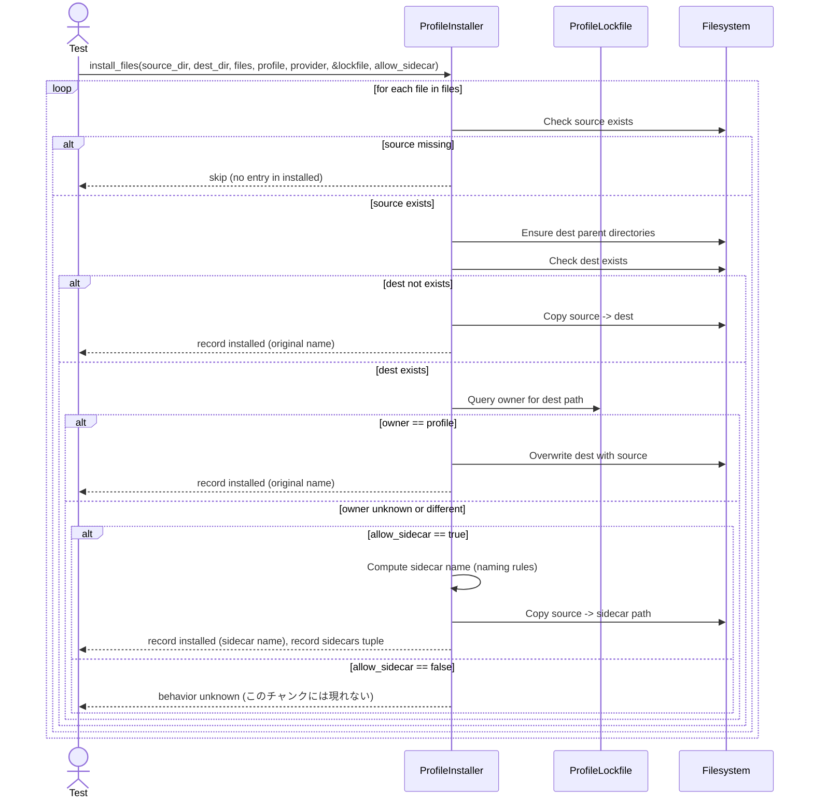

# test_installer.rs Review

## TL;DR

- 目的: プロファイルファイルのインストール処理（コピー）と、既存ファイルとの競合時の**サイドカー**生成挙動を包括的にテスト
- 主要API: **ProfileInstaller::install_files**、**ProfileLockfile::new**、**ProfileLockfile::add_profile**
- 複雑箇所: 所有者判定（Lockfile）による分岐と、ファイル名からの**サイドカー命名規則**（拡張子・ドットファイル・複数拡張子）
- 重大リスク: パス検証不足による**パストラバーサル**、ロックファイルと実ファイルの不整合時の**誤上書き**、**sidecar=false**時の競合処理不明
- エラー/安全性: テストは多数のunwrapに依存（panic前提）、並行性テストなし、unsafe未使用（このチャンクには現れない）
- パフォーマンス: O(n + 総コピーサイズ)のI/Oバウンド、ディレクトリ作成と複製の線形処理
- 追加テスト必要: **権限エラー**、**巨大ファイル/多数ファイル**、**パストラバーサル**、**sidecar=falseでの競合**、**同時書き込み競合**

## Overview & Purpose

このファイルは、プロファイルインストーラー（ProfileInstaller）のファイルインストール機能を検証するRustのユニットテストです。主に以下を目的としています。

- ソースディレクトリから指定されたファイル群を、宛先ディレクトリにコピーする基本動作の確認
- サブディレクトリ含むパスの再現（階層の作成）動作の確認
- ソースに存在しないファイルのスキップ動作の確認
- Lockfile（ProfileLockfile）に基づく所有者判定と、競合時の**サイドカー**生成ルールの検証
- 既存ファイルが他のプロファイルに所有されている場合の保存（上書き回避）と、同一プロファイル所有時の更新（上書き）確認
- サイドカー命名ルール（拡張子位置、ドットファイル、複数拡張子）検証

このチャンクにはインストーラーの実装本体は含まれていないため、動作はテストケースの期待値から推定しています（重要主張の根拠は各テスト関数名:行番号不明）。

## Structure & Key Components

| 種別 | 名前 | 公開範囲 | 責務 | 複雑度 |
|------|------|----------|------|--------|
| Function | test_install_single_file | private #[test] | 単一ファイルのインストール検証 | Low |
| Function | test_install_multiple_files | private #[test] | 複数ファイルのインストール検証 | Low |
| Function | test_install_with_subdirectory | private #[test] | サブディレクトリ内ファイルのコピーと階層作成 | Low |
| Function | test_skip_nonexistent_files | private #[test] | ソース不存在ファイルのスキップ | Low |
| Function | test_sidecar_for_unknown_owner | private #[test] | Lockfile未登録（未知の所有者）との競合時のサイドカー生成 | Med |
| Function | test_sidecar_for_different_profile | private #[test] | 異なるプロファイル所有との競合時のサイドカー生成 | Med |
| Function | test_same_profile_updates_without_sidecar | private #[test] | 同一プロファイル所有時の上書き（サイドカーなし） | Med |
| Function | test_sidecar_naming_patterns | private #[test] | サイドカー命名のパターン（拡張子・ドットファイル・複数拡張子） | Med |

### Dependencies & Interactions

- 内部依存:
  - 各テストは共通して以下のパターンに依存
    - tempfile::tempdir による一時ディレクトリ生成
    - std::fs によるファイル/ディレクトリ作成・書き込み・削除
    - ProfileLockfile の初期化と任意のプロファイルの登録（競合条件の設定）
    - ProfileInstaller::install_files の呼び出しと戻り値（installed, sidecars）の検証

- 外部依存（このチャンクに現れる使用クレート/モジュール）:

| クレート/モジュール | 用途 |
|--------------------|------|
| codanna::profiles::installer::ProfileInstaller | ファイル群のインストール実処理 |
| codanna::profiles::lockfile::{ProfileLockfile, ProfileLockEntry} | 所有者（プロファイル）管理と競合判定用データ |
| tempfile::tempdir | テスト用一時ディレクトリ |
| std::fs | ファイルI/O（作成・書き込み・読み込み・削除） |

- 被依存推定（このモジュールを使用する可能性のある箇所）:
  - codanna内のプロファイル管理・CLI/サービスの「プロファイル適用」機能
  - ロックファイルを更新する管理機能（テストでは生成/参照のみ）

## API Surface (Public/Exported) and Data Contracts

このテストファイル自体に公開APIはありません（該当なし）。ただし、テスト対象の外部APIについて、テストから推定されるシグネチャと契約を整理します。

| API名 | シグネチャ | 目的 | Time | Space |
|-------|-----------|------|------|-------|
| ProfileInstaller::install_files | 推定: fn install_files(&self, source_dir: &Path, dest_dir: &Path, files: &[String], profile_name: &str, provider_id: &str, lockfile: &ProfileLockfile, allow_sidecar: bool) -> Result<(Vec<String>, Vec<(String, String)>), E> | ファイル群のインストール、競合時のサイドカー生成 | O(n + Σcopy_bytes) | O(n) |
| ProfileLockfile::new | fn new() -> ProfileLockfile | 空のロックファイル生成 | O(1) | O(1) |
| ProfileLockfile::add_profile | 推定: fn add_profile(entry: ProfileLockEntry) | ロックファイルにプロファイル追加（所有ファイル登録） | O(p + f) | O(p + f) |

詳細（install_files）:

1. 目的と責務
   - 指定されたファイルリストをsource_dirからdest_dirにインストール
   - dest_dirに既存ファイルがあり、かつロックファイル上の所有者が「自身以外」または「不明」の場合、allow_sidecar=trueならサイドカーを生成して既存ファイルを保持
   - ロックファイル上で「自身が所有者」の場合は上書き更新（サイドカーなし）
   - ソースに存在しないファイルはスキップ

2. アルゴリズム（推定ステップ分解）
   - filesを順に処理
     - source_dir/path の存在チェック
       - 無ければスキップ（installedに含めない）（test_skip_nonexistent_files）
     - destのパスを構築し、必要なら親ディレクトリを作成（test_install_with_subdirectory）
     - 競合判定:
       - destに既存ファイルがあり、Lockfileにエントリがない → unknown owner（test_sidecar_for_unknown_owner）
       - destに既存ファイルがあり、Lockfileに存在し、かつ所有プロファイル≠profile_name → different profile（test_sidecar_for_different_profile）
       - destに既存ファイルがあり、Lockfileの所有プロファイル==profile_name → same profile（test_same_profile_updates_without_sidecar）
       - destに既存ファイルがない → そのままコピー（test_install_single_file）
     - 競合時の処理:
       - allow_sidecar=true: サイドカー命名規則に従い sidecar_path を生成、ソースをsidecar_pathへコピー。installedにsidecar_pathのベース名（例: "CLAUDE.codanna.md"）を追加、sidecarsに("意図した元ファイル", "サイドカー")を追加（test_sidecar_for_unknown_owner, test_sidecar_for_different_profile, test_sidecar_naming_patterns）
       - allow_sidecar=false: 不明（このチャンクには現れない）
     - 所有者が同一（自分）なら、destを上書きコピー。installedに元ファイル名を追加（test_same_profile_updates_without_sidecar）

3. 引数

| 引数 | 型（推定） | 説明 |
|-----|------------|------|
| source_dir | &Path（テストでは &PathBuf） | ソースのルートディレクトリ |
| dest_dir | &Path（テストでは &PathBuf） | インストール先のルートディレクトリ |
| files | &[String]（テストでは Vec<String>の借用） | 相対パスのファイルリスト |
| profile_name | &str | 現在インストール中のプロファイル名 |
| provider_id | &str | サイドカー命名に使用する識別子（例: "codanna"） |
| lockfile | &ProfileLockfile | 所有者（プロファイル）情報 |
| allow_sidecar | bool | 競合時にサイドカーを許可するか |

4. 戻り値

| 戻り値 | 型 | 説明 |
|--------|----|------|
| installed | Vec<String> | 実際に作成/更新されたファイルのベース名（サイドカーの場合はサイドカー名） |
| sidecars | Vec<(String, String)> | (意図したインストール先ファイル, 実際に生成したサイドカー) のペア |

5. 使用例

```rust
// 重要部分のみ抜粋（行番号不明）
let installer = ProfileInstaller::new();
let files = vec!["CLAUDE.md".to_string()];
let (installed, sidecars) = installer.install_files(
    &source_dir,
    &dest_dir,
    &files,
    "test-profile",
    "codanna",
    &lockfile,
    true,
).unwrap();
```

6. エッジケース
- ソースにファイルが存在しない → スキップ（installedに含まれない）
- サブディレクトリを含む相対パス → 親ディレクトリを作成してコピー
- 既存ファイルがありLockfile未登録 → allow_sidecar=trueならサイドカー生成
- 既存ファイルがLockfileで別プロファイル所有 → allow_sidecar=trueならサイドカー生成
- 既存ファイルがLockfileで同一プロファイル所有 → 上書き更新（サイドカーなし）
- サイドカー命名規則 → "BASE.provider.ext"、ドットファイルは末尾に".provider"、複数拡張子は最初のベース名直後に".provider"を挿入

## Walkthrough & Data Flow

以下は、テストから推定される install_files の主要な相互作用と分岐のシーケンスです。



上記の図は install_files 呼び出しの主要分岐を示します（本ファイル内の各テスト関数に共通、行番号不明）。

## Complexity & Performance

- 時間計算量: O(n + Σbytes)（nはfiles数、Σbytesはコピーしたファイルサイズ合計）
  - 所有者判定（ロックファイル検索）は実装依存。線形探索なら O(n + f)、ハッシュならほぼ O(n)。
- 空間計算量: O(n)（戻り値ベクタと一時的なパス文字列）
- ボトルネック:
  - ディスクI/O（コピー、ディレクトリ作成）
  - 大量のファイルや大きなファイルで遅延
- スケール限界/運用負荷:
  - ネットワーク/リモートFSが絡む場合はI/O待ちが支配的
  - ロックファイルが巨大な場合の所有者検索コスト
- 最適化案:
  - バッファサイズ調整、並行コピー（所有者判定の独立性が確保されていれば）
  - ロックファイルインデックス化（ファイルパス→プロフィールのマップ）
  - 既存チェックをbatchedに（OS依存）

## Edge Cases, Bugs, and Security

セキュリティチェックリストに基づく評価（このチャンクに現れる挙動の推定を含む）:

- メモリ安全性
  - Buffer overflow / Use-after-free / Integer overflow: 該当なし（Rustの安全なfs API使用、unsafe未使用。このチャンクには現れない）
- インジェクション
  - SQL/Command: 該当なし
  - Path traversal: 可能性あり。filesで"../"を含む相対パスが指定できる場合、意図しない上位ディレクトリに書き込みうる。対策として、source/destのルートからの正規化・ルート逸脱防止が必要（このチャンクには防御実装は現れない）
- 認証・認可
  - 権限チェック漏れ: OS権限に依存。書き込み失敗が発生する可能性に対するハンドリングは不明
  - セッション固定: 該当なし
- 秘密情報
  - Hard-coded secrets: 該当なし
  - Log leakage: ログ出力の有無不明
- 並行性
  - Race condition / Deadlock: このテストでは単一スレッド。並行インストールに対する排他制御は不明
  - 同時に同一ファイルへ書き込みが起きた場合の競合対策は不明

詳細なエッジケース表:

| エッジケース | 入力例 | 期待動作 | 実装 | 状態 |
|-------------|--------|----------|------|------|
| 空/不存在ファイルの指定 | ["exists.txt", "missing.txt"] | "missing.txt"はスキップ | test_skip_nonexistent_files | 確認済み |
| サブディレクトリのコピー | "subdir/nested.txt" | 親ディレクトリを作成してコピー | test_install_with_subdirectory | 確認済み |
| 既存ファイル（所有者不明） | destに"CLAUDE.md"あり、lockfile未登録 | allow_sidecar=trueでサイドカー作成 | test_sidecar_for_unknown_owner | 確認済み |
| 既存ファイル（別プロファイル所有） | lockfileに"CLAUDE.md"がprofile-a所有 | allow_sidecar=trueでサイドカー作成 | test_sidecar_for_different_profile | 確認済み |
| 同一プロファイル所有の更新 | lockfileの所有者==profile | 上書き（サイドカーなし） | test_same_profile_updates_without_sidecar | 確認済み |
| サイドカー命名（通常） | "CLAUDE.md" + provider="codanna" | "CLAUDE.codanna.md" | test_sidecar_naming_patterns | 確認済み |
| サイドカー命名（ドットファイル） | ".gitignore" | ".gitignore.codanna" | test_sidecar_naming_patterns | 確認済み |
| サイドカー命名（複数拡張子） | "file.tar.gz" | "file.codanna.tar.gz" | test_sidecar_naming_patterns | 確認済み |
| sidecar=falseでの競合 | allow_sidecar=false + 既存あり | 不明（エラー/上書き/スキップ？） | このチャンクには現れない | 未検証 |
| パストラバーサル | "../outside.txt" | ルート逸脱を拒否/正規化 | このチャンクには現れない | 未検証 |
| 権限不足 | 読み取り/書き込み不可 | エラーを返すべき | このチャンクには現れない | 未検証 |

## Design & Architecture Suggestions

- 所有者判定とコピー処理の分離
  - 判定フェーズ: 各ファイルについて「アクション（コピー/上書き/サイドカー/スキップ）」を決定
  - 実行フェーズ: 決定に従いI/Oを実行
- サイドカー命名を純粋関数化
  - 入力: original_path, provider_id
  - 出力: sidecar_path（拡張子/ドットファイル/複数拡張子対応）
  - テスト容易性向上（現行の命名テストの簡素化）
- Lockfileのインデックス化
  - ファイルパス→所有プロファイルのハッシュマップで高速化
- ルート逸脱防止
  - source/destについてcanonicalizeし、相対パス適用後もルート配下に収まることを検証
- エラー分類の設計
  - 不存在、権限、I/O失敗、競合（sidecar不許可）などに明確なエラー型
- オプションでdry-runモード
  - 実I/O無しでアクション計画のみ返却（監査やプレビュー向け）

## Testing Strategy (Unit/Integration) with Examples

既存テストは基本機能と主要分岐をよくカバーしています。追加で以下のテストを推奨します。

- sidecar=falseで競合した場合の挙動
  - エラー返却かスキップか、仕様を明確化してテスト

```rust
#[test]
fn test_conflict_without_sidecar_errors() {
    let temp = tempfile::tempdir().unwrap();
    let source_dir = temp.path().join("source");
    let dest_dir = temp.path().join("dest");
    std::fs::create_dir_all(&source_dir).unwrap();
    std::fs::create_dir_all(&dest_dir).unwrap();

    // 既存ファイル（所有者不明）
    std::fs::write(source_dir.join("conflict.md"), "new").unwrap();
    std::fs::write(dest_dir.join("conflict.md"), "existing").unwrap();

    let lockfile = ProfileLockfile::new();
    let installer = ProfileInstaller::new();
    let files = vec!["conflict.md".to_string()];

    let result = installer.install_files(
        &source_dir, &dest_dir, &files, "p", "codanna", &lockfile, false
    );
    // 仕様に応じて以下のいずれかを主張
    assert!(result.is_err(), "sidecar=falseの競合はErrを期待");
    // または: let (installed, sidecars) = result.unwrap(); assert!(installed.is_empty());
}
```

- パストラバーサル拒否の検証

```rust
#[test]
fn test_path_traversal_rejected() {
    let temp = tempfile::tempdir().unwrap();
    let source_dir = temp.path().join("source");
    let dest_dir = temp.path().join("dest");
    std::fs::create_dir_all(&source_dir).unwrap();
    std::fs::create_dir_all(&dest_dir).unwrap();

    std::fs::write(source_dir.join("../outside.txt"), "danger").unwrap();
    let installer = ProfileInstaller::new();
    let files = vec!["../outside.txt".to_string()];

    let res = installer.install_files(
        &source_dir, &dest_dir, &files, "p", "codanna", &ProfileLockfile::new(), true
    );
    assert!(res.is_err(), "ルート逸脱をErrで拒否するべき");
}
```

- 権限不足・I/O失敗の検証（読み取り不可/書き込み不可）
- 大量/巨大ファイルでのパフォーマンステスト（統合テスト）
- 並行実行（同一destへの並行インストール）競合検証

## Refactoring Plan & Best Practices

- テストコードの重複削減
  - ヘルパー関数で「temp環境セットアップ」「installer呼び出し」を共通化
  - テーブルドリブンテスト（命名パターンなど）を統一形式で記述
- アサーションをわかりやすく
  - installedとsidecarsの整合性を一括検証するユーティリティ
- 命名ルールのユニットテスト分離
  - sidecar名計算関数に対する専用テスト（純粋関数化が前提）
- エラーの明示的検証
  - result.is_err() のパスも含め、unwrap依存を減らす（ただしユニットテストではpanic前提でも可）

## Observability (Logging, Metrics, Tracing)

- Logging
  - ファイルごとのアクション（copy/overwrite/sidecar/skip）をINFO/DEBUGで記録
  - 競合判定の詳細（所有者、allow_sidecar、採用アクション）
- Metrics
  - インストール数、サイドカー生成数、スキップ数、エラー数、コピー総バイト数、所要時間
- Tracing
  - 複数ファイルのバッチ処理にspanを付与し、ファイル単位のイベントを紐付け
- テストでのログ検証
  - テスト用loggerを差し替え、特定メッセージの出力確認

## Risks & Unknowns

- install_filesの正確なシグネチャ・エラー型は不明（このチャンクには現れない）
- allow_sidecar=false時の競合動作は不明（仕様未確定）
- Lockfileの内部構造と検索コストは不明（線形/ハッシュ）
- パス正規化とルート逸脱防止の有無は不明
- 並行実行時の排他制御（ファイルロック等）は不明
- 大規模環境でのパフォーマンス特性（I/Oバッファ/スレッディング）は不明

以上により、公開APIの利用観点（install_files）、データフロー、セキュリティ/エッジケース、テスト拡張案、パフォーマンスとリファクタリングの指針を、本チャンクに基づき詳細化しました。