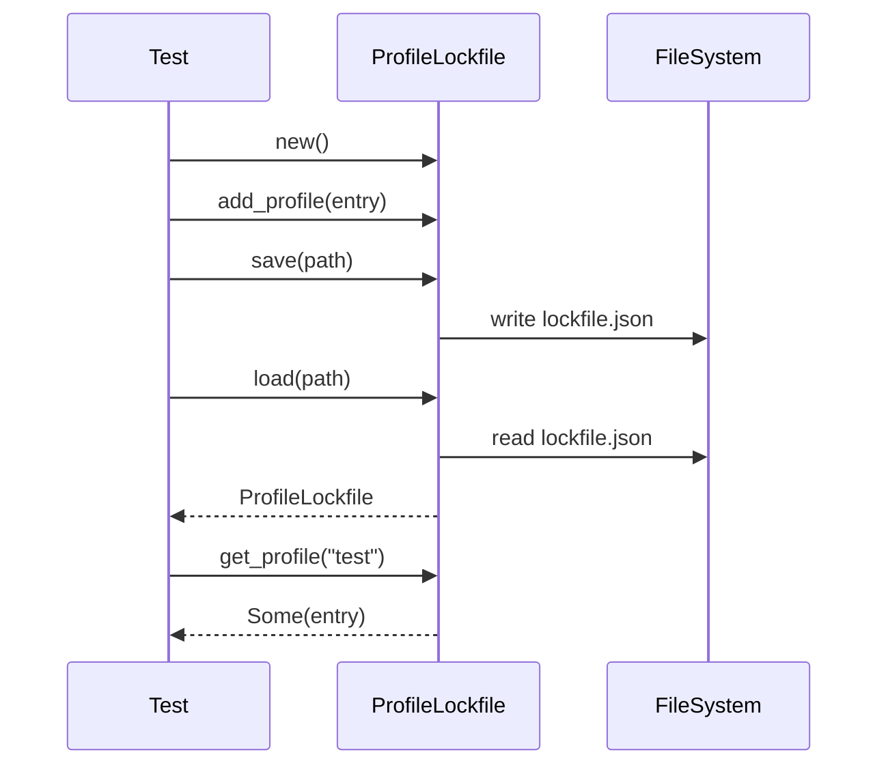

# test_lockfile.rs Review

## TL;DR

- このファイルは、ProfileLockfile/ProfileLockEntry の公開APIを対象にした統合テスト集（🧪）で、基本作成、新規追加、検索、保存/読込、レガシー互換を検証
- 主要公開API（推定）：new, add_profile, is_installed, get_profile, find_file_owner, save, load（データ契約はJSON、integrityはレガシーで欠落時に空文字へデフォルト）
- 複雑箇所：find_file_owner の全探索（O(P×F)）と、save/load のI/O・後方互換・整合性（💾）
- 重要リスク：重複ファイル所有者の扱い、書き込みの原子性・同時実行時の競合、フィールドの公開（不変条件破りの可能性）、versionの互換管理
- Rust安全性：テスト自体は安全（unsafeなし）。APIはResult/Optionの適切な選択がなされているが、エラー詳細や型（日時/パス）が文字列である点は改善余地
- セキュリティ：パス/権限/破損JSONなどI/Oエラーの扱いは不明。競合（プロセス/スレッド）時のロック機構も不明

## Overview & Purpose

このファイルは codanna::profiles::lockfile モジュールのロックファイル機能を検証する統合テストを提供します。主に以下を確認します。

- ProfileLockfile::new によりバージョン "1.0.0" と空の profiles が初期化されること
- ProfileLockEntry を add_profile で登録し、is_installed/get_profile で参照できること
- find_file_owner によりファイル所有者を逆引きできること
- save/load により JSON 形式のロックファイルを保存/読込でき、integrity フィールドが保持されること
- レガシー形式（integrity が無いJSON）でも読込に成功し、integrity が空文字にデフォルトされること

このチャンクには実装本体（profiles::lockfile モジュールのコード）は含まれていません。

## Structure & Key Components

| 種別 | 名前 | 公開範囲 | 責務 | 複雑度 |
|------|------|----------|------|--------|
| Function (test) | test_new_lockfile | #[test] | new() のデフォルト状態を検証 | Low |
| Function (test) | test_add_profile | #[test] | add_profile/is_installed/get_profile の動作検証 | Low |
| Function (test) | test_find_file_owner | #[test] | find_file_owner の動作検証 | Low |
| Function (test) | test_serialize_with_integrity | #[test] | save/load と integrity 保持の検証（I/O） | Med |
| Function (test) | test_deserialize_legacy_without_integrity | #[test] | レガシーJSON（integrity欠落）の後方互換検証 | Med |
| Struct（外部） | ProfileLockfile | pub（推定） | ロックファイルのルート。version と profiles を保持 | Low |
| Struct（外部） | ProfileLockEntry | pub（推定） | プロファイル1件のメタデータ（name, version, files, integrity, ほか） | Low |

Dependencies & Interactions
- 内部依存: 本ファイル内での関数間呼び出しはなし。各テストは独立。
- 外部依存（このチャンクに現れるもののみ）:

  | 依存 | 用途 | 備考 |
  |------|------|------|
  | codanna::profiles::lockfile::{ProfileLockfile, ProfileLockEntry} | テスト対象API | 実装はこのチャンクには現れない |
  | tempfile::tempdir | 一時ディレクトリ作成 | 保存/読込テスト用 |
  | std::fs::write | レガシーJSONの直書き | 後方互換テスト |

- 被依存推定: 本テストファイル自体は被依存されない（テストのみ）。ProfileLockfile はインストーラやCLIコマンド等から利用される可能性が高いが、このチャンクには現れない。

## API Surface (Public/Exported) and Data Contracts

本ファイルはテストのみです。以下はテストから逆算した外部公開APIとデータ契約の「推定」です（正確なシグネチャはこのチャンクには現れない）。

| API名 | シグネチャ（推定） | 目的 | Time | Space |
|-------|-------------------|------|------|-------|
| ProfileLockfile::new | fn new() -> ProfileLockfile | 初期化（version="1.0.0", profiles=空） | O(1) | O(1) |
| ProfileLockfile::add_profile | fn add_profile(entry: ProfileLockEntry) | プロファイルの登録/更新 | O(1) or O(log n) | O(1) |
| ProfileLockfile::is_installed | fn is_installed(name: &str) -> bool | 指定名の存在確認 | O(1) | O(1) |
| ProfileLockfile::get_profile | fn get_profile(name: &str) -> Option<&ProfileLockEntry> | 指定名の参照取得 | O(1) | O(1) |
| ProfileLockfile::find_file_owner | fn find_file_owner(path: &str) -> Option<impl AsRef<str>> | ファイル所有者の逆引き | O(P×F) | O(1) |
| ProfileLockfile::save | fn save(path: impl AsRef<Path>) -> Result<(), Error> | JSON保存 | O(P×F) + I/O | O(P×F) |
| ProfileLockfile::load | fn load(path: impl AsRef<Path>) -> Result<ProfileLockfile, Error> | JSON読込 | O(P×F) + I/O | O(P×F) |

データ契約（テストから読み取れる JSON 形状）
- ルート: { "version": "1.0.0", "profiles": { "<name>": ProfileLockEntry } }
- ProfileLockEntry フィールド（すべて pub（推定）、テストから構築可能）
  - name: String
  - version: String
  - installed_at: String
  - files: Vec<String>
  - integrity: String（レガシーJSONで欠落時は "" にデフォルト）
  - commit: Option<String>
  - provider_id: Option<String>
  - source: Option<String>

各APIの詳細（テストからの推定）

1) new
- 目的と責務: 空のロックファイルを生成し、version を "1.0.0" に設定
- アルゴリズム: 定数割当と空コンテナ初期化のみ
- 引数: なし
- 戻り値: 新しい ProfileLockfile
- 使用例:
  ```rust
  let lockfile = ProfileLockfile::new();
  assert_eq!(lockfile.version, "1.0.0");
  assert!(lockfile.profiles.is_empty());
  ```
- エッジケース:
  - バージョンは固定文字列で良いか（将来の互換性）: 不明

2) add_profile
- 目的と責務: 1件の ProfileLockEntry を登録（同名があれば上書きの可能性: 推定）
- アルゴリズム（推定）:
  1. entry.name をキーに profiles に格納
- 引数:
  | 名前 | 型 | 説明 |
  |------|----|------|
  | entry | ProfileLockEntry | 追加・更新するエントリ |
- 戻り値: なし
- 使用例:
  ```rust
  let mut lockfile = ProfileLockfile::new();
  let entry = ProfileLockEntry { /* 省略 */ name: "claude".into(), version: "1.0.0".into(), installed_at: "2025-01-11".into(), files: vec![], integrity: "".into(), commit: None, provider_id: None, source: None };
  lockfile.add_profile(entry);
  assert!(lockfile.is_installed("claude"));
  ```
- エッジケース:
  - 同名エントリ既存時の扱い: 上書き/マージの仕様は不明
  - name が空文字の場合: 不明

3) is_installed
- 目的と責務: プロファイルの存在確認
- アルゴリズム（推定）: profiles のキー存在チェック
- 引数:
  | 名前 | 型 | 説明 |
  |------|----|------|
  | name | &str | プロファイル名 |
- 戻り値: bool
- 使用例:
  ```rust
  assert!(lockfile.is_installed("claude"));
  assert!(!lockfile.is_installed("missing"));
  ```
- エッジケース:
  - 大文字小文字の扱い: 不明

4) get_profile
- 目的と責務: プロファイル定義の読み取り参照
- アルゴリズム（推定）: profiles から参照を返す
- 引数:
  | 名前 | 型 | 説明 |
  |------|----|------|
  | name | &str | プロファイル名 |
- 戻り値:
  | 型 | 意味 |
  |----|------|
  | Option<&ProfileLockEntry> | 見つかれば Some、なければ None |
- 使用例:
  ```rust
  let entry = lockfile.get_profile("claude").unwrap();
  assert_eq!(entry.integrity, "abc123");
  ```
- エッジケース:
  - ミュータブル参照取得APIの有無: 不明

5) find_file_owner
- 目的と責務: ファイル名から所有プロファイル名を逆引き
- アルゴリズム（推定）:
  1. すべてのプロファイルを走査
  2. 各エントリの files 内に一致があればその name を返す
- 引数:
  | 名前 | 型 | 説明 |
  |------|----|------|
  | path | &str | ファイル名/パス（テストは "CLAUDE.md" など短い相対名） |
- 戻り値:
  | 型 | 意味 |
  |----|------|
  | Option<String または &str> | 所有者名 |
- 使用例:
  ```rust
  assert_eq!(lockfile.find_file_owner("CLAUDE.md"), Some("claude"));
  assert_eq!(lockfile.find_file_owner("OTHER.md"), None);
  ```
- エッジケース:
  - 複数プロファイルが同一ファイルを含む場合の優先順位: 不明
  - 大文字小文字/パス正規化: 不明

6) save
- 目的と責務: ロックファイルを JSON へ保存
- アルゴリズム（推定）:
  1. 構造体を JSON シリアライズ
  2. 指定パスへ書き込み
- 引数:
  | 名前 | 型 | 説明 |
  |------|----|------|
  | path | impl AsRef<Path> | 保存先ファイルパス |
- 戻り値:
  | 型 | 意味 |
  |----|------|
  | Result<(), Error> | 成功/失敗 |
- 使用例:
  ```rust
  let temp = tempfile::tempdir().unwrap();
  let path = temp.path().join("lockfile.json");
  lockfile.save(&path).unwrap();
  ```
- エッジケース:
  - ディレクトリ不存在/権限なし/ディスクフル: エラー伝搬の詳細は不明
  - 原子的保存（temp→rename）やファイルロックの有無: 不明

7) load
- 目的と責務: JSON からロックファイルを読込（レガシー互換を含む）
- アルゴリズム（推定）:
  1. JSON を読み取りデシリアライズ
  2. 欠落フィールド（integrity）のデフォルト適用
- 引数:
  | 名前 | 型 | 説明 |
  |------|----|------|
  | path | impl AsRef<Path> | 読込元ファイルパス |
- 戻り値:
  | 型 | 意味 |
  |----|------|
  | Result<ProfileLockfile, Error> | 成功時は構造体 |
- 使用例:
  ```rust
  let loaded = ProfileLockfile::load(&path).unwrap();
  let e = loaded.get_profile("test").unwrap();
  assert_eq!(e.integrity, "sha256hash");
  ```
- エッジケース:
  - バージョン不一致（"version": "1.0.0" 以外）時の扱い: 不明
  - 破損JSON/スキーマ不整合: エラー詳細は不明

## Walkthrough & Data Flow

各テストの主なフロー:

- test_new_lockfile
  1. new() で初期化
  2. version が "1.0.0"、profiles が空であることを検証

- test_add_profile
  1. entry を組み立て（name/version/installed_at/files/integrity など）
  2. add_profile(entry)
  3. is_installed("claude") == true を検証
  4. get_profile("claude") で files や integrity を検証

- test_find_file_owner
  1. 単一ファイル "CLAUDE.md" を含む entry を追加
  2. find_file_owner("CLAUDE.md") == Some("claude")
  3. find_file_owner("OTHER.md") == None

- test_serialize_with_integrity（I/O）
  1. 一時ディレクトリに "lockfile.json" を作成
  2. entry を追加
  3. save(path)
  4. load(path)
  5. get_profile("test").integrity == "sha256hash"

- test_deserialize_legacy_without_integrity（レガシー互換）
  1. integrity 欠落のJSONを直接書き込み
  2. load(path)
  3. get_profile("legacy").integrity == ""（デフォルト）

Mermaid（test_serialize_with_integrity の主要フロー）



上記の図は test_serialize_with_integrity 関数の主要フローを示す（このチャンクに行番号は現れない）。

参照コード抜粋（長いため重要部のみ）
```rust
let temp = tempfile::tempdir().unwrap();
let lockfile_path = temp.path().join("lockfile.json");

let mut lockfile = ProfileLockfile::new();
let entry = ProfileLockEntry {
    name: "test".to_string(),
    version: "1.0.0".to_string(),
    installed_at: "2025-01-11T00:00:00Z".to_string(),
    files: vec!["test.txt".to_string()],
    integrity: "sha256hash".to_string(),
    commit: None,
    provider_id: None,
    source: None,
};

lockfile.add_profile(entry);
lockfile.save(&lockfile_path).unwrap();

let loaded = ProfileLockfile::load(&lockfile_path).unwrap();
let loaded_entry = loaded.get_profile("test").unwrap();
assert_eq!(loaded_entry.integrity, "sha256hash");
```

## Complexity & Performance

- new: 時間 O(1), 空間 O(1)
- add_profile: 時間 O(1)（HashMap想定）/O(log n)（BTreeMap想定）, 空間 O(1) 追加
- is_installed: 時間 O(1)（推定）, 空間 O(1)
- get_profile: 時間 O(1)（推定）, 空間 O(1)
- find_file_owner: 時間 O(P×F)（プロファイル数P×各files長Fの全探索）, 空間 O(1)
- save/load: 時間 O(P×F) + I/O, 空間 O(P×F)（シリアライズ/デシリアライズのメモリ）
- スケール限界/ボトルネック
  - find_file_owner はプロファイルとファイル数が増えると線形に遅くなる
  - save/load は I/O 従属。巨大なプロファイル群ではJSONのサイズとパースコストが支配
  - 並行書込みや頻繁な保存は競合/破損のリスク（原子的保存がない場合）

## Edge Cases, Bugs, and Security

エッジケース一覧（このチャンクから観測・推定）

| エッジケース | 入力例 | 期待動作 | 実装 | 状態 |
|-------------|--------|----------|------|------|
| 空の初期状態 | new() | version="1.0.0", profiles空 | あり（テストで検証） | OK |
| 重複名上書き | name="x" を2回 add | 上書き or エラー | 不明 | 不明 |
| find_file_owner 重複所有 | 2つのプロファイルが同一ファイル | 決定的ルールで1件に帰属 or エラー | 不明 | 不明 |
| 大文字小文字差異 | "Claude.md" vs "CLAUDE.md" | OS/仕様に応じた比較戦略 | 不明 | 不明 |
| パス正規化 | "./a/../b.txt" | 正規化後に照合 | 不明 | 不明 |
| 保存失敗 | 書込不可/ディスクフル | Errを返す | 不明 | 不明 |
| 破損JSON | "{" など | Errを返す | 不明 | 不明 |
| バージョン不一致 | "version": "2.0.0" | 互換チェック/警告/エラー | 不明 | 不明 |
| integrity 欠落 | レガシーJSON | 読込成功し "" デフォルト | あり（テストで検証） | OK |
| files 空 | files: [] | 正常だが find_file_ownerでヒットなし | 不明 | 不明 |

セキュリティチェックリスト
- メモリ安全性
  - Buffer overflow / Use-after-free / Integer overflow: Safe Rustで実装されている前提。テストにはunsafeなし
- インジェクション
  - JSONインジェクションは通常問題にならないが、不正な外部入力の取り込み時はスキーマ検証が望ましい
  - パス・トラバーサル: save/load の path が外部入力由来なら注意（このテストでは tempdir なので安全）
- 認証・認可
  - 対象外（ファイルローカル操作のみ）。ただし共有ディレクトリに保存する場合は権限設定に注意
- 秘密情報
  - ハードコード秘密情報なし。将来ログ出力する場合はパスや commit などの扱いに配慮
- 並行性
  - 同時 save（別プロセス/スレッド）での競合・破損対策（ファイルロック・原子的書込み）が必要かは不明

Rust特有の観点（詳細）
- 所有権: add_profile(entry) は entry をムーブ（テストで再利用なし）
- 借用: get_profile は参照を返す（不変参照想定）。ライフタイムは self に束縛（推定）
- ライフタイム: 明示パラメータは不要（推定）
- unsafe 境界: このチャンクには出現しない
- 並行性/非同期: 非同期APIは出現しない。Send/Sync 要件は不明
- await 境界/キャンセル: 該当なし
- エラー設計: save/load は Result、get_profile は Option を返す設計で適切。テスト中の unwrap は妥当（テストなので失敗時即座にパニック）

## Design & Architecture Suggestions

- フィールドの可視性
  - ProfileLockfile.version/profiles が pub であるため、不変条件が外部から破られるリスク。原則非公開にし、専用アクセサを提供するのが安全
- find_file_owner の効率化
  - 検索が O(P×F) の全探索。頻繁に呼ばれるなら「ファイル→プロファイル名」の逆引きインデックスを維持（HashMap）し O(1) に
- 保存の堅牢性
  - 原子的保存（tempファイルへ write→fsync→rename）とファイルロック（OS依存）で競合/破損に強くする
  - 連番バックアップや「version」違い時のマイグレーション手順も設計
- データ型の厳密化
  - installed_at は String ではなく time/chrono の型へ
  - files は String より PathBuf（プラットフォーム差異吸収）
  - integrity は Option<String> + 型付け（アルゴリズム識別子+値）で表現力/バリデーション向上
- シリアライズの決定性
  - profiles を BTreeMap にするなどで出力順を安定化、差分管理/レビュー容易化
- バージョニング戦略
  - version の互換ルール、マイグレーションの実装（load 時に version を判定し段階的に変換）

## Testing Strategy (Unit/Integration) with Examples

追加で欲しいテスト（例）

- 重複名の上書き
  ```rust
  #[test]
  fn test_add_profile_overwrite() {
      let mut lf = ProfileLockfile::new();
      let mut e1 = ProfileLockEntry { name: "x".into(), version: "1.0".into(), installed_at: "t1".into(), files: vec!["a".into()], integrity: "".into(), commit: None, provider_id: None, source: None };
      lf.add_profile(e1);
      let e2 = ProfileLockEntry { name: "x".into(), version: "2.0".into(), installed_at: "t2".into(), files: vec!["b".into()], integrity: "h".into(), commit: None, provider_id: None, source: None };
      lf.add_profile(e2);
      let e = lf.get_profile("x").unwrap();
      assert_eq!(e.version, "2.0");
      assert!(e.files.contains(&"b".to_string()));
  }
  ```
- 重複ファイル所有者の優先順位
  ```rust
  #[test]
  fn test_find_file_owner_duplicated() {
      let mut lf = ProfileLockfile::new();
      lf.add_profile(ProfileLockEntry { name: "a".into(), version: "1".into(), installed_at: "t".into(), files: vec!["same.txt".into()], integrity: "".into(), commit: None, provider_id: None, source: None });
      lf.add_profile(ProfileLockEntry { name: "b".into(), version: "1".into(), installed_at: "t".into(), files: vec!["same.txt".into()], integrity: "".into(), commit: None, provider_id: None, source: None });
      // 仕様に合わせて期待値を定義（例: 先勝ち/後勝ち）
      let owner = lf.find_file_owner("same.txt");
      assert!(owner.is_some());
  }
  ```
- 不正/破損JSONの読込
  ```rust
  #[test]
  fn test_load_invalid_json() {
      let temp = tempfile::tempdir().unwrap();
      let path = temp.path().join("lockfile.json");
      std::fs::write(&path, "{").unwrap();
      assert!(ProfileLockfile::load(&path).is_err());
  }
  ```
- バージョン不一致の扱い
  ```rust
  #[test]
  fn test_load_version_mismatch() {
      let temp = tempfile::tempdir().unwrap();
      let path = temp.path().join("lockfile.json");
      let json = r#"{ "version":"9.9.9", "profiles":{} }"#;
      std::fs::write(&path, json).unwrap();
      // 期待: 警告 or エラー or 自動マイグレーション
      let _ = ProfileLockfile::load(&path); // 振る舞いに応じてassert
  }
  ```
- パス/権限エラー
  ```rust
  #[test]
  fn test_save_permission_denied() {
      // OS依存のためスキップ可能条件を設ける
      // 保存先を権限のない場所にして Err を期待
  }
  ```

## Refactoring Plan & Best Practices

- フィールドの隠蔽: ProfileLockfile.version/profiles を非pubにし、アクセサ/操作メソッドで不変条件を確保
- ビルダー導入: ProfileLockEntry の構築を Builder にして必須/任意フィールドを明示、バリデーションを集中
- 型の見直し: installed_at を DateTime、files を PathBuf、integrity を型安全な構造体に
- 逆引きインデックス: find_file_owner の高速化と重複検知のため、内部に HashMap<PathBuf, String> を保持（保存時は冗長化せず生成時に構築）
- シリアライズ層の分離: serdeモデルと内部ドメインモデルを分離（後方互換やマイグレーション実装を容易に）
- I/Oの堅牢化: 原子的保存、fsync、ファイルロック（advisory lock）をオプションで有効化

## Observability (Logging, Metrics, Tracing)

- Logging
  - load 時: 読込パス、サイズ、version、レガシー変換の有無を debug/info で
  - save 時: 保存先、サイズ、エントリ数
  - エラー時: 具体的な原因（権限/存在/パース失敗）
- Metrics
  - profiles の件数、files の総数、save/load 所要時間、失敗回数
- Tracing
  - save/load をスパンでラップし I/O 境界を可視化
- 低ノイズ方針
  - テストではログ抑制、実運用ではレベル切替可能に

## Risks & Unknowns

- 不明点（このチャンクには現れない）
  - 内部データ構造（HashMap/BTreeMap等）、ソート順、シリアライズの安定性
  - 同名プロファイル追加時の仕様
  - find_file_owner の重複所有時の決定ルール、大小文字やパス正規化戦略
  - save/load の原子性、ロック、エラー分類
  - バージョン互換ポリシーとマイグレーション戦略
- リスク
  - フィールドが pub であるため、外部から不整合な状態にされやすい
  - 大規模データでの find_file_owner 全探索による性能劣化
  - 競合書込み時の破損リスク（原子的保存やロックが未実装の場合）
  - integrity を空文字でデフォルトする設計は「未検証」と「検証済み空文字」の区別が付きにくい（Option を推奨）