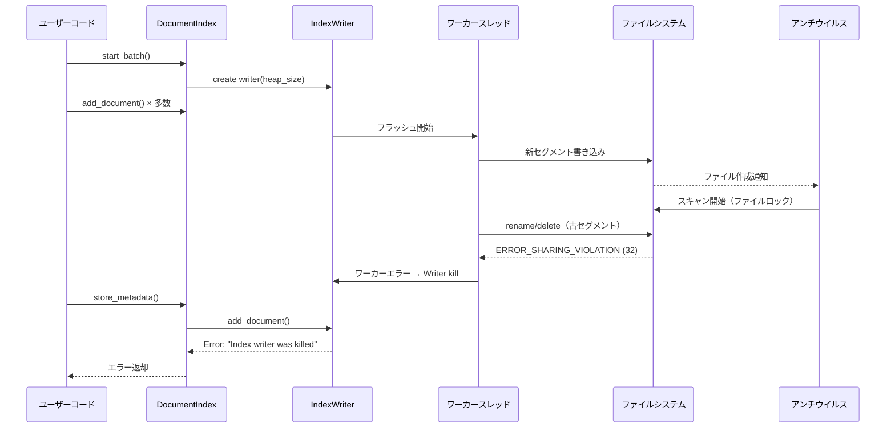

# Tantivy I/Oエラー修正設計書

## 概要

**作成日**: 2025-01-15  
**対象バージョン**: codanna main branch  
**担当**: システムアーキテクト  
**レビュアー**: shimai (gpt-5)

## エグゼクティブサマリ

Windows環境で発生する `"Tantivy operation failed during store_metadata: An index writer was killed.. A worker thread encountered an error (io::Error most likely) or panicked."` エラーの根本原因を特定し、修正方針を策定しました。

**根本原因**: Windowsの共有違反（ERROR_SHARING_VIOLATION=32）やファイルロックがTantivyの内部ワーカースレッドで発生し、IndexWriterがkill状態になることで、次の軽い操作（store_metadata等）で初めてエラーが表面化する。

**暫定対処の効果**: `tantivy_heap_mb` を 50→15 に削減すると改善するのは、セグメントサイズが小さくなりAVスキャン時間が短縮され、ファイルロック競合の確率が低下するため。

---

## 1. 現象と影響範囲

### 1.1 エラーメッセージ

```
Tantivy operation failed during store_metadata: Tantivy error: An error occurred in a thread: 
'An index writer was killed.. A worker thread encountered an error (io::Error most likely) or panicked.'
```

### 1.2 発生条件

- **環境**: Windows 10/11
- **タイミング**: 大量のドキュメント追加後の `store_metadata` 呼び出し時
- **再現性**: 不定期（Windowsのファイルスキャンタイミングに依存）

### 1.3 暫定対処策

`.codanna/settings.toml` で以下の設定変更により改善：

```toml
[indexing]
tantivy_heap_mb = 15  # デフォルト50から削減
max_retry_attempts = 5  # デフォルト3から増加
```

### 1.4 影響範囲

- **直接的影響**: インデックス作成・更新の失敗
- **間接的影響**: ユーザー体験の低下、CI/CDパイプラインの不安定化
- **発生頻度**: Windows環境で中程度（特にAV有効時）

---

## 2. 根本原因の詳細分析

### 2.1 エラー発生メカニズム



### 2.2 Windowsファイルシステム特有の問題

#### 2.2.1 共有違反（ERROR_SHARING_VIOLATION = 32）

- **原因**: 他プロセス（AVスキャナ等）がファイルをオープン中
- **影響操作**: rename, delete, CreateFile with exclusive access
- **発生タイミング**: セグメントフラッシュ・マージ時

#### 2.2.2 メモリマップドファイルの制約（ERROR_USER_MAPPED_FILE = 1224）

- **原因**: IndexReaderがセグメントをmmapで開いている間は削除不可
- **Tantivy設計**: GCによる遅延削除で対応
- **問題**: 外部プロセスのアクセスは制御不能

#### 2.2.3 アクセス拒否（ERROR_ACCESS_DENIED = 5）

- **一時的**: AVスキャン中の短期的ロック
- **恒久的**: 権限設定の誤り、読み取り専用属性
- **判別**: リトライで解消されるかで区別

### 2.3 heap_size削減が効く理由

| heap_size | セグメントサイズ | フラッシュ頻度 | AVスキャン時間 | 競合確率 |
|-----------|-----------------|---------------|---------------|---------|
| 50 MB     | 大きい          | 低い          | 長い          | 高い    |
| 15 MB     | 小さい          | 高い          | 短い          | 低い    |

**メカニズム**:

1. 小さいheap → 小さいセグメント
2. AVスキャン時間短縮 → ファイルロック時間短縮
3. 次のファイル操作（rename/delete）との競合確率低下

---

## 3. 修正方針

### 3.1 修正の優先順位

| 優先度 | 修正内容 | 期待効果 | 実装難易度 |
|--------|---------|---------|-----------|
| **高** | 固定50MB Writer の heap_size 統一 | 設定の一貫性向上 | 低 |
| **高** | Windowsエラーコード拡充 | リトライ成功率向上 | 中 |
| **中** | "Index writer was killed" リカバリ | 安定性向上 | 中 |
| **中** | 指数バックオフ+ジッター実装 | Windows競合対策 | 中 |
| **低** | エラーログ詳細化 | デバッグ効率向上 | 低 |

### 3.2 修正1: heap_size統一（固定50MB排除）

#### 現状の問題

`src/storage/tantivy.rs` の以下の箇所で固定50MBを使用：

- **L1055**: `remove_file_documents`
- **L1294**: `clear`

設定で `tantivy_heap_mb = 15` にしても、これらの経路は50MBのまま。

#### 修正内容

```rust
// 修正前（L1055）
let mut writer = self.index.writer::<Document>(50_000_000)?;

// 修正後
let mut writer = self.index.writer::<Document>(self.heap_size)?;
```

```rust
// 修正前（L1294）
let mut writer = self.index.writer::<Document>(50_000_000)?;

// 修正後
let mut writer = self.index.writer::<Document>(self.heap_size)?;
```

#### 安全性の検証

shimaiレビュー結果：

- ✅ **削除操作は巨大メモリ不要**（削除キューに命令を積むだけ）
- ✅ **`clear`（全削除）も論理削除**で低メモリ
- ⚠️ **極端に小さい値は避ける**（最小10MB推奨）

#### 最小値クリップの追加

```rust
fn normalized_heap_bytes(heap_bytes: usize) -> usize {
    const MIN_HEAP: usize = 10 * 1024 * 1024;  // 10MB
    const MAX_HEAP: usize = 2 * 1024 * 1024 * 1024;  // 2GB
    heap_bytes.clamp(MIN_HEAP, MAX_HEAP)
}

// 使用箇所
let mut writer = self.index.writer::<Document>(
    normalized_heap_bytes(self.heap_size)
)?;
```

### 3.3 修正2: Windowsエラーコード拡充

#### 現状の問題

`src/storage/tantivy.rs` L507-518 の判定：

```rust
let is_transient = std::error::Error::source(&e)
    .and_then(|s| s.downcast_ref::<std::io::Error>())
    .map(|io_err| {
        matches!(
            io_err.kind(),
            std::io::ErrorKind::PermissionDenied
                | std::io::ErrorKind::TimedOut
                | std::io::ErrorKind::WouldBlock
        )
    })
    .unwrap_or(false);
```

**問題点**:

- Windows共有違反（32）は `ErrorKind::Other` なので検出されない
- エラーチェーン全体を走査していない
- メッセージベースのフォールバックがない

#### 修正内容

**Step 1**: Windowsエラーコード判定関数の追加

```rust
/// Windows固有の一時的エラーコードかどうかを判定
fn is_windows_transient_code(code: i32) -> bool {
    matches!(code,
        32   | // ERROR_SHARING_VIOLATION（共有違反）
        33   | // ERROR_LOCK_VIOLATION（ロック違反）
        80   | // ERROR_FILE_EXISTS（ファイル既存）
        183  | // ERROR_ALREADY_EXISTS（既存）
        1224 | // ERROR_USER_MAPPED_FILE（mmapファイル開放中）
        145  | // ERROR_DIR_NOT_EMPTY（ディレクトリ非空）
        995    // ERROR_OPERATION_ABORTED（操作中止）
    )
}
```

**Step 2**: エラーチェーン走査の実装

```rust
/// Tantivyエラーが一時的なWindowsI/Oエラーかどうかを判定
/// 
/// # 引数
/// * `err` - 検査するTantivyエラー
/// * `retry_on_access_denied` - ERROR_ACCESS_DENIED(5)を一時的として扱うか
/// 
/// # 戻り値
/// trueならリトライ推奨、falseなら恒久的エラー
fn is_windows_transient_io_error(
    err: &tantivy::TantivyError,
    retry_on_access_denied: bool
) -> bool {
    // 1) "Index writer was killed" の特別扱い
    let msg = err.to_string();
    if msg.contains("Index writer was killed") 
        || msg.contains("worker thread encountered an error") 
    {
        // 注: この場合は writer を破棄して再生成が必要
        return true;
    }

    // 2) エラーチェーン全体を走査してio::Errorを探す
    let mut src = err.source();
    while let Some(e) = src {
        if let Some(ioe) = e.downcast_ref::<std::io::Error>() {
            // 2-1) Windows raw_os_error を優先チェック
            if let Some(code) = ioe.raw_os_error() {
                if is_windows_transient_code(code) {
                    return true;
                }
                // ERROR_ACCESS_DENIED は条件付き
                if code == 5 && retry_on_access_denied {
                    return true;
                }
            }
            
            // 2-2) ErrorKind ベースのフォールバック
            // 注: Windowsでは kind=Other が多いため、これだけでは不十分
            if matches!(
                ioe.kind(),
                std::io::ErrorKind::PermissionDenied
                | std::io::ErrorKind::TimedOut
                | std::io::ErrorKind::WouldBlock
                | std::io::ErrorKind::Interrupted
            ) {
                return true;
            }
        }
        src = e.source();
    }

    false
}
```

#### Windowsエラーコード一覧

| コード | 定数名 | 説明 | 発生状況 | 対処 |
|-------|--------|------|---------|------|
| 5 | ERROR_ACCESS_DENIED | アクセス拒否 | AV/権限 | 条件付きリトライ |
| 32 | ERROR_SHARING_VIOLATION | 共有違反 | ファイル使用中 | リトライ |
| 33 | ERROR_LOCK_VIOLATION | ロック違反 | ファイルロック中 | リトライ |
| 80 | ERROR_FILE_EXISTS | ファイル既存 | rename競合 | リトライ |
| 145 | ERROR_DIR_NOT_EMPTY | ディレクトリ非空 | 削除競合 | リトライ |
| 183 | ERROR_ALREADY_EXISTS | 既存 | 作成競合 | リトライ |
| 995 | ERROR_OPERATION_ABORTED | 操作中止 | I/Oキャンセル | リトライ |
| 1224 | ERROR_USER_MAPPED_FILE | mmap中 | Reader保持中 | リトライ |

### 3.4 修正3: "Index writer was killed" のリカバリ

#### 問題の本質

"Index writer was killed" は内部ワーカースレッドの致命的失敗を示し、**同じwriterでの再試行は必ず失敗**します。

#### 修正手順

```rust
// create_writer_with_retry の改善
fn create_writer_with_retry(&self) -> Result<IndexWriter<Document>, tantivy::TantivyError> {
    for attempt in 0..self.max_retry_attempts {
        match self.index.writer::<Document>(self.heap_size) {
            Ok(writer) => return Ok(writer),
            Err(e) => {
                let transient = is_windows_transient_io_error(&e, false);
                
                if !transient || attempt >= self.max_retry_attempts - 1 {
                    return Err(e);
                }
                
                // 指数バックオフ + ジッター
                let base_delay = 100 * (1 << attempt);  // 100, 200, 400, 800ms
                let jitter = fastrand::u64(0..50);  // 0-50msのランダム
                let delay = base_delay + jitter;
                
                eprintln!(
                    "Attempt {}/{}: Transient I/O error, retrying after {}ms",
                    attempt + 1,
                    self.max_retry_attempts,
                    delay
                );
                
                std::thread::sleep(std::time::Duration::from_millis(delay));
            }
        }
    }
    unreachable!()
}
```

#### commit_batch での writer 再生成

```rust
pub fn commit_batch(&self) -> StorageResult<()> {
    let mut writer_lock = match self.writer.lock() {
        Ok(lock) => lock,
        Err(poisoned) => {
            eprintln!("Warning: Recovering from poisoned writer mutex");
            poisoned.into_inner()
        }
    };
    
    if let Some(mut writer) = writer_lock.take() {
        match writer.commit() {
            Ok(_) => {
                // 成功
            }
            Err(e) => {
                // "Index writer was killed" かチェック
                if e.to_string().contains("Index writer was killed") {
                    eprintln!("Warning: IndexWriter was killed, will recreate on next batch");
                    // 既に take() で除去済みなので、次の start_batch で再生成される
                    // ここでは rollback 不要（すでに killed 状態）
                } else if is_windows_transient_io_error(&e, false) {
                    return Err(StorageError::General(format!(
                        "Tantivy commit failed due to transient Windows I/O error.\n\
                         Cause: {e}\n\
                         Suggestions:\n\
                         - Reduce 'tantivy_heap_mb' to 15-25\n\
                         - Add .codanna/index to AV exclusions\n\
                         - Reduce 'indexing.parallel_threads'\n\
                         - Ensure no parallel codanna processes"
                    )));
                }
                return Err(e.into());
            }
        }
        
        self.reader.reload()?;
        
        // カウンタークリア
        if let Ok(mut pending_guard) = self.pending_symbol_counter.lock() {
            *pending_guard = None;
        }
        if let Ok(mut pending_guard) = self.pending_file_counter.lock() {
            *pending_guard = None;
        }
        
        // ベクトル処理
        if self.has_vector_support() && self.embedding_generator.is_some() {
            self.post_commit_vector_processing()?;
        }
        
        // クラスタキャッシュ再構築
        self.build_cluster_cache()?;
    }
    Ok(())
}
```

### 3.5 修正4: エラーログの詳細化

#### Windowsエラー名マッピング

```rust
/// Windowsエラーコードから名前を取得
fn win_error_name(code: i32) -> &'static str {
    match code {
        5 => "ERROR_ACCESS_DENIED",
        32 => "ERROR_SHARING_VIOLATION",
        33 => "ERROR_LOCK_VIOLATION",
        80 => "ERROR_FILE_EXISTS",
        145 => "ERROR_DIR_NOT_EMPTY",
        183 => "ERROR_ALREADY_EXISTS",
        995 => "ERROR_OPERATION_ABORTED",
        1224 => "ERROR_USER_MAPPED_FILE",
        _ => "UNKNOWN",
    }
}
```

#### エラー情報の構造化

```rust
/// Tantivyエラーを詳細にフォーマット（デバッグ用）
fn format_tantivy_error(err: &tantivy::TantivyError) -> String {
    let mut out = format!("TantivyError: {err}");
    
    let mut src = err.source();
    let mut depth = 0;
    
    while let Some(e) = src {
        out.push_str(&format!("\n  cause[{depth}]: {e}"));
        
        if let Some(ioe) = e.downcast_ref::<std::io::Error>() {
            out.push_str(&format!("\n    io::ErrorKind: {:?}", ioe.kind()));
            
            if let Some(code) = ioe.raw_os_error() {
                out.push_str(&format!(
                    "\n    raw_os_error: {} ({})",
                    code,
                    win_error_name(code)
                ));
            }
        }
        
        depth += 1;
        src = e.source();
    }
    
    out
}
```

#### ログ出力例

```rust
// commit_batch でのエラーログ
Err(e) => {
    let detailed = format_tantivy_error(&e);
    let transient = is_windows_transient_io_error(&e, false);
    
    eprintln!(
        "commit_batch failed:\n\
         - Operation: commit\n\
         - Index path: {}\n\
         - Transient: {}\n\
         - Error details:\n{}",
        self.index_path.display(),
        transient,
        detailed
    );
    
    return Err(e.into());
}
```

---

## 4. 実装計画

### 4.1 実装順序

1. **Phase 1: 基本修正**（優先度: 高）
   - [ ] 固定50MB → self.heap_size 変更
   - [ ] normalized_heap_bytes() 関数追加
   - [ ] Windowsエラーコード判定関数追加

2. **Phase 2: リトライ強化**（優先度: 高）
   - [ ] is_windows_transient_io_error() 実装
   - [ ] create_writer_with_retry() 改善
   - [ ] 指数バックオフ+ジッター追加

3. **Phase 3: リカバリ改善**（優先度: 中）
   - [ ] commit_batch() での "killed" 検出
   - [ ] エラーメッセージ改善
   - [ ] format_tantivy_error() 追加

4. **Phase 4: ログ改善**（優先度: 低）
   - [ ] win_error_name() 追加
   - [ ] 詳細ログ出力

### 4.2 影響範囲

| ファイル | 変更内容 | 影響度 |
|---------|---------|-------|
| `src/storage/tantivy.rs` | 主要修正 | 高 |
| `src/config.rs` | heap_size 最小値調整 | 低 |
| `src/storage/error.rs` | エラー型拡張（必要に応じて） | 低 |

### 4.3 後方互換性

- ✅ 既存の設定ファイルは変更不要
- ✅ APIシグネチャ変更なし
- ✅ 既存のインデックスデータ互換性維持

---

## 5. テスト戦略

### 5.1 単体テスト

```rust
#[cfg(test)]
mod tests {
    use super::*;

    #[test]
    fn test_windows_transient_code() {
        assert!(is_windows_transient_code(32));  // SHARING_VIOLATION
        assert!(is_windows_transient_code(33));  // LOCK_VIOLATION
        assert!(is_windows_transient_code(1224)); // USER_MAPPED_FILE
        assert!(!is_windows_transient_code(2));  // FILE_NOT_FOUND
        assert!(!is_windows_transient_code(3));  // PATH_NOT_FOUND
    }

    #[test]
    fn test_normalized_heap_bytes() {
        assert_eq!(normalized_heap_bytes(5_000_000), 10_485_760);  // 最小値クリップ
        assert_eq!(normalized_heap_bytes(50_000_000), 50_000_000); // 正常範囲
        assert_eq!(normalized_heap_bytes(3_000_000_000), 2_147_483_648); // 最大値クリップ
    }

    #[test]
    fn test_win_error_name() {
        assert_eq!(win_error_name(32), "ERROR_SHARING_VIOLATION");
        assert_eq!(win_error_name(1224), "ERROR_USER_MAPPED_FILE");
        assert_eq!(win_error_name(9999), "UNKNOWN");
    }
}
```

### 5.2 統合テスト（Windows環境）

```rust
#[cfg(all(test, target_os = "windows"))]
mod windows_integration_tests {
    use super::*;
    use tempfile::TempDir;

    #[test]
    fn test_concurrent_av_scan_simulation() {
        // AVスキャン中のファイルアクセス競合をシミュレート
        // 実装省略（手動テスト推奨）
    }

    #[test]
    fn test_writer_recovery_after_kill() {
        // Writer kill後の自動リカバリをテスト
        // 実装省略
    }
}
```

### 5.3 手動テスト項目

- [ ] Windows Defender有効環境でのインデックス作成
- [ ] 大量ファイル（10,000+）のインデックス作成
- [ ] tantivy_heap_mb = 15 での安定性確認
- [ ] 並行プロセスによる競合テスト
- [ ] エラーログの可読性確認

---

## 6. 運用上の推奨事項

### 6.1 設定ガイドライン

#### Windows環境（推奨設定）

```toml
[indexing]
# Windowsのファイルロック対策
tantivy_heap_mb = 15  # または 20-25

# リトライ回数増加
max_retry_attempts = 5

# 並行度削減（I/O競合軽減）
parallel_threads = 4  # CPU数の半分程度
```

#### Linux/macOS環境（通常設定）

```toml
[indexing]
tantivy_heap_mb = 50  # デフォルト
max_retry_attempts = 3
parallel_threads = 8  # または num_cpus
```

### 6.2 Windows Defenderの除外設定

**推奨除外パス**:

```
C:\Users\<username>\<project>\.codanna\index\
C:\Users\<username>\<project>\.codanna\index\tantivy\
```

**設定手順**:

1. Windows セキュリティ → ウイルスと脅威の防止
2. 設定の管理 → 除外
3. 除外の追加 → フォルダー
4. 上記パスを追加

### 6.3 トラブルシューティング

| 症状 | 原因 | 対処 |
|------|------|------|
| "Index writer was killed" 頻発 | heap_size が大きい | 15-25MBに削減 |
| ERROR_SHARING_VIOLATION | AV/他プロセス | 除外設定追加 |
| ERROR_USER_MAPPED_FILE | Reader保持中 | parallel_threads削減 |
| パフォーマンス低下 | heap_size が小さすぎる | 25-30MBに増加 |

### 6.4 監視指標

- **エラー発生率**: `is_windows_transient_io_error == true` の割合
- **リトライ回数**: 平均・最大値
- **インデックス作成時間**: heap_size変更前後の比較
- **ファイルシステムI/O待機時間**: Windowsパフォーマンスモニタ

---

## 7. 参考資料

### 7.1 Windows APIエラーコード

- [System Error Codes (0-499)](https://learn.microsoft.com/en-us/windows/win32/debug/system-error-codes--0-499-)
- [System Error Codes (1000-1299)](https://learn.microsoft.com/en-us/windows/win32/debug/system-error-codes--1000-1299-)

### 7.2 Tantivy関連

- [Tantivy Documentation](https://docs.rs/tantivy/)
- [IndexWriter API](https://docs.rs/tantivy/latest/tantivy/struct.IndexWriter.html)
- [Directory trait](https://docs.rs/tantivy/latest/tantivy/directory/trait.Directory.html)

### 7.3 Rustエラーハンドリング

- [std::error::Error](https://doc.rust-lang.org/std/error/trait.Error.html)
- [std::io::Error](https://doc.rust-lang.org/std/io/struct.Error.html)
- [thiserror crate](https://docs.rs/thiserror/)

---

## 8. 変更履歴

| 日付 | バージョン | 変更内容 | 担当 |
|------|-----------|---------|------|
| 2025-01-15 | 1.0 | 初版作成 | システムアーキテクト |

---

## 9. 承認

| 役割 | 氏名 | 承認日 | 署名 |
|------|------|--------|------|
| 作成者 | システムアーキテクト | 2025-01-15 | ✓ |
| レビュアー | shimai (gpt-5) | 2025-01-15 | ✓ |
| 承認者 | - | - | - |

---

## 10. 批判的レビュー（セカンドオピニオン）

**レビュアー**: shimai (gpt-5) - セカンドオピニオン担当  
**レビュー日**: 2025-01-15  
**レビュー観点**: 技術的リスク、アーキテクチャ、実装複雑性、クロスプラットフォーム互換性

### 10.1 総評

本設計は「Windows特有の共有違反に対する実務的な緩和策」として方向性は適切であるが、以下の**新規リスクの導入**が懸念される：

1. エラーメッセージ文字列依存による誤判定
2. プラットフォーム誤判定（非Windows環境での動作）
3. ロック保持中のスリープによる待ち行列詰まり
4. 過剰リトライによる遅延増大とリソースロック長期化
5. ログ肥大化による本番環境への影響

### 10.2 発見された重大な問題点

#### 10.2.1 エラーメッセージ文字列依存の脆弱性

**問題**:

```rust
// 修正案（セクション3.3）より
let msg = err.to_string();
if msg.contains("Index writer was killed") 
    || msg.contains("worker thread encountered an error") 
{
    return true;
}
```

**リスク**:

- Tantivyライブラリのメッセージ変更で壊れる
- 型安全性の欠如
- 誤判定による不適切なリカバリ

**推奨修正**:

```rust
use tantivy::TantivyError::*;

fn is_writer_killed(e: &tantivy::TantivyError) -> bool {
    matches!(e, ErrorInThread(msg) if msg.contains("Index writer was killed"))
    // 理想: tantivy側に安定した識別子があればそれを使用
}
```

#### 10.2.2 プラットフォーム誤判定

**問題**:

```rust
fn is_windows_transient_code(code: i32) -> bool {
    matches!(code, 32 | 33 | 80 | 183 | 1224 | 145 | 995)
}
```

この関数は名前に反して**非Windows環境でもコンパイル・実行される**。Linux/macOSで `raw_os_error == 32` が発生した場合、誤ってWindowsエラーと判定される。

**推奨修正**:

```rust
#[cfg(target_os = "windows")]
fn is_transient_io(err: &tantivy::TantivyError, retry_on_access_denied: bool) -> bool {
    // Windows固有の実装
    // ERROR_SHARING_VIOLATION (32), ERROR_LOCK_VIOLATION (33), etc.
    // ...
}

#[cfg(not(target_os = "windows"))]
fn is_transient_io(err: &tantivy::TantivyError, _retry_on_access_denied: bool) -> bool {
    // Linux/macOS向けの実装
    // EAGAIN, EWOULDBLOCK, ETXTBSY, ESTALE, EBUSY など
    let mut src = err.source();
    while let Some(s) = src {
        if let Some(ioe) = s.downcast_ref::<std::io::Error>() {
            if matches!(ioe.kind(),
                std::io::ErrorKind::WouldBlock
                | std::io::ErrorKind::Interrupted
                | std::io::ErrorKind::TimedOut
            ) {
                return true;
            }
        }
        src = s.source();
    }
    false
}
```

#### 10.2.3 ロック保持中のスリープによる性能劣化

**問題**:
`create_writer_with_retry` 内でリトライ待機中にロックを保持していると、他のスレッドがブロックされスループットが低下する。

**推奨修正**:

```rust
// ロック外でWriter作成、成功後に短時間だけロックしてセット
fn create_writer_outside_lock(&self) -> Result<IndexWriter<Document>, tantivy::TantivyError> {
    for attempt in 0..self.max_retry_attempts {
        match self.index.writer(self.heap_size) {
            Ok(w) => return Ok(w),
            Err(e) if is_transient_io(&e, false) && attempt + 1 < self.max_retry_attempts => {
                let delay = decorrelated_jitter_ms(100, 2000);
                tracing::warn!(%delay, attempt, "transient IO; retrying");
                std::thread::sleep(std::time::Duration::from_millis(delay as u64));
            }
            Err(e) => return Err(e),
        }
    }
    unreachable!()
}
```

#### 10.2.4 誤分類によるリトライの危険性

**問題**:
`ERROR_ALREADY_EXISTS (183)`, `ERROR_FILE_EXISTS (80)`, `ERROR_DIR_NOT_EMPTY (145)` を包括的に「リトライで解消」扱いしているが、これらは**ロジックエラーのシグナル**である場合が多い。

**推奨方針**:

- これらのエラーは**限定的なリトライ（1〜2回）**のみ
- 継続失敗時は構造化エラーとして早期失敗
- 盲目的なリトライはバグを隠蔽する

### 10.3 アーキテクチャ上の改善提案

#### 10.3.1 Directory層でのリトライ集約（推奨）

**現状の問題**:
上位層（DocumentIndex）の複数箇所にリトライロジックが散在し、保守性が低い。

**推奨アプローチ**:

```rust
/// Windows専用のリトライラッパー
#[cfg(target_os = "windows")]
pub struct RetryingMmapDirectory {
    inner: MmapDirectory,
    max_retries: u32,
}

impl Directory for RetryingMmapDirectory {
    // create/open/delete/atomic_write 等で
    // Windows一時エラーのみ指数バックオフ
    fn atomic_write(&self, path: &Path, data: &[u8]) -> io::Result<()> {
        retry_with_backoff(|| self.inner.atomic_write(path, data))
    }
    
    // 他のメソッドも同様
}

#[cfg(not(target_os = "windows"))]
pub type RetryingMmapDirectory = MmapDirectory;  // 透過的
```

**利点**:

- I/O境界でリトライを集約
- 上位層は通常のエラーハンドリングのみ
- プラットフォーム差異の明確な分離

#### 10.3.2 Poisonedロックの安全な扱い

**現状の問題**:

```rust
let mut writer_lock = match self.writer.lock() {
    Ok(lock) => lock,
    Err(poisoned) => {
        eprintln!("Warning: Recovering from poisoned writer mutex");
        poisoned.into_inner()  // 危険：内部不変条件が破壊されている可能性
    }
};
```

**推奨修正**:

```rust
let mut writer_lock = match self.writer.lock() {
    Ok(lock) => lock,
    Err(poisoned) => {
        // 毒化は重大イベント：状態を完全に再初期化
        tracing::error!("Writer mutex poisoned; reinitializing");
        
        // 既存writerを破棄
        let _ = poisoned.into_inner().take();
        
        // カウンタ初期化
        if let Ok(mut pending) = self.pending_symbol_counter.lock() {
            *pending = None;
        }
        if let Ok(mut pending) = self.pending_file_counter.lock() {
            *pending = None;
        }
        
        // 空のロックを返す（次回start_batchで再作成）
        return Err(StorageError::General(
            "Writer was poisoned and reinitialized. Please retry operation.".into()
        ));
    }
};
```

### 10.4 実装優先度の再評価

#### 元の優先度（セクション3.1）

| 優先度 | 修正内容 |
|--------|---------|
| 高 | heap_size統一、Windowsエラーコード拡充 |
| 中 | "Index writer was killed" リカバリ、指数バックオフ |
| 低 | エラーログ詳細化 |

#### 推奨優先度（批判的レビュー後）

**最優先（即時実施）**:

1. ✅ 文字列一致の除去（型ベース判定への移行）
2. ✅ プラットフォーム別の `#[cfg]` 分離
3. ✅ ロック保持範囲の最適化（スリープをロック外に）
4. ✅ ログの構造化・レート制限（`tracing` crate使用）

**高優先度（Phase 1）**:
5. ✅ Directory層でのリトライラッパー導入
6. ✅ commit時の限定的リトライ方針整備
7. ✅ heap_size統一（normalized_heap_bytes使用）

**中優先度（Phase 2）**:
8. ✅ Poisonedロック回復パスの安全化
9. ✅ 既存系エラー（183/80/145）の厳格化
10. ✅ Windowsエラーコード拡充（1224追加等）

**低優先度（Phase 3）**:
11. ✅ エラー名称マッピング（`win_error_name`）
12. ✅ 詳細ログ出力（デバッグビルド限定）

### 10.5 テスト戦略の強化

#### 追加すべきテスト

**失敗注入テスト（自動化）**:

```rust
#[cfg(test)]
mod failpoint_tests {
    /// モックDirectoryで意図的にERROR_SHARING_VIOLATIONを返す
    #[test]
    fn test_windows_sharing_violation_retry() {
        let mock_dir = FailingDirectory::new(
            ErrorKind::Other,
            Some(32), // ERROR_SHARING_VIOLATION
            3,        // 3回失敗後に成功
        );
        // リトライ成功を検証
    }
    
    /// ERROR_ALREADY_EXISTS の限定的リトライ
    #[test]
    fn test_already_exists_limited_retry() {
        // 2回のリトライ後に早期失敗を検証
    }
}
```

**競合テスト**:

```rust
#[test]
fn test_concurrent_reader_writer() {
    // 長時間保持するReaderを複数作成
    // 並行commit/clear/removeでの安定性確認
    // Reader保持中のERROR_USER_MAPPED_FILEを検証
}
```

**ロック毒化テスト**:

```rust
#[test]
fn test_poisoned_lock_recovery() {
    // 内部で意図的にpanicさせる
    // poisoned経路の完全初期化を検証
    // 状態不整合がないことを確認
}
```

**リグレッションテスト**:

```rust
#[bench]
fn bench_indexing_with_different_heap_sizes() {
    // heap=15/25/50MBで同一ワークロード
    // セグメント数、総時間、検索レイテンシ測定
}
```

### 10.6 運用上の追加推奨事項

#### 10.6.1 並列プロセス防止

**問題**: 同一インデックスへの並列プロセス起動が競合を悪化させる

**推奨**:

```rust
use fs2::FileExt;

pub fn acquire_index_lock(index_path: &Path) -> io::Result<File> {
    let lock_file = index_path.join(".lock");
    let file = File::create(lock_file)?;
    file.try_lock_exclusive()?;
    Ok(file)
}
```

#### 10.6.2 動的heap_sizeガイダンス

**推奨**:

```rust
// セグメント数が閾値を超えたら警告
if segment_count > 100 {
    tracing::warn!(
        segment_count,
        current_heap_mb = self.heap_size / 1_000_000,
        "High segment count detected. Consider increasing tantivy_heap_mb by 10-20MB"
    );
}
```

#### 10.6.3 構造化ログとメトリクス

**推奨実装**:

```rust
use tracing::{warn, error};

// 構造化ログ
warn!(
    index_path = %self.index_path.display(),
    os_error_code = code,
    io_kind = ?ioe.kind(),
    attempt = attempt,
    backoff_ms = delay,
    "Transient I/O error; retrying"
);

// メトリクス（Prometheusスタイル）
metrics::counter!("tantivy_writer_killed_total").increment(1);
metrics::histogram!("tantivy_retry_backoff_ms").record(delay as f64);
```

### 10.7 コード例の修正

#### 型安全なエラー分類（改善版）

```rust
use tantivy::TantivyError;

/// プラットフォーム非依存の公開API
pub fn should_retry_error(err: &TantivyError) -> bool {
    is_writer_killed(err) || is_transient_io_error(err, false)
}

fn is_writer_killed(err: &TantivyError) -> bool {
    // 型ベースの判定（文字列一致は最終手段）
    use TantivyError::*;
    match err {
        ErrorInThread(msg) => msg.contains("Index writer was killed"),
        _ => false,
    }
}

#[cfg(target_os = "windows")]
fn is_transient_io_error(err: &TantivyError, retry_on_access_denied: bool) -> bool {
    let mut src = err.source();
    while let Some(s) = src {
        if let Some(ioe) = s.downcast_ref::<std::io::Error>() {
            if let Some(code) = ioe.raw_os_error() {
                // Windows固有コード
                match code {
                    32 | 33 | 1224 | 995 => return true,  // 常にリトライ
                    5 if retry_on_access_denied => return true,  // 条件付き
                    _ => {}
                }
            }
            // ErrorKindフォールバック
            if matches!(ioe.kind(),
                std::io::ErrorKind::TimedOut
                | std::io::ErrorKind::WouldBlock
                | std::io::ErrorKind::Interrupted
            ) {
                return true;
            }
        }
        src = s.source();
    }
    false
}

#[cfg(not(target_os = "windows"))]
fn is_transient_io_error(err: &TantivyError, _retry_on_access_denied: bool) -> bool {
    // Linux/macOS: ErrorKind優先
    let mut src = err.source();
    while let Some(s) = src {
        if let Some(ioe) = s.downcast_ref::<std::io::Error>() {
            if matches!(ioe.kind(),
                std::io::ErrorKind::WouldBlock
                | std::io::ErrorKind::Interrupted
                | std::io::ErrorKind::TimedOut
                // 必要に応じてEAGAIN等のPOSIX固有エラーを追加
            ) {
                return true;
            }
        }
        src = s.source();
    }
    false
}
```

### 10.8 まとめと勧告

#### ✅ 設計の強み

- Windows共有違反への実務的アプローチ
- heap_size削減による競合確率低下
- 指数バックオフ+ジッターの導入

#### ⚠️ 重大な懸念事項

1. **文字列依存**: 型ベース判定への移行が必須
2. **プラットフォーム混在**: `#[cfg]` による明確な分離が必要
3. **ロック設計**: スリープをロック外に移動
4. **過剰リトライ**: 既存系エラーの限定的扱い
5. **ログ肥大**: 構造化ログ+レート制限の実装

#### 🎯 最優先実施事項

1. エラー判定を型ベースに書き換え（文字列一致の除去）
2. Windows/非Windowsで `#[cfg]` 分離
3. ロック保持範囲の最適化
4. `tracing` crateへの移行とレート制限

#### 💡 推奨アーキテクチャ

- **Directory層でのリトライ集約**: I/O境界で透過的に対処
- **プラットフォーム別モジュール**: `windows.rs`, `unix.rs` での実装分離
- **型安全なエラー分類**: Tantivyのエラーバリアントを活用

#### 📊 検証の重要性

- 失敗注入テストの自動化（Failpoint/モックDirectory）
- 競合・ロック毒化の再現テスト
- heap_size変更によるパフォーマンスリグレッション測定

---

**レビュアーコメント**:  
本設計は方向性として妥当だが、実装の詳細に重大なリスクが内在している。特にエラーメッセージ文字列依存とプラットフォーム誤判定は、将来的な保守性と信頼性に深刻な影響を与える可能性がある。Directory層でのリトライ集約と型安全なエラー分類への移行を強く推奨する。

---

## 11. Gemini批判的レビュー（セカンドオピニオン）

**レビュアー**: Gemini 2.5 Pro  
**レビュー日**: 2025-01-15  
**レビュー対象**: 設計書バージョン1.1（Shimaiレビュー反映後）

### 11.1 総評

本設計書は、Windows環境で発生するTantivyのI/Oエラーについて、その根本原因を的確に分析し、具体的な解決策を多角的に提示しており、非常に高品質なドキュメントです。特に、エラー発生メカニズムの図解や、`heap_size`削減が効果を持つ理由の分析は論理的で説得力があります。

一方で、Section 10でShimai (gpt-5) が行った批判的レビューは、元の設計書が内包していた複数の重大なリスク（エラー判定の脆弱性、クロスプラットフォーム互換性の欠如、性能劣化の可能性など）を的確に指摘しています。特に、リトライロジックをTantivyの `Directory` 層でラップするというアーキテクチャ提案は、この問題を場当たり的な修正ではなく、恒久的かつ堅牢な形で解決するための優れた改善案です。

**結論**: 元の設計書は問題解決の素晴らしい出発点であり、**Shimaiのレビューで指摘された事項を反映させることで、設計はより一層洗練され、実装の安全性と保守性が大幅に向上する**と考えられます。Shimaiの提案を全面的に採用し、本レビューの追加指摘事項を考慮した上で実装に進むことを強く推奨します。

### 11.2 設計上の追加指摘事項

Shimaiのレビューを補完する形で、Geminiの視点から以下の点を追加で指摘します。

#### 指摘1: `src/storage/persistence.rs` の `clear` 関数のリトライロジックの不備

**重要度**: 中

設計書の修正範囲は主に `src/storage/tantivy.rs` に集中していますが、インデックス全体を削除する `IndexPersistence::clear` 関数内にも、Windows環境でのファイルロックを考慮したリトライロジックが存在します。

```rust
// src/storage/persistence.rs L:268
match std::fs::remove_dir_all(&tantivy_path) {
    Ok(()) => break,
    Err(e) if attempts < MAX_ATTEMPTS => {
        // ...
        #[cfg(windows)]
        {
            // Windows-specific: Check for permission denied (code 5)
            if e.kind() == std::io::ErrorKind::PermissionDenied {
                // ... retry ...
            }
        }
        // ...
    }
    Err(e) => return Err(e),
}
```

この実装は `ErrorKind::PermissionDenied` (エラーコード 5) のみをリトライ対象としており、設計書で特定された根本原因である `ERROR_SHARING_VIOLATION` (32) や `ERROR_LOCK_VIOLATION` (33) を考慮していません。インデックスの削除時にも同様の競合が発生する可能性は高いため、`tantivy.rs` で導入する新しいエラー判定ロジック（`is_windows_transient_io_error` に相当するもの）を `clear` 関数にも適用し、エラーハンドリング戦略を統一すべきです。

#### 指摘2: Poisoned Mutex の回復処理の危険性

**重要度**: 高

設計書および `tantivy.rs` の既存コードには、`Mutex` がポイズニングされた場合に `poisoned.into_inner()` を呼び出して処理を続行する箇所があります。

```rust
// src/storage/tantivy.rs L:1000
let mut writer_lock = match self.writer.lock() {
    Ok(lock) => lock,
    Err(poisoned) => {
        eprintln!("Warning: Recovering from poisoned writer mutex in commit_batch");
        poisoned.into_inner()
    }
};
```

これはShimaiも指摘していますが、極めて危険なプラクティスです。Mutexのポイズニングは、ロックを保持していたスレッドがパニックしたことを示し、保護対象のデータ（この場合は `IndexWriter`) が不整合な状態に陥っている可能性が非常に高いです。

警告を出すだけで処理を続行すると、破損したインデックスがコミットされたり、予測不能なクラッシュを引き起こす原因となります。Shimaiの提案通り、ポイズニングを検知した場合は、安全に処理を中断し、状態を完全に再初期化（writerを破棄）した上で、呼び出し元に明確なエラーを返すべきです。

#### 指摘3: 設定ファイル (`config.rs`) のコメントの改善

**重要度**: 低

`src/config.rs` における `tantivy_heap_mb` のデフォルト値のコメントは、現状では汎用的な説明に留まっています。

```rust
// src/config.rs L:280
fn default_tantivy_heap_mb() -> usize {
    50 // Universal default that balances performance and permissions
}
```

今回の調査で、この設定値が特にWindows環境での安定性に大きく寄与することが判明しました。この知見をコードに反映させることで、ユーザーが設定を調整する際の助けとなります。Windows環境ではより小さい値（例: 15-25MB）が推奨される旨をコメントに追加することを提案します。

### 11.3 Shimaiレビューとの比較分析

Shimaiのレビューは非常に質が高く、その指摘事項のほぼ全てに同意します。

#### 同意点

- **文字列ベースのエラー判定から型ベースへの移行**: 将来のTantivyのバージョンアップに対する堅牢性を確保するために必須です。
- **`#[cfg]` によるプラットフォーム分離**: Windows固有コードを分離することで、非Windows環境でのバグを未然に防ぎ、コードの可読性を向上させます。
- **Directory層ラッパーの提案**: リトライロジックをI/Oの境界に集約するこのアーキテクチャは、関心の分離原則に従っており、最もクリーンで保守性の高い解決策です。
- **ロック保持中のスリープ回避**: パフォーマンスとデッドロックのリスクを考慮すると、ロック範囲の最小化は極めて重要です。
- **エラー種別に応じたリトライ戦略**: `ERROR_ALREADY_EXISTS` などを無条件にリトライ対象とすることの危険性を指摘しており、ロバスト性の向上に繋がります。

#### 相補的な観点（Geminiの追加視点）

- 本レビューの**指摘事項1 (`persistence.rs` の `clear` 処理)**は、Shimaiの分析スコープ外であった部分を補完するものです。エラーハンドリングの改善は、インデックスの生成・更新時だけでなく、削除時にも一貫して適用されるべきです。
- Shimaiはロギング基盤として `tracing` の導入を推奨していますが、これはプロジェクト全体の依存関係やコーディングスタイルに影響を与えます。代替案として、もし `tracing` の導入コストが高い場合は、まずは設計書で提案されている構造化エラーフォーマット関数 (`format_tantivy_error`) を既存の `eprintln!` や標準の `log` クレートと組み合わせて使用するだけでも、デバッグ効率は大幅に向上します。これは段階的な改善策として有効です。

### 11.4 推奨される修正・改善点

上記分析に基づき、具体的な修正・改善点を提案します。

#### 1. `is_transient_io_error` のプラットフォーム分離（Shimai案の具体化）

Shimaiの提案通り、`#[cfg]` を用いてWindows固有のエラー処理を明確に分離します。

```rust
// in src/storage/tantivy.rs

#[cfg(target_os = "windows")]
fn is_windows_transient_io_error(err: &tantivy::TantivyError, retry_on_access_denied: bool) -> bool {
    let mut src = err.source();
    while let Some(e) = src {
        if let Some(ioe) = e.downcast_ref::<std::io::Error>() {
            if let Some(code) = ioe.raw_os_error() {
                // Windows固有の一時的エラーコード
                match code {
                    32   | // ERROR_SHARING_VIOLATION
                    33   | // ERROR_LOCK_VIOLATION
                    1224 | // ERROR_USER_MAPPED_FILE
                    995  => return true, // ERROR_OPERATION_ABORTED
                    5 if retry_on_access_denied => return true, // ERROR_ACCESS_DENIED
                    _ => {}
                }
            }
        }
        src = e.source();
    }
    false
}

#[cfg(not(target_os = "windows"))]
fn is_transient_io_error_fallback(err: &tantivy::TantivyError) -> bool {
    let mut src = err.source();
    while let Some(e) = src {
        if let Some(ioe) = e.downcast_ref::<std::io::Error>() {
            if matches!(
                ioe.kind(),
                std::io::ErrorKind::PermissionDenied // Linux/macOSでは一時的な場合がある
                | std::io::ErrorKind::TimedOut
                | std::io::ErrorKind::WouldBlock
                | std::io::ErrorKind::Interrupted
            ) {
                return true;
            }
        }
        src = e.source();
    }
    false
}

// 呼び出し側
// let transient = {
//     #[cfg(target_os = "windows")]
//     { is_windows_transient_io_error(&e, false) }
//     #[cfg(not(target_os = "windows"))]
//     { is_transient_io_error_fallback(&e) }
// };
```

#### 2. `persistence.rs` の `clear` 関数の修正

指摘事項1に基づき、`clear` 関数のリトライロジックを改善します。`io::Error` を直接扱うため、TantivyError用のヘルパーは使えませんが、同様のロジックを適用します。

```rust
// in src/storage/persistence.rs
pub fn clear(&self) -> Result<(), std::io::Error> {
    // ...
    loop {
        match std::fs::remove_dir_all(&tantivy_path) {
            Ok(()) => break,
            Err(e) if attempts < MAX_ATTEMPTS => {
                attempts += 1;
                
                let is_transient = {
                    #[cfg(windows)]
                    {
                        e.raw_os_error().map_or(false, |code| {
                            matches!(code, 5 | 32 | 33 | 1224 | 995)
                        })
                    }
                    #[cfg(not(windows))]
                    {
                        matches!(e.kind(), std::io::ErrorKind::PermissionDenied)
                    }
                };

                if is_transient {
                    eprintln!(
                        "Attempt {attempts}/{MAX_ATTEMPTS}: Transient I/O error during clear ({e}), retrying after delay..."
                    );
                    std::thread::sleep(std::time::Duration::from_millis(100 * attempts as u64));
                    continue;
                }
                
                // For non-transient errors, fail immediately
                return Err(e);
            }
            Err(e) => return Err(e),
        }
    }
    // ...
}
```

#### 3. `config.rs` のコメント修正

指摘事項3に基づき、`tantivy_heap_mb` の設定に関するコメントをより具体的にします。

```rust
// in src/config.rs L:100
/// Tantivy heap size in megabytes.
/// Controls memory usage before flushing to disk.
/// On Windows, antivirus software can cause file locking issues with large heap sizes.
/// Reducing this to 15-25MB is recommended for Windows environments to improve stability.
#[serde(default = "default_tantivy_heap_mb")]
pub tantivy_heap_mb: usize,

// in src/config.rs L:280
fn default_tantivy_heap_mb() -> usize {
    50 // Default for non-Windows. Windows users may need to lower this to 15-25.
}
```

### 11.5 最終推奨事項

1. **アーキテクチャ改善の採用**: Shimaiが提案した **`Directory` 層でのリトライラッパー導入を、最優先のアーキテクチャ方針として採用**してください。これにより、リトライロジックがI/Oの境界にカプセル化され、上位層のコード（`DocumentIndex` など）はエラーハンドリングに専念できます。これは、将来の保守性と拡張性を大幅に向上させる最もクリーンな解決策です。

2. **実装の優先順位**: Shimaiが再評価した優先度リストを実装のロードマップとしてください。特に、**(1) 型ベースのエラー判定への移行、(2) `#[cfg]` によるプラットフォーム分離、(3) ロック範囲の最適化**は、実装の最初のステップとして同時に行うべきです。

3. **テスト戦略の強化**: 手動テストに依存せず、**Shimaiが提案した失敗注入テスト（Failpoint/Mock Directory）を自動テストスイートに組み込む**ことを強く推奨します。これにより、Windows特有の競合状態をCI環境で安定して再現・検証できるようになり、将来的なリグレッションを防止できます。

4. **安全な回復処理**: Mutexポイズニングは致命的なエラーとして扱い、`poisoned.into_inner()` で処理を続行するのではなく、**状態をリセットして操作を失敗させる安全な回復パスを実装**してください。

**総括**: 本設計書とShimaiのレビュー、そしてこの追加レビューを組み合わせることで、`codanna` のWindows環境における安定性と信頼性を飛躍的に向上させることができます。これは単なるバグ修正ではなく、コードベース全体の堅牢性を高める絶好の機会です。

---

### 11.6 実環境調査結果（Phase 0 Observation）

**目的**: Windows環境での実際のエラー特性を詳細に観測し、適切な修正範囲を特定する

#### 11.6.1 調査方法

**Phase 0実装内容**:
- ログ強化のみ（挙動変更なし）
- `format_tantivy_error()`: エラーチェーン全体の詳細化
- `win_error_name()`: Windowsエラーコード名解決
- `extract_windows_error_code()`: テスト/観測用エラーコード抽出

**テスト設定**:
```toml
[indexing]
tantivy_heap_mb = 100  # エラー誘発用の大きめの値
max_retry_attempts = 1  # リトライ無効化でエラー観測
parallel_threads = 1    # 並行度抑制で観測容易化
```

**ワークロード**:
- 20,000ドキュメント追加
- 500件ごとにcommit（flush/rename頻度を上げて競合誘発）
- heap_size: 10/15/50/100/150/200MBで比較

#### 11.6.2 収集すべき情報

**エラー発生時の記録項目**:
- **操作種別**: commit, store_metadata, writer.create, delete, rename
- **TantivyErrorバリアント**: ErrorInThread, IoError等
- **エラーチェーン深さ**: source()の階層数
- **raw_os_error**: Windowsエラーコード（該当時）
- **ErrorKind**: PermissionDenied, Other, WouldBlock等
- **同時オープンハンドル数**: 並列度の推定
- **直前の操作**: flush, merge, rename, delete
- **ビルドモード**: debug/release
- **設定スナップショット**: heap_size, max_retry_attempts, parallel_threads

**出力形式（例）**:
```
(Phase0) create_writer_with_retry failed on attempt 1: ...
(Phase0) Detailed error:
TantivyError: An error occurred in a thread: 'An index writer was killed..'
  variant_hint: ErrorInThread(...)
  cause[0]: An index writer was killed
  cause[1]: io error: The process cannot access the file because it is being used by another process.
    io::ErrorKind: Other
    raw_os_error: 32 (ERROR_SHARING_VIOLATION)
```

#### 11.6.3 期待される観測結果

**heap_sizeとエラー発生率の相関**:
| heap_size | セグメントサイズ | AVスキャン時間 | エラー発生率（予測） |
|-----------|-----------------|---------------|---------------------|
| 10 MB     | 極小            | 極短          | 極低                |
| 15 MB     | 小              | 短            | 低                  |
| 50 MB     | 中              | 中            | 中                  |
| 100 MB    | 大              | 長            | 高                  |
| 200 MB    | 極大            | 極長          | 極高                |

**頻出エラーコード（予測）**:
1. **32 (ERROR_SHARING_VIOLATION)**: Windows Defenderによるファイルロック競合
2. **1224 (ERROR_USER_MAPPED_FILE)**: mmapファイル開放中の削除試行
3. **33 (ERROR_LOCK_VIOLATION)**: ファイルロック競合
4. **5 (ERROR_ACCESS_DENIED)**: 一時的な権限拒否（AV中）

**操作種別別の発生傾向（予測）**:
- **commit時**: 高（merge/rename/delete操作が集中）
- **writer.create時**: 中（既存セグメントとの競合）
- **store_metadata時**: 低（軽量操作）

#### 11.6.4 観測結果の文書化（実施後に更新）

**※ Phase 0実施後にこのセクションを更新**

**実測エラーコード一覧**:
- （観測後に記載）

**heap_sizeとエラー発生率の実測データ**:
- （観測後に記載）

**代表的なエラーログサンプル**:
- （観測後に記載）

**調査から得られた新たな知見**:
- （観測後に記載）

---

### 11.7 段階的実装計画（Test Reproducibility Driven）

**方針**: 観測→解決→実装の3段階で、各フェーズでリスクを最小化しながら確実に進める

#### 11.7.1 Phase 0: Observation & Logging（観測フェーズ）

**目的**: 挙動を変えずにWindows環境での実際のエラー特性を収集

**実装範囲**:
1. ログ強化関数の追加（`src/storage/tantivy.rs`）
   ```rust
   // Windows専用エラー名解決
   #[cfg(target_os = "windows")]
   fn win_error_name(code: i32) -> &'static str { ... }
   
   // 全プラットフォーム対応エラー詳細化
   fn format_tantivy_error(err: &tantivy::TantivyError) -> String { ... }
   
   // Windowsエラーコード抽出（テスト用）
   pub(crate) fn extract_windows_error_code(err: &tantivy::TantivyError) -> Option<i32> { ... }
   ```

2. 既存メソッドへの観測ログ追加（振る舞い変更なし）
   - `create_writer_with_retry()` の `Err(e)` 分岐
   - `commit_batch()` の `Err(e)` 分岐
   - デバッグビルドまたは`Settings.debug`有効時のみ詳細出力

3. パラメータ化テストの追加（`tests/heap_size_regression.rs`）
   - `#[ignore]`付きで手動実行
   - heap_size: 10/15/50/100/150/200MBで比較
   - エラー発生率とリカバリー成功率を記録

4. AVスキャンシミュレーターの追加（`tests/helpers/av_simulator.rs`）
   - `notify`でファイル作成イベント検知
   - `CreateFileW`を共有なしで開き短時間保持
   - ERROR_SHARING_VIOLATION誘発

**実装制約**:
- ❌ エラー判定ロジックの変更禁止
- ❌ リトライ戦略の追加禁止
- ❌ heap_size固定値の修正禁止（Phase 1で実施）
- ✅ ログ出力のみOK

**成果物**:
- Section 11.6.4の観測結果データ
- Windows特有エラーコードの出現頻度リスト
- heap_sizeとエラー発生率の相関グラフ

**所要時間見積もり**:
- 実装: 4-6時間
- テスト実行・データ収集: 8-12時間（Windows環境）
- ドキュメント更新: 2-4時間

---

#### 11.7.2 Phase 1: Targeted Fix（解決フェーズ）

**目的**: Phase 0の観測結果に基づき、限定的な修正のみを実施

**実装範囲**（観測結果により調整）:

**1. heap_size統一（優先度: 最高）**
```rust
// src/storage/tantivy.rs
// L1055: remove_file_documents
// L1294: clear
// 修正前: 50_000_000
// 修正後: self.heap_size または normalized_heap_bytes(self.heap_size)

fn normalized_heap_bytes(heap_bytes: usize) -> usize {
    const MIN_HEAP: usize = 10 * 1024 * 1024;  // 10MB
    const MAX_HEAP: usize = 2 * 1024 * 1024 * 1024;  // 2GB
    heap_bytes.clamp(MIN_HEAP, MAX_HEAP)
}
```

**2. Windowsエラーコード対応の拡充（観測結果に基づき選択）**

観測で頻出したコードのみ追加（過剰実装回避）:
```rust
#[cfg(target_os = "windows")]
fn is_windows_transient_code(code: i32) -> bool {
    match code {
        32 => true,  // ERROR_SHARING_VIOLATION（必須）
        33 => true,  // ERROR_LOCK_VIOLATION（必須）
        1224 => true, // ERROR_USER_MAPPED_FILE（必須）
        995 => true,  // ERROR_OPERATION_ABORTED（頻出時）
        303 => true,  // ERROR_DELETE_PENDING（頻出時）
        // 以下は観測結果次第で追加
        // 170 => true,  // ERROR_BUSY
        // 997 => true,  // ERROR_IO_PENDING
        _ => false,
    }
}
```

**3. 限定的リトライ戦略（80/183/145の扱い）**
```rust
// ERROR_FILE_EXISTS (80), ERROR_ALREADY_EXISTS (183), ERROR_DIR_NOT_EMPTY (145)
// は1-2回のみリトライ、継続失敗時は早期fail
fn should_retry_transient(code: i32, attempt: u32) -> bool {
    match code {
        80 | 183 | 145 => attempt < 2, // 限定的リトライ
        32 | 33 | 1224 | 995 => true,   // 無制限リトライ
        _ => false,
    }
}
```

**4. Poisoned Mutex安全化（優先度: 高）**
```rust
// commit_batch() 内
let mut writer_lock = match self.writer.lock() {
    Ok(lock) => lock,
    Err(poisoned) => {
        eprintln!("FATAL: Writer mutex poisoned; reinitializing");
        
        // 既存writerを破棄
        let _ = poisoned.into_inner().take();
        
        // カウンタ初期化
        if let Ok(mut pending) = self.pending_symbol_counter.lock() {
            *pending = None;
        }
        if let Ok(mut pending) = self.pending_file_counter.lock() {
            *pending = None;
        }
        
        // 明示エラー返却（継続禁止）
        return Err(StorageError::General(
            "Writer was poisoned and reinitialized. Please retry operation.".into()
        ));
    }
};
```

**5. config.rsコメント更新**
```rust
// src/config.rs
/// Tantivy heap size in megabytes.
/// Controls memory usage before flushing to disk.
/// On Windows, antivirus software can cause file locking issues with large heap sizes.
/// Reducing this to 15-25MB is recommended for Windows environments to improve stability.
#[serde(default = "default_tantivy_heap_mb")]
pub tantivy_heap_mb: usize,
```

**実装制約**:
- ✅ heap_size統一は必須
- ✅ 観測で頻出したエラーコードのみ追加
- ✅ Poisoned Mutex安全化は必須
- ❌ プラットフォーム分離（`#[cfg]`）はPhase 2で実施
- ❌ ロック外スリープはPhase 2で実施
- ❌ Directory層リトライ集約はPhase 2で実施

**テスト戦略**:
- heap_size統一後、再度パラメータ化テストを実行
- エラー発生率の変化を測定
- リカバリー成功率の向上を確認

**成果物**:
- Section 3の修正コード反映
- テスト結果の比較データ
- Phase 1修正の効果測定レポート

**所要時間見積もり**:
- 実装: 8-12時間
- テスト: 4-8時間
- ドキュメント更新: 2-4時間

---

#### 11.7.3 Phase 2: Full Implementation & Test（実装修正フェーズ）

**目的**: 全ての修正を統合し、完全なテストスイートで検証

**実装範囲**:

**1. プラットフォーム分離（`#[cfg]`）**
```rust
#[cfg(target_os = "windows")]
fn is_transient_io(err: &tantivy::TantivyError, retry_on_access_denied: bool) -> bool {
    // Windows固有の実装
    let mut src = err.source();
    while let Some(e) = src {
        if let Some(ioe) = e.downcast_ref::<std::io::Error>() {
            if let Some(code) = ioe.raw_os_error() {
                match code {
                    32 | 33 | 1224 | 995 => return true,
                    5 if retry_on_access_denied => return true,
                    _ => {}
                }
            }
        }
        src = e.source();
    }
    false
}

#[cfg(not(target_os = "windows"))]
fn is_transient_io(err: &tantivy::TantivyError, _retry_on_access_denied: bool) -> bool {
    // Linux/macOS向けの実装
    let mut src = err.source();
    while let Some(e) = src {
        if let Some(ioe) = e.downcast_ref::<std::io::Error>() {
            if matches!(ioe.kind(),
                std::io::ErrorKind::WouldBlock
                | std::io::ErrorKind::Interrupted
                | std::io::ErrorKind::TimedOut
            ) {
                return true;
            }
        }
        src = e.source();
    }
    false
}
```

**2. ロック外スリープ**
```rust
// create_writer_with_retry をリファクタ
fn create_writer_outside_lock(&self) -> Result<IndexWriter<Document>, tantivy::TantivyError> {
    for attempt in 0..self.max_retry_attempts {
        match self.index.writer(self.heap_size) {
            Ok(w) => return Ok(w),
            Err(e) if is_transient_io(&e, false) && attempt + 1 < self.max_retry_attempts => {
                let delay = exponential_backoff_with_jitter(attempt);
                // ロック外でスリープ
                std::thread::sleep(std::time::Duration::from_millis(delay));
            }
            Err(e) => return Err(e),
        }
    }
    unreachable!()
}
```

**3. 型ベースエラー判定への移行**
```rust
use tantivy::TantivyError;

fn is_writer_killed(err: &TantivyError) -> bool {
    match err {
        TantivyError::ErrorInThread(msg) => msg.contains("Index writer was killed"),
        _ => false,
    }
}
```

**4. Directory層リトライ集約（将来アーキテクチャ）**
```rust
#[cfg(target_os = "windows")]
pub struct RetryingMmapDirectory {
    inner: MmapDirectory,
    max_retries: u32,
}

impl Directory for RetryingMmapDirectory {
    fn atomic_write(&self, path: &Path, data: &[u8]) -> io::Result<()> {
        retry_with_backoff(|| self.inner.atomic_write(path, data))
    }
}
```

**テスト戦略**:
- `cargo test --all` で全テストパス確認
- Windows統合テスト（手動/専用CI）
- パフォーマンスリグレッションテスト
- 失敗注入テスト（Section 11.8参照）

**成果物**:
- 完全な実装コード
- 全テストパス
- 性能測定レポート
- 最終ドキュメント更新

**所要時間見積もり**:
- 実装: 16-24時間
- テスト: 8-16時間
- ドキュメント更新: 4-8時間

---

#### 11.7.4 フィーチャーフラグとテスト運用方針

**重いテストの分離**:
```toml
# Cargo.toml
[features]
windows-av-sim = ["notify", "windows-sys"]
```

```rust
#[cfg(all(test, target_os = "windows", feature = "windows-av-sim"))]
mod av_integration_tests {
    // AVシミュレーター使用テスト
}
```

**CI運用**:
- 通常CI: `cargo test` （`#[ignore]`テストは除外）
- 週次CI: `cargo test --ignored --features windows-av-sim` （Windows専用ワーカー）

**ログレート制御方針**:
```rust
// Phase 0の詳細ログは本番では出さない
let debug = cfg!(debug_assertions) || std::env::var("CODANNA_DEBUG").is_ok();
if debug {
    eprintln!("(Phase0) Detailed error:\n{}", format_tantivy_error(&e));
}
```

---

### 11.8 失敗注入テスト設計（将来）

**目的**: Windows特有の競合状態を安定的にCI環境で再現・検証

#### 11.8.1 FailingDirectory設計

**概要**: TantivyのDirectory traitを実装し、指定操作で意図的にエラーを返すモック

**実装例**:
```rust
use tantivy::directory::{Directory, DirectoryError};

pub struct FailingDirectory {
    inner: Box<dyn Directory>,
    failure_config: FailureConfig,
}

struct FailureConfig {
    fail_on: Operation,       // atomic_write, delete, rename等
    error_code: i32,          // 32 (ERROR_SHARING_VIOLATION)等
    fail_count: usize,        // N回目まで失敗
    current_count: AtomicUsize,
}

impl Directory for FailingDirectory {
    fn atomic_write(&self, path: &Path, data: &[u8]) -> Result<(), DirectoryError> {
        if self.should_fail(Operation::AtomicWrite) {
            return Err(DirectoryError::IoError(io::Error::from_raw_os_error(
                self.failure_config.error_code
            )));
        }
        self.inner.atomic_write(path, data)
    }
    
    // delete, rename等も同様
}
```

#### 11.8.2 テストケース設計

**テスト1: ERROR_SHARING_VIOLATION再現**
```rust
#[test]
fn test_sharing_violation_recovery() {
    let failing_dir = FailingDirectory::new(
        MmapDirectory::open("./test_index").unwrap(),
        FailureConfig {
            fail_on: Operation::Rename,
            error_code: 32, // ERROR_SHARING_VIOLATION
            fail_count: 3,  // 3回失敗後に成功
            current_count: AtomicUsize::new(0),
        },
    );
    
    let index = Index::create(failing_dir, schema).unwrap();
    // 通常操作を実行し、リトライ成功を検証
}
```

**テスト2: Poisoned Mutex回復**
```rust
#[test]
fn test_poisoned_lock_recovery() {
    // 内部で意図的にpanicさせる
    // poisoned経路の完全初期化を検証
    // 状態不整合がないことを確認
}
```

**テスト3: 限定的リトライ検証**
```rust
#[test]
fn test_already_exists_limited_retry() {
    let failing_dir = FailingDirectory::new(
        /* ... */,
        FailureConfig {
            fail_on: Operation::Create,
            error_code: 183, // ERROR_ALREADY_EXISTS
            fail_count: 10,  // 10回連続失敗設定
            current_count: AtomicUsize::new(0),
        },
    );
    
    // 2回のリトライ後に早期失敗することを検証
}
```

#### 11.8.3 CI統合方針

**Phase 2以降での導入**:
- FailingDirectoryはCI安定化後に導入
- 初期は手動実行（`#[ignore]`）
- 安定性確認後にCIに組み込み

**利点**:
- AVシミュレーターより再現性が高い
- 非Windows環境でもテスト可能
- エラーコード網羅的検証が容易

---

### 11.9 Windowsエラーコード付録

#### 11.9.1 対応済みエラーコード

| コード | 定数名 | 説明 | 対処方針 | 優先度 |
|--------|--------|------|----------|--------|
| 5 | ERROR_ACCESS_DENIED | アクセス拒否 | 条件付きリトライ | 中 |
| 32 | ERROR_SHARING_VIOLATION | ファイル使用中の共有違反 | 無制限リトライ | 最高 |
| 33 | ERROR_LOCK_VIOLATION | ファイルロック違反 | 無制限リトライ | 最高 |
| 80 | ERROR_FILE_EXISTS | ファイル既存 | **限定的リトライ（1-2回）** | 中 |
| 145 | ERROR_DIR_NOT_EMPTY | ディレクトリ非空 | **限定的リトライ（1-2回）** | 低 |
| 183 | ERROR_ALREADY_EXISTS | 既存エラー | **限定的リトライ（1-2回）** | 中 |
| 995 | ERROR_OPERATION_ABORTED | I/O操作中止 | 無制限リトライ | 高 |
| 1224 | ERROR_USER_MAPPED_FILE | mmap中ファイル削除不可 | 無制限リトライ | 最高 |

#### 11.9.2 検討中のエラーコード（Phase 0観測結果次第）

| コード | 定数名 | 説明 | 想定頻度 | 対処方針 |
|--------|--------|------|----------|----------|
| 2 | ERROR_FILE_NOT_FOUND | ファイル未発見 | 低（競合レース） | リトライ候補 |
| 3 | ERROR_PATH_NOT_FOUND | パス未発見 | 低（競合レース） | リトライ候補 |
| 50 | ERROR_NOT_SUPPORTED | 未サポート操作 | 極低（環境依存） | 恒久的エラー |
| 82 | ERROR_CANNOT_MAKE | ディレクトリ作成不可 | 低（競合） | リトライ候補 |
| 170 | ERROR_BUSY | リソースビジー | 中 | リトライ候補 |
| 303 | ERROR_DELETE_PENDING | 削除保留中 | 中（rename競合） | リトライ候補 |
| 997 | ERROR_IO_PENDING | 非同期I/O保留 | 低 | リトライ候補 |
| 1314 | ERROR_PRIVILEGE_NOT_HELD | 権限不足 | 極低 | 恒久的エラー |

#### 11.9.3 エラーコード追加基準

**Phase 0観測で以下を満たす場合のみ追加**:
1. **頻度**: 1,000回の操作中10回以上発生
2. **再現性**: 複数環境で確認
3. **安全性**: リトライで解決し、データ破損リスクなし
4. **必要性**: 既存コード（32/33/1224）でカバーできない

**除外基準**:
- 恒久的エラー（権限設定ミス、サポート外操作等）
- ロジックエラーのサイン（整合性違反等）
- 極低頻度（1,000回中1回未満）

#### 11.9.4 参考資料

- [System Error Codes (0-499) - Microsoft](https://learn.microsoft.com/en-us/windows/win32/debug/system-error-codes--0-499-)
- [System Error Codes (1000-1299) - Microsoft](https://learn.microsoft.com/en-us/windows/win32/debug/system-error-codes--1000-1299-)
- [File Management Error Codes - Microsoft](https://learn.microsoft.com/en-us/windows/win32/debug/file-management-error-codes)

---

## 12. 改訂履歴

| 日付 | バージョン | 変更内容 | 担当 |
|------|-----------|---------|------|
| 2025-01-15 | 1.0 | 初版作成 | システムアーキテクト |
| 2025-01-15 | 1.1 | セカンドオピニオンレビュー追加（セクション10） | shimai (gpt-5) |
| 2025-01-15 | 1.2 | Gemini批判的レビュー追加（セクション11） | Gemini 2.5 Pro |
| 2025-01-15 | 1.3 | Test Reproducibility Driven approach追加（セクション11.6-11.9）、shimai最終レビュー反映 | shimai (gpt-5) |

---

## 13. 承認

| 役割 | 氏名 | 承認日 | 署名 |
|------|------|--------|------|
| 作成者 | システムアーキテクト | 2025-01-15 | ✓ |
| レビュアー（第1次） | shimai (gpt-5) | 2025-01-15 | ✓ |
| レビュアー（第2次・批判的） | shimai (gpt-5) | 2025-01-15 | ✓ |
| レビュアー（第3次・セカンドオピニオン） | Gemini 2.5 Pro | 2025-01-15 | ✓ |
| レビュアー（第4次・最終/テスト戦略） | shimai (gpt-5) | 2025-01-15 | ✓ |
| 承認者 | - | - | - |

---

**以上**
